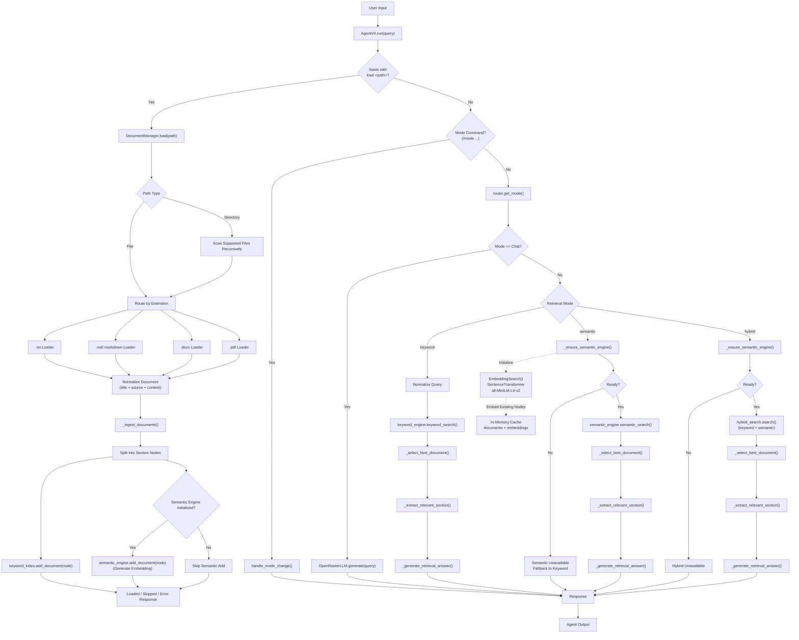

```mermaid
flowchart TD

    U["User Input"] --> A["AgentV4.run(query)"]

    A --> L{"Starts with<br/>load &lt;path&gt;?"}

    L -- Yes --> DM["DocumentManager.load(path)"]
    DM --> R{"Path Type"}

    R -->|File| FL["Route by Extension"]
    R -->|Directory| SCAN["Scan Supported Files Recursively"]

    FL --> TXT[".txt Loader"]
    FL --> MD[".md/.markdown Loader"]
    FL --> DOCX[".docx Loader"]
    FL --> PDF[".pdf Loader"]

    SCAN --> FL

    TXT --> NORM["Normalize Document<br/>(title + source + content)"]
    MD --> NORM
    DOCX --> NORM
    PDF --> NORM

    NORM --> ING["_ingest_documents()"]
    ING --> NODES["Split into Section Nodes"]

    NODES --> KADD["keyword_index.add_document(node)"]

    NODES --> SADD{"Semantic Engine Initialized?"}

    SADD -- Yes --> EADD["semantic_engine.add_document(node)<br/>(Generate Embedding)"]
    SADD -- No --> SKIP["Skip Semantic Add"]

    KADD --> LOADRESP["Loaded / Skipped / Error Response"]
    EADD --> LOADRESP
    SKIP --> LOADRESP

    L -- No --> M{"Mode Command?<br/>(/mode ...)"}

    M -- Yes --> MODE["handle_mode_change()"]
    MODE --> RESP["Response"]

    M -- No --> QMODE["router.get_mode()"]
    QMODE --> CHAT{"Mode == Chat?"}

    CHAT -- Yes --> CLLM["OpenRouterLLM.generate(query)"]
    CLLM --> RESP

    CHAT -- No --> RETR{"Retrieval Mode"}

    RETR -->|keyword| KQ["Normalize Query"]
    KQ --> KS["keyword_engine.keyword_search()"]
    KS --> SEL["_select_best_document()"]
    SEL --> EXT["_extract_relevant_section()"]
    EXT --> SYN["_generate_retrieval_answer()"]
    SYN --> RESP

    RETR -->|semantic| ENS["_ensure_semantic_engine()"]
    ENS --> OK1{"Ready?"}

    OK1 -- No --> ERR1["Semantic Unavailable<br/>Fallback to Keyword"]
    ERR1 --> RESP

    OK1 -- Yes --> SS["semantic_engine.semantic_search()"]
    SS --> SEL2["_select_best_document()"]
    SEL2 --> EXT2["_extract_relevant_section()"]
    EXT2 --> SYN2["_generate_retrieval_answer()"]
    SYN2 --> RESP

    RETR -->|hybrid| ENS2["_ensure_semantic_engine()"]
    ENS2 --> OK2{"Ready?"}

    OK2 -- No --> ERR2["Hybrid Unavailable"]
    ERR2 --> RESP

    OK2 -- Yes --> HS["hybrid_search.search()<br/>(keyword + semantic)"]
    HS --> SEL3["_select_best_document()"]
    SEL3 --> EXT3["_extract_relevant_section()"]
    EXT3 --> SYN3["_generate_retrieval_answer()"]
    SYN3 --> RESP

    ENS -. Initialize .-> INIT["EmbeddingSearch()<br/>SentenceTransformer<br/>all-MiniLM-L6-v2"]

    INIT -. Embed Existing Nodes .-> CACHE["In-Memory Cache<br/>documents + embeddings"]

    RESP --> OUT["Agent Output"]
```
