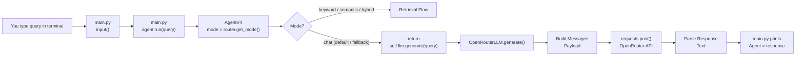

## LLM Chat Flow



### Flow Description

* User enters a query in the terminal.
* `main.py` reads the input.
* The query is passed to `agent.run(query)`.
* `AgentV4` checks the active mode using `router.get_mode()`.
* If the mode is `keyword`, `semantic`, or `hybrid`, the retrieval pipeline is executed.
* Otherwise, chat mode calls `self.llm.generate(query)`.
* `OpenRouterLLM.generate()` builds the request payload.
* A POST request is sent to the OpenRouter API.
* The response text is parsed.
* The final answer is returned to `main.py`.
* The terminal displays `Agent > response`.

```
```
