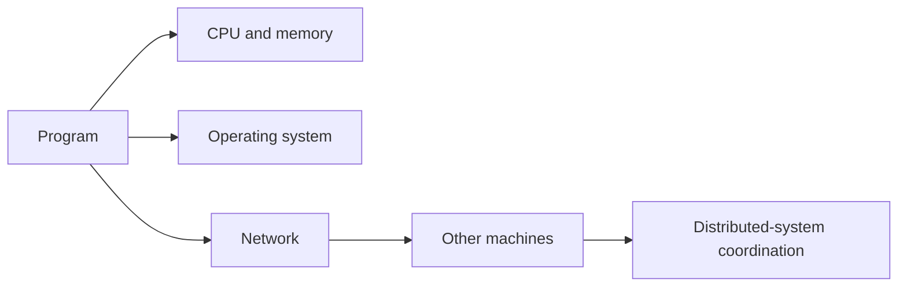

# Computer Fundamentals - Beginner to Expert

These notes explain how programs interact with processors, operating systems, networks, and distributed systems. They are conceptual by design: no programming snippets, only diagrams, mental models, decisions, failure modes, and interview questions.

## Study Method

For every topic:

1. explain the simple definition without jargon;
2. trace one request or instruction through the diagram;
3. name the resource being protected or optimized;
4. explain the failure mode and tradeoff;
5. answer the interview questions aloud.



## Independent Learning Tracks

1. [Computer architecture](computer_architecture/00-computer-architecture-roadmap.md)
2. [Operating systems](operating_systems/00-operating-systems-roadmap.md)
3. [Networking](networking/00-networking-roadmap.md)
4. [Distributed systems](distributed_systems/00-distributed-systems-roadmap.md)

## Recommended Order

```text
Computer architecture -> Operating systems -> Networking -> Distributed systems
```

Architecture explains the hardware costs. Operating systems explain resource sharing on one machine. Networking explains communication between machines. Distributed systems explain coordination and failure across machines.

## Interview Rule

Strong answers follow this shape:

```text
definition -> mechanism -> tradeoff -> failure mode -> practical decision
```

For example, do not answer only “a cache is fast memory.” Explain where it sits, why locality matters, what a cache miss costs, how access patterns affect it, and when profiling would prove it matters.

