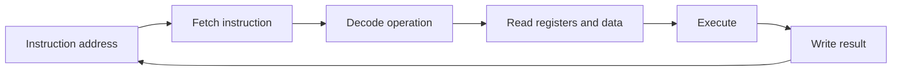
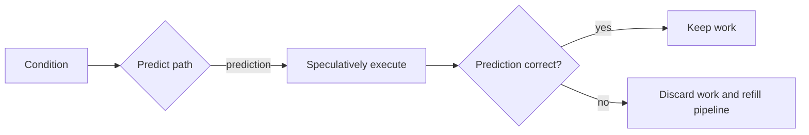

# CPU Execution, Pipelines, Branches, Assembly, and Compilers

## 1. The Simple Model

A CPU repeatedly reads instructions and data, performs operations, and writes results. Modern CPUs overlap many steps and may execute instructions in a different internal order while preserving the program's required visible result.



The important question is not “how many instructions exist?” It is “which dependency, branch, memory access, or resource prevents the next useful instruction from completing?”

## 2. CPU Core Building Blocks

| Part | Simple meaning | Why it matters |
|---|---|---|
| Core | one execution engine | several cores can run independent work in parallel |
| Register | tiny storage close to execution units | fastest place for active values |
| ALU | arithmetic and logic unit | handles integer math and comparisons |
| Floating-point/SIMD unit | specialized arithmetic execution | handles vector/numeric operations |
| Cache | small fast memory near core | reduces waits for main memory |
| Branch predictor | guesses next control-flow path | avoids idle pipeline time |
| TLB | cache of virtual-to-physical mappings | avoids page-table walks |

## 3. Latency, Throughput, and Parallelism

- Latency: time for one operation to finish.
- Throughput: completed operations per unit time.
- Concurrency: several operations are in progress.
- Parallelism: several operations execute simultaneously on separate hardware resources.

```text
One checkout:          start ---------------------------- finish

Four independent work items:
core 1:                start -------- finish
core 2:                   start -------- finish
core 3:                      start -------- finish
core 4:                         start -------- finish
```

Adding cores can improve throughput without improving the latency of one sequential dependency chain.

## 4. CPU Pipeline

An instruction pipeline splits work into stages so different instructions occupy different stages at once.

```text
cycle       1       2       3       4       5
instruction A  fetch   decode   execute write
instruction B          fetch    decode  execute write
instruction C                  fetch   decode execute write
```

This overlap improves throughput. It does not make one instruction's stages instantaneous.

## 5. Pipeline Hazards

### Data hazard

One instruction needs a value that an earlier instruction has not produced yet.

```text
calculate total
use total immediately
```

The second operation waits unless the CPU can forward the result directly from an earlier stage.

### Control hazard

A branch makes the next instruction unknown until a condition is known.

```text
if inventory is empty
    reject order
otherwise
    reserve inventory
```

### Structural hazard

Several instructions compete for one execution resource, such as a division unit or memory port.

## 6. Out-of-Order Execution

Modern CPUs can execute later independent instructions while an earlier one waits for memory.

```text
load customer from memory        waiting
calculate tax from register data ready -> execute now
format response after customer   waits for customer
```

The CPU tracks dependencies so the architectural result matches the program order. Independent work helps; unnecessary dependencies and pointer chasing reduce available work.

## 7. Superscalar Execution

A superscalar CPU can issue more than one instruction per cycle when instructions are independent and execution resources are available.

```text
same cycle
    integer addition ----> ALU
    address calculation --> address unit
    vector addition -----> SIMD unit
```

More instructions in source do not automatically mean more work per cycle. Dependencies, branches, cache misses, and limited execution ports can stop issue width from being used.

## 8. Branch Prediction

A branch predictor guesses which path a conditional branch will take. The CPU starts work on that predicted path before the condition is confirmed.



A correct prediction keeps the pipeline busy. A wrong prediction causes a branch-misprediction penalty: speculative work is discarded and the pipeline refills from the correct path.

## 9. Predictable and Unpredictable Branches

Predictable:

```text
loop repeats thousands of times and exits once
```

Harder to predict:

```text
input values arrive in random order and half take each branch
```

Do not replace readable branches with obscure arithmetic merely because branch prediction exists. Profile first. For a measured hot loop, sorting/grouping data by condition, using a vectorized library, or changing the algorithm may improve predictability.

## 10. Speculation Is Not Permission to Ignore Security

Speculative execution can touch data before a branch result is architecturally committed. Microarchitectural side channels have shown that timing and cache state can leak information in some designs.

Security-sensitive code should use reviewed platform/library primitives for constant-time comparison, secret handling, sandboxing, and isolation. Application authors should not invent branchless “security fixes” casually.

## 11. Assembly Basics

Assembly is a human-readable representation of machine instructions for one processor architecture. It exposes:

- registers;
- loads and stores;
- arithmetic operations;
- comparisons and branches;
- function-call conventions;
- stack-frame setup/cleanup;
- vector instructions.

Conceptual sequence for computing a total:

```text
load price into register
load quantity into register
multiply registers
store result or return it
```

The exact names differ across x86-64, ARM64, RISC-V, and compilers.

## 12. Registers and the Stack

Registers hold active values. The stack is per-call storage commonly used for return addresses, saved registers, local storage, and spilled values when registers are insufficient.

```text
high addresses
    caller frame
    return address
    current function locals
    temporary spill values
low addresses
```

“Stack versus heap” is a useful high-level model, not a rule that every local value lives on a physical stack. Compilers can keep, move, or eliminate values when behavior permits.

## 13. Calling Convention

A calling convention defines how functions cooperate at the binary level:

- which arguments use registers or stack;
- where return values appear;
- which registers a caller or callee must preserve;
- stack alignment;
- name/linkage conventions.

It matters when mixing languages, debugging crashes, writing FFI, or reading profiles. Mismatched ABI assumptions can corrupt memory or crash a process.

## 14. Compiler Optimization

Compilers transform a program while preserving its defined behavior.

Common transformations include:

- constant folding: calculate fixed expressions during compilation;
- dead-code elimination: remove unreachable or unused work;
- inlining: replace a small call with its body;
- loop-invariant code motion: move repeated stable work outside a loop;
- common-subexpression elimination: reuse an already computed result;
- loop unrolling: perform several loop iterations per loop-control step;
- vectorization: use SIMD operations for independent values;
- escape/lifetime analysis: choose storage and remove unnecessary allocation;
- profile-guided optimization: use measured program behavior to guide layout/inlining.

## 15. Optimization Preconditions

A compiler may not apply a transformation when it cannot prove safety. Barriers include:

- observable side effects;
- aliasing: two references might refer to the same memory;
- volatile/atomic semantics;
- potential exceptions or traps;
- unknown external calls;
- integer overflow rules for the language;
- dynamic dispatch or reflection.

The compiler is conservative when changing behavior would be unsafe.

## 16. Undefined Behavior

In languages with undefined behavior, an invalid operation can allow the compiler to make assumptions that surprise programmers. Examples can include invalid pointer access, data races, or signed overflow depending on language rules.

“It worked in a debug build” is not evidence that undefined behavior is safe. Use sanitizers, strict compiler warnings, safe language features, and tests.

## 17. Memory Ordering and Reordering

CPUs and compilers can reorder independent operations internally. Concurrent programs need synchronization operations with defined memory-order semantics so one thread's publication is visible correctly to another.

```text
producer: write data -> publish ready flag with release semantics
consumer: observe ready flag with acquire semantics -> read data
```

Locks and higher-level concurrency primitives normally provide the needed ordering. Do not attempt lock-free synchronization without a precise memory-model proof.

## 18. Architecture Interview Questions

### What is the difference between latency and throughput?

Latency is completion time for one unit. Throughput is completed units per time. Pipelining and extra cores often improve throughput; dependency chains dominate latency.

### Why can a branch make a loop slow?

An unpredictable branch causes mispredictions, discarded speculative work, and pipeline refill. Measure first because cache misses or algorithmic cost can be larger.

### What is out-of-order execution?

The CPU runs independent later instructions while earlier instructions wait, then retires results so visible program behavior remains correct.

### Does assembly equal machine code?

Assembly is a readable representation mapped to machine instructions for a specific architecture. Calling conventions, relocations, and linker work are also part of a real binary.

### Why might a compiler not optimize a loop?

It may not prove aliasing, side effects, overflow, exception, or synchronization conditions needed to preserve defined behavior.

## 19. Interview Answer Framework

When asked why code is slow:

```text
first classify: CPU, cache/memory, branch, lock, I/O, or algorithm
then gather evidence: profile, counters, tracing, benchmark
then change one measured bottleneck
then verify correctness and representative improvement
```

## Final Rules

- pipeline overlap improves throughput, not every dependency's latency;
- independent work lets modern CPUs hide waits;
- branch prediction is useful but mistakes are costly;
- assembly reveals implementation details, not source-language intent alone;
- compiler optimizations preserve defined behavior, not undefined behavior;
- synchronization is required for cross-thread invariants;
- use hardware knowledge to form hypotheses, then measure.

