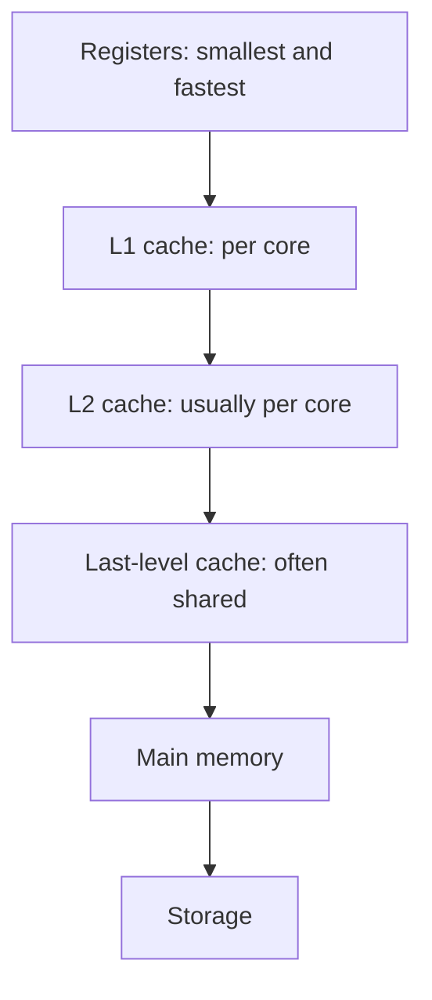
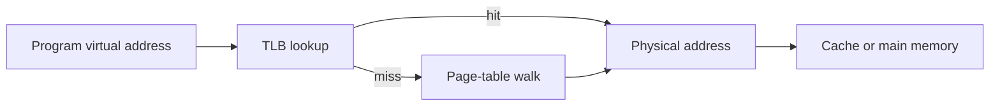
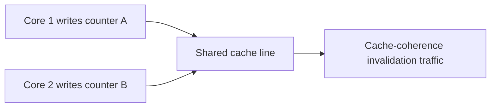

# Caches, Locality, Virtual Memory, TLB, Alignment, and False Sharing

## 1. The Memory-Speed Problem

CPUs operate much faster than main memory. A memory hierarchy keeps frequently used data close to the core.



As capacity grows, latency generally grows too. Exact sizes and latencies are hardware-specific; use this as a relative model.

## 2. Cache Lines

Caches transfer data in fixed-size blocks called cache lines, commonly dozens of bytes. Reading one value often brings neighboring bytes into the cache line too.

```text
memory:   [A][B][C][D][E][F][G][H]
cache line loaded for C: [A][B][C][D]
```

This creates opportunity for spatial locality and risk for false sharing.

## 3. Temporal Locality

Temporal locality means recently used data is likely to be used again soon.

```text
read account balance
validate balance
update balance
write audit record using balance
```

Keeping active working data small enough to stay in cache can reduce repeated main-memory waits.

## 4. Spatial Locality

Spatial locality means nearby memory is likely to be used soon.

```text
good for contiguous layout:  item 0 -> item 1 -> item 2 -> item 3
harder for locality:         node -> unrelated pointer -> unrelated pointer
```

Sequential arrays often have better spatial locality than pointer-heavy structures. That does not make arrays universally better; insertion, deletion, identity, and ownership still matter.

## 5. Cache Hit and Cache Miss

- Cache hit: required data is already in a nearby cache.
- Cache miss: hardware must retrieve it from a farther level.

```text
load value
  L1 hit      -> continue quickly
  L1 miss     -> check L2
  L2 miss     -> check last-level cache
  final miss  -> wait for main memory or beyond
```

One miss can stall a dependency chain for far longer than many arithmetic instructions take.

## 6. Working Set

The working set is the data actively needed over a period of execution. If it fits in a cache level, reuse is cheap. If it does not, data repeatedly replaces other data and miss rates rise.

```text
working set smaller than cache -> repeated hits likely
working set much larger        -> eviction and refill pressure
```

Optimize the access pattern and data layout before assuming hardware cache size alone is the issue.

## 7. Cache Associativity and Conflict Misses

Caches map memory addresses to limited placement locations. Two actively used addresses can compete for the same location even when total data would fit in the cache.

This is a conflict miss. Padding, allocation alignment, traversal order, or a different layout can sometimes help, but only after counter evidence shows the problem.

## 8. Prefetching

Hardware prefetchers detect predictable patterns and fetch likely future cache lines.

```text
sequential scan:  0 -> 1 -> 2 -> 3 -> likely prefetch succeeds
pointer chase:    A -> unknown next address -> prefetch struggles
```

Prefetching cannot solve data dependencies whose next address is unknown until the previous load completes.

## 9. Array of Structures and Structure of Arrays

```text
Array of structures
    [id, price, quantity] [id, price, quantity] [id, price, quantity]

Structure of arrays
    ids:        [id] [id] [id]
    prices:     [price] [price] [price]
    quantities: [quantity] [quantity] [quantity]
```

Array of structures is convenient when operations use complete records. Structure of arrays can improve locality and SIMD when a loop reads only one or two fields across many records.

Choose based on measured access patterns, not fashion.

## 10. Virtual Memory

Each process sees virtual addresses. The operating system and hardware map virtual pages to physical memory pages.



Virtual memory provides isolation, protection, flexible allocation, file mapping, and the appearance of one large address space.

## 11. Pages and Page Tables

Memory is managed in pages. A page table records mappings and permissions such as readable, writable, executable, present, and user/kernel accessible.

```text
virtual page number + offset
    -> page-table mapping
    -> physical frame number + same offset
```

The offset remains unchanged because virtual and physical pages have the same size.

## 12. TLB

The translation lookaside buffer is a cache of recent virtual-to-physical page translations.

```text
memory access
    TLB hit  -> quickly translate address
    TLB miss -> walk page tables, then cache translation
```

Large random working sets can cause many TLB misses even if data cache behavior is acceptable. Larger pages can reduce translation pressure but increase allocation and fragmentation tradeoffs.

## 13. Page Faults

A page fault occurs when an access needs an unavailable or disallowed mapping.

Possible outcomes:

- demand-zero page: OS supplies a new zeroed page;
- file-backed page: OS loads data from mapped file;
- swapped-out page: OS retrieves data from storage;
- invalid/protected access: OS sends a fault signal or terminates the process.

```text
CPU accesses page -> mapping absent -> kernel handles fault -> retry access
```

Major faults involving storage are much slower than cache or ordinary memory misses.

## 14. Paging and Swapping

When physical memory is under pressure, the OS may reclaim pages, write modified anonymous pages to swap, or evict clean file-backed pages that can be reread.

Excessive paging can create thrashing:

```text
processes need more active pages than memory can hold
    -> faults increase
    -> storage I/O increases
    -> useful CPU work falls
```

More threads or processes can worsen thrashing by increasing the combined working set.

## 15. Memory Alignment

Alignment means placing a value at an address compatible with its type or hardware requirements.

```text
aligned 8-byte value: address divisible by 8
misaligned value:     crosses an inconvenient boundary
```

Misalignment can cost extra work or be illegal on some architectures. Compilers add padding to structures so fields meet alignment requirements.

## 16. Padding Tradeoff

```text
logical fields:        flag (1 byte), count (8 bytes)
physical layout:       flag, padding, count
```

Padding can increase memory footprint but make access safe and fast. Reordering fields can reduce padding in low-level or large-array layouts, but it changes ABI/serialization assumptions and should be measured.

## 17. False Sharing

False sharing occurs when different cores modify different variables located on the same cache line.



The variables are logically independent, but cache coherence treats the line as one unit. Each write can invalidate the other core's copy and cause expensive bouncing.

## 18. Reduce False Sharing

Options include:

- partition work so each worker owns separate data regions;
- use per-worker counters and combine them later;
- pad or align independent hot fields when profiling proves line contention;
- reduce write frequency through batching;
- avoid sharing mutable counters on hot paths.

Padding blindly can waste cache capacity and make behavior worse. Confirm with profiling and hardware counters.

## 19. Cache Coherence

Cache coherence keeps a consistent view of writes to the same memory location across cores. Coherence traffic is required for shared writable data.

Coherence does not automatically make an application-level sequence atomic or correctly ordered. Locks, atomics, and defined memory-order rules are still needed for concurrent invariants.

## 20. Interview Questions

### Why are arrays often faster than linked lists in practice?

Arrays place elements contiguously, improving cache locality and prefetching. Linked lists can require pointer chasing and more cache misses. Algorithmic complexity alone does not capture memory latency.

### What is a cache line?

It is the fixed-size unit transferred between memory and cache. Neighboring values can arrive together, which creates spatial locality and false-sharing effects.

### What is a TLB miss?

The CPU lacks a cached virtual-to-physical page translation and must walk page tables. It is separate from a data-cache miss.

### What is the difference between a page fault and a cache miss?

A cache miss fetches data from a farther hardware memory level. A page fault requires operating-system handling because a virtual page mapping is absent, protected, or not resident.

### What is false sharing?

Independent threads write different variables in the same cache line, causing coherence invalidations and performance loss despite no logical shared variable.

## 21. Diagnosis Framework

```text
high CPU but low throughput
    -> inspect algorithm, cache misses, branches, lock contention, vectorization

high latency with low CPU
    -> inspect I/O waits, page faults, network, queues, scheduler delay

memory growth or swap activity
    -> inspect working set, allocation rate, leaks, cache size, process count
```

## Final Rules

- locality often matters more than raw instruction count;
- a cache line, not one variable, is the unit of cache movement and coherence;
- TLB translation is a separate performance layer from data caching;
- virtual memory improves isolation but page faults are expensive;
- alignment and padding are layout tradeoffs;
- false sharing is a write-heavy multi-core locality problem;
- profile and use counters before changing layout or adding padding.

