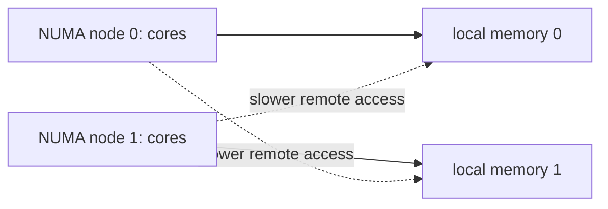

# SIMD, NUMA, and Parallel Hardware

## 1. Two Kinds of Hardware Parallelism

```text
thread-level parallelism: different cores work on different tasks
data-level parallelism:   one SIMD instruction works on several values
```

They can be combined, but both require independent work and careful memory access.

## 2. SIMD in Simple Words

Single Instruction, Multiple Data (SIMD) applies one operation to multiple independent values packed into a vector register.

```text
scalar addition
    a0 + b0 -> c0
    a1 + b1 -> c1
    a2 + b2 -> c2
    a3 + b3 -> c3

SIMD addition
    [a0 a1 a2 a3] + [b0 b1 b2 b3] -> [c0 c1 c2 c3]
```

Common SIMD instruction families include x86 SSE/AVX and ARM NEON. The source language, compiler, and CPU determine what is available.

## 3. SIMD Preconditions

SIMD works best when:

- the same operation applies independently to many values;
- values use uniform numeric representations;
- data is contiguous or gathered efficiently;
- control flow is similar across values;
- the loop has enough work to amortize setup and tail handling.

Examples include image processing, audio, numeric arrays, checksums, parsing, cryptography through reviewed libraries, and analytics kernels.

## 4. Why SIMD Can Fail to Help

Barriers include:

- loop-carried dependency: each result needs the previous result;
- pointer chasing and irregular layout;
- unpredictable branch per element;
- aliasing uncertainty;
- function calls or exceptions in the loop;
- tiny input;
- conversion or copying cost larger than the vectorized work.

```text
running balance: next value depends on previous total -> hard to vectorize directly
independent prices: each value is multiplied by tax rate -> vector-friendly
```

## 5. Compiler Auto-Vectorization

Compilers may recognize a safe vectorizable loop. They need proof that memory accesses do not overlap in unsafe ways and that arithmetic/exception behavior remains valid.

Use compiler vectorization reports, disassembly, benchmarks, and correctness tests when vectorization is a measured requirement. Do not assume a loop is vectorized because it looks numeric.

## 6. Vector Width and Portability

Wider vector registers can process more values at once, but wider instructions may change CPU frequency, resource pressure, or portability. A binary compiled for one CPU feature set may not run on another.

Prefer portable libraries or runtime dispatch unless a controlled deployment target justifies architecture-specific code.

## 7. Tail Handling

If vector width is four and there are ten values:

```text
vector work: values 0-3, 4-7
tail work:   values 8-9
```

The compiler or library must handle the remainder safely. Never read past the valid buffer merely to fill a vector unless the API and allocation explicitly make that safe.

## 8. Reduction Operations

Summing values requires combining lanes after parallel work:

```text
lanes: [a0+a1+a2+a3]
horizontal reduction: lane0 + lane1 + lane2 + lane3
```

Floating-point reductions can produce different rounding because addition order changes. Define numerical tolerance and reproducibility requirements before parallelizing math.

## 9. NUMA in Simple Words

Non-Uniform Memory Access (NUMA) machines have groups of CPUs and memory with different access costs.



One process may see one address space, but a core usually reaches memory attached to its own NUMA node faster than memory attached to another node.

## 10. First Touch

Many operating systems place a physical page near the CPU/node that first writes it.

```text
one initialization thread touches all pages on node 0
many workers later run across nodes
    -> remote memory traffic for non-node-0 workers
```

Parallel initialization aligned with later worker placement can improve locality for very large memory-bound workloads.

## 11. NUMA Failure Modes

- one node owns most allocated pages;
- threads migrate across nodes while repeatedly using remote memory;
- a shared queue or lock sits on one node and becomes a hotspot;
- process placement ignores container/host CPU topology;
- benchmark machine differs from production topology.

Symptoms can include uneven core utilization, high memory latency, cross-node traffic, and poor scaling beyond one socket.

## 12. NUMA-Aware Design

Use only when measurement shows NUMA is important:

- partition data and workers by node;
- allocate/touch data near the worker that uses it;
- use per-node queues or caches and combine results;
- pin threads/processes only with a clear operational reason;
- measure performance with production-like topology and CPU quotas.

Aggressive affinity can hurt load balancing and cloud portability. It is a specialized optimization.

## 13. False Sharing Meets NUMA

False sharing causes cache-line bouncing; NUMA can make that bouncing cross sockets/nodes and more expensive.

```text
one global mutable counter
    -> cache coherence traffic
    -> possible cross-node traffic
    -> scaling collapse

per-worker counters + periodic aggregation
    -> local writes
    -> far less coordination
```

## 14. Memory Bandwidth

Some workloads are limited not by arithmetic but by how quickly data can move from memory to cores.

```text
arithmetic intensity = useful arithmetic / bytes moved

low intensity: scan huge data, little arithmetic -> bandwidth-bound
high intensity: many calculations per loaded value -> compute-bound
```

Adding more cores to a bandwidth-bound workload can produce little benefit once memory channels are saturated.

## 15. Roofline Mental Model

```text
performance ceiling
    = lower of compute peak and memory-bandwidth-derived limit
```

This model helps ask whether optimizing arithmetic or reducing memory movement is more likely to help. It is a planning tool, not a substitute for measurement.

## 16. Hyper-Threading / Simultaneous Multithreading

One physical core may expose multiple logical CPUs. They share some core resources and can use otherwise idle execution capacity.

It can improve throughput for some mixes but does not double every resource. Two heavy tasks can compete for cache, execution units, and bandwidth.

Treat logical CPU count as an upper bound for experiments, not an automatic worker-count setting.

## 17. Hardware Counters

Performance-monitoring counters can provide evidence for:

- cycles and instructions;
- cache and TLB misses;
- branch instructions and mispredictions;
- stalled cycles;
- memory bandwidth;
- context switches and migrations through operating-system tools.

Counter interpretation is hardware-specific. Compare before/after under the same representative workload rather than relying on one absolute number.

## 18. Interview Questions

### What is SIMD and when does it help?

SIMD performs one operation on several independent data values. It helps regular data-parallel workloads with suitable layout and enough work to amortize overhead.

### Why can vectorized code be numerically different?

Parallel reduction changes floating-point operation order. Floating-point addition is not perfectly associative, so define tolerances or deterministic reduction rules.

### What is NUMA?

It is a multi-node hardware topology where memory access cost depends on which CPU node owns the memory. Local memory is usually faster than remote memory.

### Why might adding cores stop improving performance?

The workload may be limited by memory bandwidth, cache coherence, lock contention, remote NUMA access, I/O, or insufficient parallel work.

### When should you pin threads?

Only when profiling demonstrates migration/locality harm and the deployment topology is controlled. Pinning can reduce load balancing and portability.

## 19. Practical Diagnosis

```text
CPU kernel is slow
    -> verify correctness and algorithm
    -> determine compute-bound versus bandwidth-bound
    -> inspect cache, branch, vectorization, and data layout
    -> inspect thread scaling and false sharing
    -> inspect NUMA only on relevant hardware
    -> make one measured change
```

## Final Rules

- SIMD accelerates independent regular data, not arbitrary loops;
- data layout and memory movement determine whether SIMD can help;
- NUMA turns memory placement into a scalability concern on multi-node machines;
- false sharing and global write hotspots can defeat additional cores;
- physical cores, logical CPUs, memory bandwidth, and cache capacity are different resources;
- use counters and production-like benchmarks before hardware-specific tuning.

