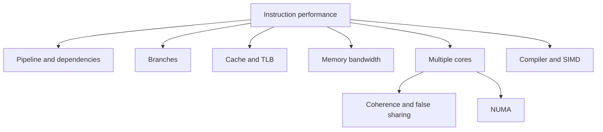

# Computer Architecture Interview Preparation and Diagnosis

This chapter turns architecture knowledge into concise interview answers and practical diagnosis.

## 1. Answer Pattern

```text
define the concept
    -> explain the mechanism
    -> name the tradeoff
    -> give a production symptom
    -> say how you would measure it
```

Example:

```text
False sharing is cache-line contention between independent variables.
Different cores write values in the same line, so coherence repeatedly invalidates copies.
Padding can help but costs memory and cache capacity.
It appears as poor multi-core scaling on a write-heavy hot path.
I would confirm it with profiling/counters and compare a per-worker design.
```

## 2. Core Concept Map



## 3. Beginner Questions

### What is a CPU cache?

A small fast memory layer that keeps recently or nearby used data close to a CPU core. It reduces average wait time compared with main memory.

### What is locality?

Temporal locality is reusing data soon. Spatial locality is using nearby data soon. Both make cache lines more useful.

### What is a pipeline?

A pipeline divides instruction work into stages and overlaps stages of multiple instructions. It improves throughput but must handle dependencies and branches.

### What is virtual memory?

An address-translation and protection system that gives each process its own virtual address space mapped to physical memory pages.

## 4. Intermediate Questions

### Cache miss versus TLB miss?

A cache miss is missing data in a cache. A TLB miss is missing the translation from virtual page to physical page. Both add delay but occur in different layers.

### Why is pointer chasing slow?

The next address is often unknown until a previous load returns, limiting prefetching and out-of-order overlap. Nodes may also be scattered across memory.

### Why is an unpredictable branch costly?

The CPU may speculatively execute the wrong path. It then discards that work and refills the pipeline from the correct path.

### What is memory alignment?

It is placing values at addresses suitable for their type/hardware access. Compilers may add padding to preserve it.

## 5. Advanced Questions

### What is false sharing, and how would you fix it?

Independent cores update values in one cache line, causing coherence traffic. First verify it. Then partition ownership, aggregate per-worker state, batch writes, or pad/alignment-isolate hot fields if justified.

### Explain NUMA and first touch.

NUMA systems have memory attached to CPU nodes with non-uniform access cost. The node that first writes a page often influences placement. Initializing data on one node and consuming it from another can create remote-memory traffic.

### What prevents compiler vectorization?

Dependencies, uncertain aliasing, irregular branches, exceptions, function calls, incompatible arithmetic semantics, or insufficient loop structure can prevent a safe transformation.

### Why do more threads sometimes reduce throughput?

They can increase context switching, cache pressure, memory-bandwidth saturation, lock contention, false sharing, NUMA traffic, or oversubscription of native thread pools.

## 6. Scenario: Slow Array Scan

```text
symptom: a numeric scan is slower than expected

questions:
    Is the algorithm linear and correct?
    Is data contiguous?
    Is it memory-bandwidth-bound?
    Is a branch unpredictable per item?
    Did the compiler/library vectorize it?
    Is work too small for parallelism?
    Do threads compete for the same output/cache line?
```

Do not start with assembly. Start with a profile and representative benchmark.

## 7. Scenario: Performance Stops Scaling at Eight Cores

```text
one core -> good
two/four cores -> better
eight+ cores -> flat or worse
```

Hypotheses:

- shared lock or queue bottleneck;
- false sharing on counters/metadata;
- memory-bandwidth saturation;
- hot shared cache line;
- NUMA remote-memory traffic;
- process/thread oversubscription;
- external service/database limit;
- serial stage predicted by Amdahl's law.

Measure worker utilization, queue depth, CPU migrations, cache/coherence counters, memory bandwidth, and external dependency latency.

## 8. Amdahl's Law

If part of a workload remains serial, that part limits speedup regardless of added cores.

```text
speedup = 1 / (serial fraction + parallel fraction / worker count)
```

The formula is a reminder to find serial coordination and setup costs. Real systems also have overhead that grows with worker count.

## 9. Interview Mistakes

- saying “the cache stores frequently used variables” without mentioning cache lines/locality;
- claiming the GIL, a lock, or cache coherence makes a compound operation automatically safe;
- treating Big-O as the only performance model;
- claiming SIMD always makes code faster;
- assuming logical CPU count equals physical-core performance;
- adding padding before proving false sharing;
- calling every memory delay a page fault;
- quoting exact cycle counts without hardware/workload context.

## 10. Practice Prompts

1. Explain why a linked list can lose to an array despite constant-time insertion.
2. Explain cache line, false sharing, and the fix in two minutes.
3. Explain a TLB miss to a junior developer.
4. Explain why a CPU-bound workload may not scale with more threads.
5. Explain how a compiler can change source structure without changing behavior.
6. Design a benchmark that distinguishes cache locality from algorithmic improvement.
7. Explain why NUMA matters for an in-memory database.
8. Compare data-level SIMD with thread-level parallelism.

## 11. Final Interview Checklist

- definition is correct and simple;
- mechanism names the relevant hardware layer;
- tradeoff is explicit;
- no absolute performance claim without measurement;
- synchronization and correctness are considered before speed;
- answer ends with an evidence-gathering plan.

[Return to the architecture roadmap](00-computer-architecture-roadmap.md)

