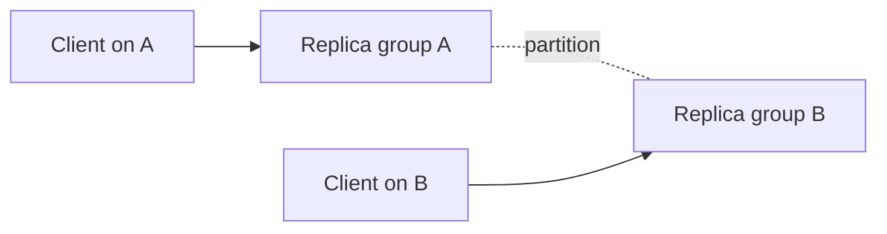
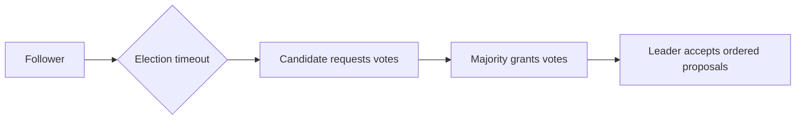
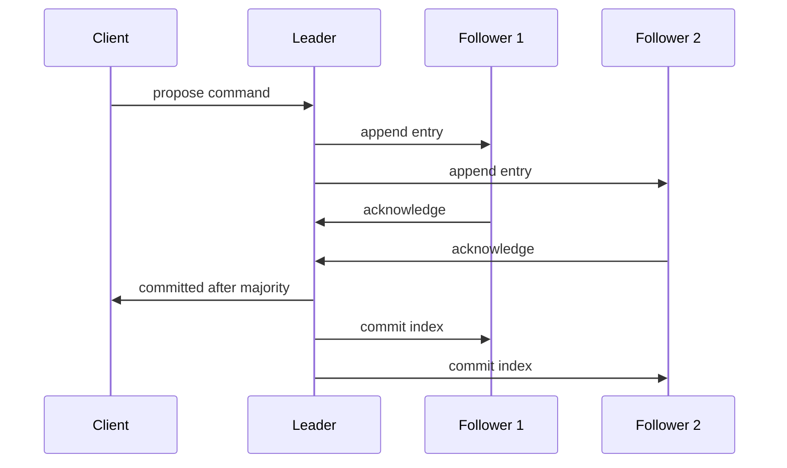

# CAP, Consensus, Raft, Paxos, and Leader Election

## 1. Why Distributed Systems Are Different

Machines communicate through a network that can delay, duplicate, reorder, or lose messages. A machine can fail, pause, restart, or become unreachable while still running.

```text
client cannot distinguish with certainty:
    server is slow
    network is slow
    response was lost
    server processed request then crashed
    server never received request
```

This uncertainty is the foundation of distributed-systems design.

## 2. Failure Types

| Failure | Meaning |
|---|---|
| crash-stop | process stops and does nothing further |
| crash-recovery | process stops and later restarts from durable state |
| omission | message/request/response is not delivered |
| delay | message arrives too late to be useful |
| partition | groups of nodes cannot communicate reliably |
| Byzantine | node behaves arbitrarily/maliciously |

Most service systems design for crash, delay, omission, and partition—not Byzantine behavior—unless their trust model requires stronger protocols.

## 3. Consistency Has Several Meanings

Do not use “consistent” without defining it.

- data-model consistency: constraints such as valid foreign keys;
- linearizability: operations appear to happen atomically in one real-time-respecting order;
- sequential consistency: one global order exists but need not respect real time;
- eventual consistency: replicas converge when writes stop and communication resumes;
- read-your-writes/session guarantees: client-facing consistency properties;
- CAP consistency: typically means linearizable single-copy behavior under the theorem's model.

## 4. CAP Theorem in Plain Language

During a network partition, a distributed service that must serve both sides must choose between:

- consistency: reject/delay some operations rather than return conflicting/stale results;
- availability: continue replying to every request, potentially with stale/divergent data.



CAP is not “pick two of three forever.” Partition tolerance is not optional when communication can fail. The important decision is behavior during a partition.

## 5. Availability in CAP Is Narrow

CAP availability means every request to a non-failing node receives a non-error response. It does not mean high uptime, fast response, correct business result, or infinite capacity.

In production, teams also discuss SLO availability, latency, durability, and operational resilience. State which definition you mean.

## 6. PACELC Extension

PACELC is a useful reminder:

```text
if Partition: choose Availability or Consistency
Else:          choose Latency or Consistency tradeoff
```

It is a model, not a complete design. Replication topology, workload, database semantics, and client guarantees still matter.

## 7. Consensus

Consensus lets distributed nodes agree on one ordered sequence of decisions despite failures, under defined assumptions.

Typical use:

```text
agree that log entry 42 is: “configuration version 7”
then every replica applies entries in the same order
```

Consensus is often used for metadata, leadership, configuration, coordination, and strongly consistent small state—not necessarily every high-volume business record.

## 8. Quorum

A quorum is a subset large enough that two successful quorums overlap.

```text
three replicas
majority quorum = two

any two majorities share at least one replica
```

The overlap helps preserve safety because a later decision can learn about earlier committed state. Quorum choices affect latency, fault tolerance, and capacity.

## 9. Leader Election

A leader centralizes ordering for a period of time.



Leadership is a lease/term/state-machine concept, not proof that a node is globally healthy. A partition can create an old leader that still believes it leads; protocols use terms, quorums, and fencing to prevent stale authority from committing unsafe work.

## 10. Fencing Tokens

When an external resource must reject stale leaders, a monotonically increasing fencing token can help.

```text
leader term 10 writes token 10
new leader term 11 writes token 11
resource rejects future requests carrying token 10
```

The protected resource must enforce the token. A lock alone cannot stop a paused former leader from resuming later.

## 11. Raft in Simple Words

Raft is a consensus algorithm designed to be understandable. It separates:

- leader election;
- log replication;
- safety rules;
- membership changes.

Nodes are followers, candidates, or leader within a numbered term.

## 12. Raft Log Replication



The leader appends a proposed command, replicates it, and considers it committed after required quorum conditions. Replicas apply committed entries in order to their state machine.

## 13. Raft Safety Intuition

Raft rules ensure a leader with an older/incomplete log cannot overwrite committed history. Terms, voting restrictions, log matching, and majority overlap preserve the ordered committed prefix.

Safety means replicas do not commit conflicting commands at one log index. Liveness still depends on communication and enough healthy nodes.

## 14. Raft Read Semantics

Not every read from a Raft replica is linearizable. A follower can be behind, and an isolated old leader can be stale.

Strong read options can include leader reads with quorum confirmation/read-index mechanisms or leases under correct timing assumptions. Faster stale reads may be acceptable for explicitly designed use cases.

## 15. Paxos in Simple Words

Paxos is a family of consensus algorithms built around proposers, acceptors, and learners.

Basic intuition:

```text
proposer chooses a unique proposal number
acceptors promise not to accept older proposals
proposer learns prior accepted value if any
majority accepts one value
learners observe chosen result
```

Like Raft, Paxos relies on quorum overlap for safety. Multi-Paxos commonly uses a stable leader to avoid repeating expensive coordination for each log entry.

## 16. Raft Versus Paxos

| Aspect | Raft | Paxos family |
|---|---|---|
| presentation | explicit leader/election/log decomposition | concise quorum-based protocol family |
| common operational form | leader replicates log | Multi-Paxos with stable leader |
| safety basis | terms, voting, log rules, majorities | proposal numbers and quorum intersection |
| practical lesson | understand leader failover and log commit | understand quorum agreement and chosen values |

Neither is “easy.” Correct implementation needs durable logs, recovery, membership changes, transport assumptions, observability, and extensive fault testing.

## 17. Split Brain

Split brain means separate nodes/groups believe they may act as leader or authority. It can happen under partitions, stale membership, poor lease design, or manual recovery mistakes.

Prevent damage with consensus/quorums, fencing, one authoritative membership source, safe failover, and operational procedures. Never rely only on wall-clock time or “the old leader should be down by now.”

## 18. Clocks

Distributed clocks can drift, jump, or differ. Use monotonic clocks for local durations. Treat wall-clock timestamps as observations, not total ordering proof.

Logical clocks, version vectors, sequence numbers, or consensus log indices can express causal/order requirements more safely than comparing unsynchronized timestamps.

## 19. Membership Changes

Changing consensus membership is itself a coordination problem. Safe algorithms use staged/joint configurations so old and new quorum sets overlap during transition.

Do not add/remove several nodes manually without the system's documented membership procedure. A wrong change can lose quorum or create conflicting authority.

## 20. When Not to Use Consensus

Avoid putting every high-throughput operation behind a global consensus log when:

- independent partitions can own data;
- eventual/session consistency is acceptable;
- a database already provides the needed transaction/consistency semantics;
- the coordination domain can be reduced;
- throughput/latency needs exceed one leader's capacity.

Use consensus where one authoritative decision/order is truly needed.

## 21. Interview Questions

### Explain CAP correctly.

During a network partition, a system cannot both provide linearizable consistency and always return a successful response from each non-failing side. It must define which requests are rejected/delayed or which stale/divergent answers are allowed.

### What is consensus?

Nodes agree on one ordered decision sequence despite failures under defined assumptions. It is used for coordination and strongly consistent replicated state.

### Why is a majority important?

Majority quorums overlap, so two conflicting decisions cannot both be safely chosen without a common node/protocol violation.

### Raft leader versus primary database?

Both can centralize writes, but Raft leader authority and commit rules are part of a consensus protocol with quorum replication. A generic primary/replica setup may have different failover and consistency guarantees.

### What is leader election for?

To select a node authorized to order or coordinate work for a term. It needs protection against stale leaders and partitions.

## Final Rules

- state failure assumptions before selecting a protocol;
- define consistency precisely;
- CAP describes partition behavior, not a permanent marketing label;
- quorums provide overlap for safety;
- consensus preserves safety under assumptions but cannot guarantee progress without communication/quorum;
- use fencing for external side effects from leaders;
- test failover, partitions, recovery, clock anomalies, and membership changes;
- reduce the coordination domain whenever possible.

