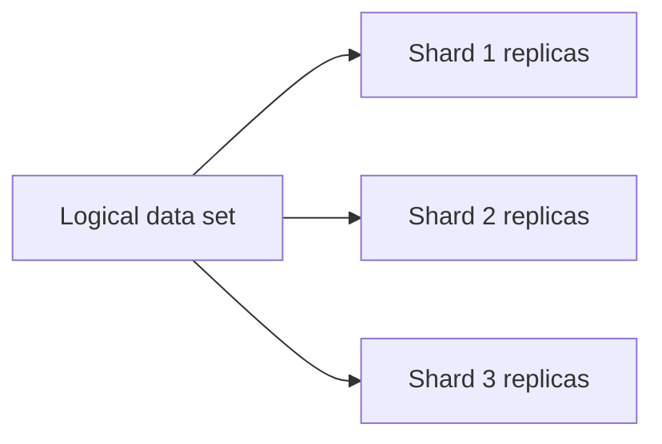
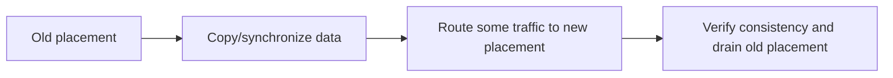

# Replication, Sharding, Partitioning, and Consistent Hashing

## 1. Scale Has Two Main Dimensions

```text
replication: copy same logical data to several nodes
partitioning: divide logical data across nodes
```

Most large systems use both.



## 2. Why Replicate?

Replication can provide:

- read capacity;
- fault tolerance;
- regional proximity;
- maintenance without full outage;
- durability when replicas are independent.

It also introduces replication delay, conflict/failover complexity, more cost, and more operational states.

## 3. Replication Topologies

| Topology | Idea | Main tradeoff |
|---|---|---|
| single leader | one writer replicates to followers | simple write order; leader bottleneck/failover |
| multi-leader | several sites accept writes | conflicts and resolution complexity |
| leaderless | writes/reads use quorums across replicas | conflict/version/read-repair complexity |
| chain | ordered replica propagation | predictable order; tail latency/failover design |

The database/system defines exact guarantees. Do not infer them from the topology name alone.

## 4. Synchronous and Asynchronous Replication

```text
synchronous acknowledgement
    -> wait for required replica acknowledgment
    -> stronger acknowledged durability/consistency potential
    -> higher write latency and availability sensitivity

asynchronous replication
    -> acknowledge before some replicas receive write
    -> lower latency
    -> lag and possible acknowledged-data loss on failover
```

Choose based on explicit recovery point objective, consistency requirement, and latency budget.

## 5. Replication Lag

Lag means a replica has not applied the latest data.

Symptoms:

- user writes then reads stale data from follower;
- failover loses async acknowledged writes;
- analytical/reporting results differ temporarily;
- cache invalidation reaches regions at different times.

Mitigations include leader reads after write, session stickiness, version tokens, read-your-writes guarantees, synchronous quorum, or explicit user-visible pending state.

## 6. Conflict Resolution

Multi-writer or leaderless systems need a conflict policy:

- last-write-wins: simple but can discard meaningful updates and depends on clocks;
- application merge: domain-aware but complex;
- version vectors/causal metadata: detect concurrent writes;
- CRDTs: mergeable data types with defined algebraic rules;
- reject/conflict workflow: let user/system resolve.

Conflict resolution is a business decision. Do not hide it as an infrastructure default.

## 7. Partitioning Versus Sharding

Partitioning means dividing data/work into pieces. Sharding usually means distributing those partitions across independent database/service nodes.

```text
tenant A through M -> shard 1
tenant N through Z -> shard 2
```

Partitioning can also occur within one database table, log, queue, or storage engine.

## 8. Partition Keys

A partition key determines where data lives.

Good key properties:

- high cardinality;
- even distribution under real traffic;
- common queries can target one/few partitions;
- supports authorization/tenant isolation needs;
- stable enough for operations;
- avoids unbounded hot keys.

The best key is driven by access patterns and invariants, not by an arbitrary identifier.

## 9. Partitioning Strategies

| Strategy | Strength | Risk |
|---|---|---|
| range | range scans/locality | hot recent ranges/skew |
| hash | even distribution | range queries scatter |
| directory/lookup | flexible placement | lookup dependency/metadata consistency |
| geographic | locality/compliance | global queries and uneven regions |
| tenant | isolation/simple routing | very large tenant hotspot |
| time | retention/query convenience | current-time hot partition |

Hybrid schemes are common, such as tenant plus hash or time plus hash.

## 10. Hot Partitions

One partition can dominate traffic due to a popular tenant, current timestamp, celebrity account, global counter, or skewed key distribution.

```text
all writes use current day key
    -> one shard receives most writes
    -> adding other shards does not help
```

Mitigate with key salting/bucketing, workload splitting, caching, aggregation, rate limits, queue partition changes, or data-model redesign. Preserve query and correctness requirements.

## 11. Cross-Shard Queries and Transactions

Operations that span shards are more expensive because they need fan-out, coordination, distributed transaction semantics, or asynchronous workflows.

```text
single-shard transaction -> local consistency/latency
multi-shard transaction  -> coordination, failure, retries, partial outcome risk
```

Model data so common invariants and transactions stay within one shard where possible.

## 12. Rebalancing

Adding/removing nodes requires moving partitions or adjusting routing.



Rebalancing must handle writes during movement, read consistency, throttling, rollback, capacity headroom, and observability. It is an operational migration, not merely a hash calculation.

## 13. Consistent Hashing

Consistent hashing maps keys and nodes onto a ring-like hash space.

```text
hash space: 0 -------------------------------------- max
nodes placed at positions around the ring
key belongs to next node clockwise
```

When a node joins/leaves, only a subset of keys near that position move instead of remapping all keys as simple modulo hashing can.

## 14. Virtual Nodes

One physical node can own several positions in the hash space.

Benefits:

- smoother distribution;
- easier weighting for larger nodes;
- smaller movement per change;
- less sensitivity to unlucky node positions.

Virtual nodes do not fix hot keys: one extremely popular key still maps to one primary placement unless the application deliberately replicates/splits that workload.

## 15. Replication with Consistent Hashing

```text
key maps to primary position
next N distinct nodes on ring hold replicas
```

Define replica selection, rack/zone diversity, failure-domain awareness, quorum policy, repair, and conflict semantics. Hashing alone is not a replication protocol.

## 16. Metadata and Routing

Clients/services need a current map from key/partition to owner.

Options include:

- central metadata service;
- versioned routing table pushed to clients;
- request router/gateway;
- DNS/service discovery for coarse routing;
- consistent hashing with membership dissemination.

Routing metadata is critical infrastructure. Version it, cache it carefully, handle stale routes, and provide safe refresh/retry behavior.

## 17. Read and Write Quorums

Some replicated systems use:

```text
N = replica count
W = required write acknowledgments
R = required read responses

R + W > N can provide overlap under stated assumptions
```

Overlap alone does not guarantee a simple linearizable experience. Coordinator behavior, concurrent writes, repair, failure detector, versioning, and read policy matter.

## 18. Repair and Anti-Entropy

Replicas can diverge due to outages, lag, or failed writes. Repair mechanisms compare and synchronize state.

- read repair: update stale replica while serving a read;
- background anti-entropy: compare replicas periodically;
- hinted handoff: temporarily store work for unavailable node;
- log replay/snapshot transfer: catch up a replica.

Repair consumes network and storage capacity. Monitor lag and repair backlog; do not assume eventual consistency converges instantly.

## 19. Interview Questions

### Replication versus sharding?

Replication copies the same logical data for availability/read capacity. Sharding divides data across nodes for capacity and write/read distribution. Large systems commonly combine both.

### How do you choose a shard key?

From real query, transaction, authorization, cardinality, and traffic-skew patterns. Aim to keep common operations local while distributing load evenly.

### What is a hot shard?

One partition receives disproportionate load, so cluster capacity elsewhere is idle. Adding nodes without changing routing/key design may not help.

### What does consistent hashing solve?

It reduces key movement when membership changes. It does not by itself solve hot keys, replication consistency, metadata, or safe data migration.

### Why are cross-shard transactions difficult?

They require coordination across independent failure domains, adding latency, partial-failure states, retries, and operational complexity.

## Final Rules

- replication and partitioning solve different scale/failure problems;
- choose replication consistency from explicit durability and read guarantees;
- choose keys from workload and invariants;
- design for skew and hot partitions from the beginning;
- keep common transactions local to one shard;
- treat rebalancing as a production migration;
- use consistent hashing for controlled movement, not as a complete data-system design;
- monitor lag, repair, routing freshness, and per-partition load.

