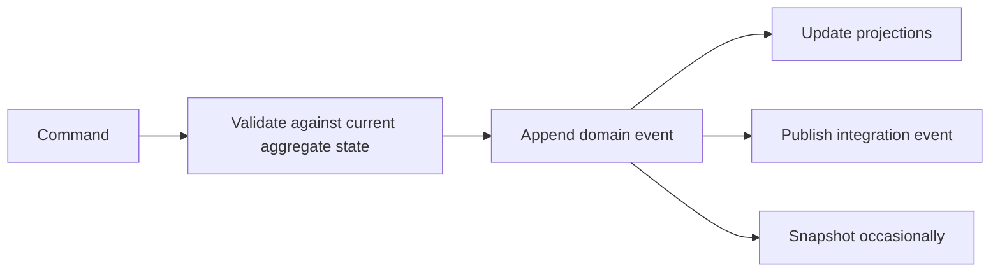
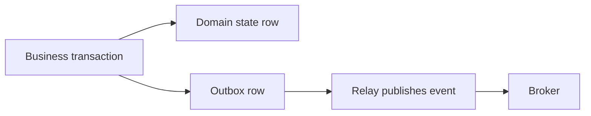
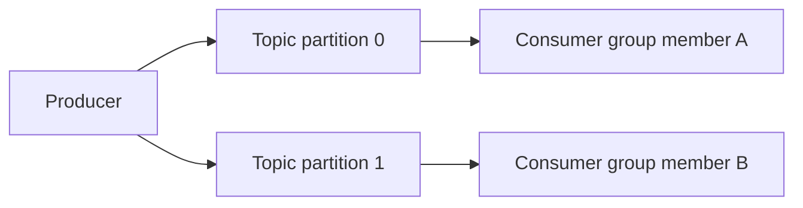
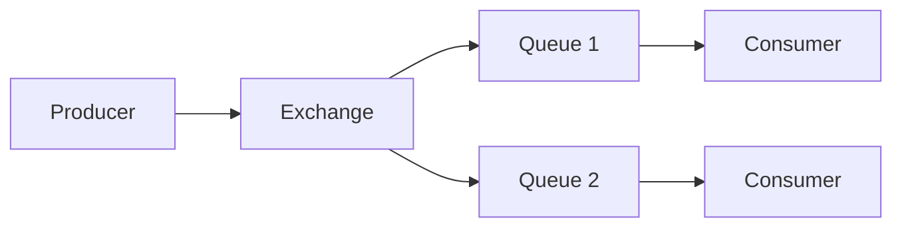
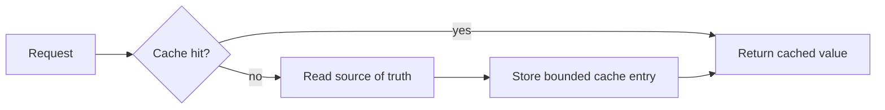

# Event Sourcing, Kafka, RabbitMQ, and Redis

## 1. Event, Command, and State

```text
command: request to do something
event:   immutable fact that something happened
state:   current result after applying facts
```

Example:

```text
command: “reserve inventory for order 42”
event:   “inventory reserved for order 42”
state:   available inventory is now 19
```

Do not name a rejected request as though it were a completed event.

## 2. Event Sourcing

Event sourcing stores state changes as an append-only sequence of domain events. Current state is rebuilt by replaying events or loading a snapshot plus later events.



## 3. Benefits of Event Sourcing

- audit trail of domain facts;
- reconstruct/inspect historical state;
- multiple projections for different reads;
- event-driven integration;
- explicit state-transition model;
- replay for corrected projections when event schema/policy permits.

## 4. Costs of Event Sourcing

- event design is public long-lived API design;
- schema evolution and upcasting require discipline;
- replay can be expensive;
- projections can lag/fail;
- privacy/deletion requirements need careful design;
- debugging requires reasoning across time;
- not every domain needs history as its source of truth.

Event sourcing is not “put database changes on a queue.” Events should represent stable domain facts, not accidental implementation details.

## 5. Event Versioning

An old event cannot simply be edited once persisted and consumed. Options:

- additive fields with safe defaults where compatible;
- new event version/type;
- upcaster that converts old shape at read/replay time;
- migration/rebuild of projections;
- deprecation window with multiple consumers.

Preserve event meaning. Changing the interpretation of an old event can corrupt replay and audit behavior.

## 6. Snapshotting

```text
events 1 through 10000
snapshot at 9000
to load state: snapshot 9000 + replay 9001 through 10000
```

Snapshots improve load time but add another artifact that must be versioned, validated, and recoverable. The event log remains authoritative in an event-sourced model.

## 7. Transactional Outbox

When a service writes database state and publishes an event, two separate systems can fail between steps.



Writing state and outbox record in one local transaction avoids “state changed but no event was recorded.” A relay publishes later and must tolerate duplicate delivery. Consumers still need idempotency.

## 8. Kafka in Simple Words

Kafka is a distributed append-only log platform organized around topics and partitions.



Within one partition, records have an ordered offset. Across partitions, there is no one global total order by default.

## 9. Kafka Concepts

| Concept | Meaning |
|---|---|
| topic | named stream/category of records |
| partition | ordered append log and parallelism unit |
| offset | position of record within one partition |
| producer | writes records |
| consumer | reads records |
| consumer group | cooperative consumers sharing partitions |
| broker | Kafka server storing partitions |
| retention | how long records remain available |
| replication factor | number of broker copies |

## 10. Kafka Ordering

Kafka preserves order within a partition as records are appended. To preserve order for one key, route that key consistently to one partition.

```text
order 42 events -> same partition -> ordered for order 42
different orders -> may be on different partitions -> no global order guarantee
```

More partitions improve parallelism but make global ordering and later repartitioning more complex.

## 11. Kafka Consumer Groups

One partition is assigned to at most one active consumer in a consumer group at a time.

```text
four partitions, two consumers -> each consumer gets two partitions
four partitions, six consumers -> two consumers are idle
```

Rebalancing changes assignments. Consumers must handle duplicate work, partition revocation, in-flight processing, and offset commit safely.

## 12. Offsets and Delivery

```text
process record -> persist effect -> commit offset
```

If a consumer crashes before committing, it may see the record again. If it commits before durable effect, it can lose work. The correct order depends on the sink and idempotency/transaction design.

## 13. Kafka Retention Is Not a Queue Deletion Rule

Kafka records are retained by time/size/compaction policy, not automatically removed because one consumer processed them. This allows replay by a new consumer group but requires storage planning and access control.

## 14. Log Compaction

Compacted topics retain the latest record per key eventually, while still preserving recent history according to policy. They suit state-change streams, not audit requirements that need every historical event forever.

Tombstones and compaction timing must be designed for consumer bootstrap and deletion semantics.

## 15. RabbitMQ in Simple Words

RabbitMQ is a message broker centered on exchanges, queues, bindings, and acknowledgments.



An exchange routes messages to queues by configured binding/routing rules. Consumers receive messages from queues and acknowledge when processing succeeds.

## 16. RabbitMQ Routing Patterns

- direct exchange: exact routing-key match;
- topic exchange: pattern-based routing;
- fanout exchange: broadcast to all bound queues;
- headers exchange: route by header matching.

One published message can feed several independently consumed queues. This differs from consumers competing within one queue.

## 17. RabbitMQ Acknowledgments and Prefetch

Acknowledgment tells the broker a consumer has completed a message.

```text
receive -> process -> acknowledge
crash before acknowledge -> message may be redelivered
```

Prefetch limits unacknowledged messages delivered to a consumer. It is a backpressure/fairness control. Too high can create uneven work and long redelivery; too low can underuse capacity.

## 18. Dead-Letter Handling

Failed messages need a policy:

- bounded retry with backoff;
- dead-letter queue for investigation/replay;
- poison-message alert;
- reason and attempt metadata;
- idempotent reprocessing procedure;
- retention and access control.

Do not create infinite immediate requeue loops. They can consume all capacity and hide the root cause.

## 19. Kafka and RabbitMQ Comparison

| Concern | Kafka-style log | RabbitMQ-style broker |
|---|---|---|
| core model | retained partitioned log | routed queues/messages |
| replay | natural through offsets/retention | possible through designed queues, not the primary model |
| order | within partition | queue/order behavior depends on configuration/consumers |
| routing | topic/partition/key model | exchange and bindings |
| common fit | event streams, analytics, replay, integration | work queues, routing, request/task distribution |

Both need idempotent consumers, schema evolution, backpressure, observability, and failure policy.

## 20. Redis in Simple Words

Redis is an in-memory data structure server often used for caching, coordination primitives, sessions, rate limiting, queues/streams, and fast ephemeral state.

```text
client -> Redis -> in-memory key/value and data structures
```

It is not automatically a replacement for a durable relational database, event log, or distributed transaction system.

## 21. Redis Data Structures

Common structures include:

- strings;
- hashes;
- lists;
- sets and sorted sets;
- streams;
- pub/sub channels;
- bitmaps and probabilistic structures in supported deployments.

Choose the structure whose atomic operations match the required invariant. Avoid read-modify-write races across multiple independent commands when a single atomic operation or script/transaction mechanism is needed.

## 22. Redis Caching



Define:

- source of truth;
- key format/version;
- TTL and invalidation;
- stampede protection;
- stale-data policy;
- cache size/eviction;
- serialization and schema version;
- sensitive-data rules.

## 23. Cache Stampede

Many requests can miss the same key and overload the source of truth.

Mitigations:

- request coalescing/single flight;
- bounded lock/lease with failure policy;
- probabilistic early refresh;
- stale-while-revalidate when safe;
- TTL jitter;
- rate/concurrency limits;
- cache warm-up only with capacity planning.

Do not let a cache-control mechanism become a global unavailable lock.

## 24. Redis Durability and Replication

Redis can be configured with persistence and replication, but exact data-loss/failover guarantees depend on configuration, acknowledgment policy, replication lag, and deployment topology.

State the required durability explicitly. For critical records, use a system whose transaction and recovery guarantees match the requirement.

## 25. Redis Locks

Distributed locks are hard. A lock value needs unique ownership token, expiration, safe renewal, failure behavior, and fencing for external side effects.

An expiring lock alone does not stop a paused former holder from resuming after expiration. Prefer database constraints, idempotency, queues/ownership, or consensus-backed coordination when they fit better.

## 26. Event Schema and Consumer Contract

Every event/message needs:

- stable type and version;
- unique event/message identifier;
- producer time and correlation/causation metadata where useful;
- key/partitioning rule;
- payload schema and compatibility policy;
- sensitive-data classification;
- retention/replay policy;
- ownership/contact;
- idempotency expectations.

## 27. Interview Questions

### What is event sourcing?

Persisting state changes as ordered domain events and deriving current state/projections by applying them. It provides history but adds schema, replay, projection, and privacy complexity.

### How does Kafka ordering work?

Order is guaranteed within one partition. Route related keys to the same partition if their order matters; there is no global order across partitions by default.

### Kafka versus RabbitMQ?

Kafka emphasizes retained partitioned logs and replay. RabbitMQ emphasizes routed queues and acknowledgment-driven message delivery. Choose by semantics and operational requirements, not benchmark folklore.

### Is Redis a database?

Redis stores data and can persist it, but its in-memory model and configured durability/failover semantics must be matched to the required source-of-truth guarantees.

### What is an outbox pattern?

Write domain state and an outbox event record in one local transaction, then publish asynchronously. It avoids losing the record between state commit and broker publish; consumers must still handle duplicates.

## Final Rules

- model commands, events, and state separately;
- use event sourcing only when event history is a real domain need;
- version events as long-lived contracts;
- use outbox plus idempotent consumers for reliable integration;
- design Kafka keys/partitions from ordering and scaling requirements;
- design RabbitMQ ack, prefetch, retry, and dead-letter policies explicitly;
- treat Redis cache/lock/durability semantics as configuration and design choices;
- bound retention, queues, retries, caches, and consumer lag.

