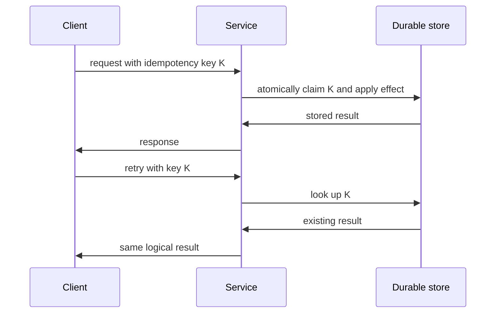

# Exactly-Once Semantics, Transactions, and Distributed Systems Interviews

## 1. Why “Exactly Once” Is Difficult

Across a network, a sender can time out after transmitting a request. It cannot know whether the receiver:

```text
did not receive it
received it but did not process it
processed it but did not persist result
persisted result but response was lost
processed it, responded, then client retried anyway
```

The receiver may also crash between any two local steps. Network delivery and business effect are different guarantees.

## 2. Delivery Semantics

| Label | Meaning | Main risk |
|---|---|---|
| at-most-once | do not retry after uncertain delivery | lost work |
| at-least-once | retry until acknowledged/expired | duplicate work |
| exactly-once delivery | one transport delivery under defined system boundary | difficult and limited scope |
| effectively-once effect | duplicates tolerated but one durable business effect | requires idempotency/deduplication |

Always ask: exactly once of what, between which components, for how long, under which crash/recovery assumptions?

## 3. Idempotency

An idempotent operation can be repeated without changing the intended final effect after the first successful application.

```text
set account email to value X -> repeating leaves X
create charge for request X -> must not create two charges
increment counter -> repeating changes result, not idempotent by default
```

Idempotency is often the practical foundation for reliable APIs and consumers.

## 4. Idempotency Key



The key needs scope, expiration/retention, payload consistency rules, authorization binding, durable atomic storage, and safe response replay behavior.

## 5. Payload Mismatch

If the same idempotency key arrives with different request content, do not silently accept it as the same operation.

Typical policy:

```text
same key + same canonical request identity -> return prior result
same key + incompatible request identity -> reject conflict
```

Canonicalization must be carefully defined. Never use weak hashing or silent normalization that merges distinct business requests.

## 6. Deduplication Table

A consumer can store processed message ID and durable effect in one local transaction.

```text
begin transaction
    insert message ID if absent
    if already present: stop as duplicate
    apply business update
commit transaction
acknowledge broker message
```

If the consumer crashes before acknowledgment, redelivery finds the stored ID and does not repeat the business effect.

The deduplication store must retain identifiers for at least the broker's possible redelivery/replay window. Infinite retention is costly; short retention can re-enable duplicates.

## 7. Inbox and Outbox


Inbox protects consuming side effects. Outbox protects publishing after local state change. Together they create an effectively-once local processing pattern, not magic global exactly-once across arbitrary systems.

## 8. Transactions

A database transaction can atomically update data within its defined resource manager.

```text
transaction boundary: account row + idempotency row + outbox row
outside boundary: message broker, email provider, payment gateway, external HTTP service
```

Do not claim a local database transaction atomically commits an external email or a remote HTTP call.

## 9. Two-Phase Commit

Two-phase commit coordinates several resource managers:

```text
prepare: participants promise they can commit
commit: coordinator tells all participants to commit
```

It can provide stronger atomicity under assumptions but introduces blocking, coordinator failure concerns, operational complexity, latency, and limited participant support. Many service architectures prefer local transactions plus outbox, idempotency, compensation, and reconciliation.

## 10. Saga

A saga coordinates a multi-step business workflow through local transactions and compensating actions.

```text
reserve inventory
    -> charge payment
    -> arrange shipment
failure after payment
    -> compensate: refund payment
    -> compensate: release inventory
```

Compensation is a new business action, not a time machine. It can fail, be delayed, or be only partially reversible. Model visible intermediate states and reconciliation.

## 11. Exactly-Once in Kafka

Kafka can provide specific exactly-once processing guarantees within carefully configured Kafka producer/transaction/consumer boundaries. These guarantees have scope and do not automatically make arbitrary external database writes, emails, or HTTP calls exactly once.

For external effects, use idempotency, transactional outbox/inbox, unique constraints, and reconciliation. State the boundary explicitly in interviews.

## 12. Unique Constraints as Deduplication

A database unique constraint can make one business identity claim atomic:

```text
one payment per merchant reference
one fulfillment per order line
one processed event ID per consumer scope
```

Constraints are simple, durable, and valuable. They need a correctly chosen key and error handling that distinguishes duplicate from unrelated database failure.

## 13. Ordering and Exactly Once

Deduplication does not guarantee order. If order matters:

- partition by the entity whose sequence matters;
- include version/sequence number;
- reject or buffer unexpected gaps according to policy;
- make handlers resilient to duplicate and late events;
- define how long gaps are waited for and how repair happens.

Global ordering is expensive and often unnecessary.

## 14. Idempotent Consumer Patterns

| Pattern | Good for | Limitation |
|---|---|---|
| natural idempotency | set desired state | not every operation has one |
| unique business key | create-once domain effect | key design required |
| processed-message table | generic consumer effect | storage/retention required |
| compare version | ordered state updates | gaps/out-of-order policy required |
| commutative operation | counters/sets with suitable model | semantics may not fit domain |

## 15. Reconciliation

Even well-designed systems need repair:

```text
periodically compare source-of-truth state with downstream effect
find missing/duplicate/inconsistent records
replay or compensate with audit trail
```

Reconciliation handles bugs, expired dedup state, manual intervention, broker outages, and external-system failures. It is a core reliability feature for critical workflows.

## 16. Observability for Reliable Delivery

Track:

- request/idempotency key or message ID, subject to privacy policy;
- correlation and causation IDs;
- producer time, receive time, processing time;
- retry count/reason;
- duplicate detection count;
- consumer lag and dead-letter count;
- outbox backlog/age;
- transaction failures;
- reconciliation mismatches;
- business result state.

Do not expose sensitive identifiers unnecessarily. Use bounded metric labels; place high-cardinality correlation IDs in traces/logs with access controls.

## 17. Interview Questions

### Is exactly-once delivery possible?

It is possible only within carefully defined protocol/system boundaries and assumptions. Across arbitrary networks and external side effects, the practical goal is usually at-least-once delivery plus idempotent/effectively-once processing.

### How do you make payment creation safe under retries?

Bind a client idempotency key to authenticated caller and canonical request identity, atomically persist the key and payment result with a unique business constraint, return the stored result for same-key retries, reject mismatched reuse, and reconcile external processor state.

### What is an outbox pattern?

Write domain state and a publishable event record in one local transaction, then relay it asynchronously. It prevents lost event records after state commit but requires duplicate-safe publishing/consuming.

### Why is a broker acknowledgment not enough?

Acknowledging may say a consumer received a message, not that its business effect is durable. Ack timing must be coordinated with the durable effect and deduplication strategy.

### Saga versus distributed transaction?

A saga uses local transactions and compensations for a business workflow. A distributed transaction seeks atomic commit across participants. They have different failure, blocking, latency, and operational tradeoffs.

## 18. CAP and Delivery Semantics Together

During partitions, a service may need to reject a mutation rather than risk conflicting duplicate/ordered effects, or accept it with a conflict/reconciliation model. Exactly-once language does not remove the CAP/coordination tradeoff.

## 19. Interview Practice Prompts

1. Design an order system that reserves inventory, charges payment, and sends notification.
2. Explain how a Kafka consumer updates a database without losing or duplicating business effect.
3. Explain what happens when a client times out after a server commits a mutation.
4. Compare at-most-once, at-least-once, and effectively-once with examples.
5. Design dedup retention for a replayable event stream.
6. Explain why a unique database constraint can be better than a distributed lock.
7. Explain how to recover from a failed outbox relay.
8. Explain why “exactly once” must name a boundary.

## 20. Common Interview Mistakes

- claiming TCP gives exactly-once business processing;
- calling broker acknowledgment a committed business effect;
- using a cache lock as durable deduplication;
- retrying mutations without idempotency key/unique constraint;
- assuming a timeout means no side effect occurred;
- treating compensation as guaranteed rollback;
- ignoring dedup retention/replay windows;
- claiming Kafka exactly-once covers arbitrary external services;
- forgetting reconciliation and audit paths.

## Final Rules

- name the exact boundary and effect for every delivery guarantee;
- prefer at-least-once transport plus idempotent durable business effects;
- bind idempotency keys to request identity and authorization;
- make deduplication and business update atomic locally;
- use outbox/inbox patterns for reliable cross-system messaging;
- use unique constraints where domain identity permits;
- design ordering separately from deduplication;
- include reconciliation for critical workflows;
- observe retries, duplicates, lag, outbox age, and mismatches;
- never promise global exactly-once without precise protocol scope.

