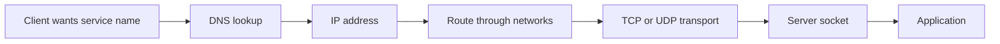
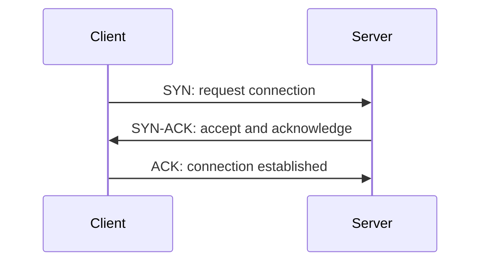
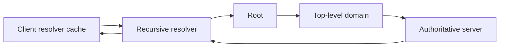

# TCP/IP, UDP, DNS, and Connection Behavior

## 1. Request Journey



Every stage can add latency or fail independently.

## 2. Layered Model

| Layer | Main responsibility | Examples |
|---|---|---|
| application | user-visible protocol and data | HTTP, DNS, gRPC, WebSocket |
| transport | communication between endpoints/ports | TCP, UDP, QUIC |
| internet/network | addressing and routing across networks | IP, ICMP |
| link | delivery on one local network | Ethernet, Wi-Fi |

Layers are abstractions, not walls. An HTTP client must still understand timeouts, DNS, TLS, and transport behavior.

## 3. IP Addressing

An IP address identifies a network interface endpoint for routing. A port identifies a transport-level service endpoint on that address.

```text
destination = IP address + transport protocol + port

example shape: client ephemeral port -> server address:service port
```

NAT, firewalls, load balancers, proxies, containers, and service meshes can change the apparent addresses and ports along the path.

## 4. Packets, Datagrams, and Frames

Data crosses layers with headers added/removed:

```text
application message
    -> transport segment/datagram
    -> IP packet
    -> link frame
    -> physical transmission
```

Maximum transmission units (MTUs) limit frame/packet size. Oversized packets can fragment or fail depending on path and configuration.

## 5. TCP in Simple Words

TCP provides a reliable, ordered byte stream between two endpoints.

It provides:

- connection setup;
- sequence numbers and acknowledgments;
- retransmission of loss;
- in-order delivery to the application;
- flow control based on receiver capacity;
- congestion control based on network conditions;
- connection teardown.

It does not provide message boundaries, application-level exactly-once processing, or end-to-end business transaction semantics.

## 6. TCP Handshake



The handshake establishes sequence-number state and confirms both directions can communicate. TLS may add another handshake above TCP.

## 7. TCP Byte Stream

```text
sender writes:  [message A][message B]
receiver reads: [part of A] then [rest of A + part of B]
```

TCP preserves byte order, not application message boundaries. HTTP, gRPC, database protocols, and custom protocols must define framing.

## 8. Flow Control

Flow control prevents a fast sender from overwhelming a receiver's buffer capacity.

```text
receiver advertises available window
sender limits unacknowledged data accordingly
```

It protects one endpoint. It is different from congestion control, which protects the network path.

## 9. Head-of-Line Blocking in TCP

If one earlier TCP segment is lost, later bytes cannot be delivered to the application until the missing segment arrives because TCP must preserve order.

```text
segments: 1 arrives, 2 lost, 3 arrives
application receives: 1, then waits for 2 before 3
```

This is transport-level head-of-line blocking. HTTP/2 removes some application-level blocking but still commonly uses one ordered TCP stream, so loss can affect multiplexed streams.

## 10. TCP Connection Teardown

Each direction closes independently. States such as `TIME_WAIT` exist to handle delayed packets and reliable connection shutdown semantics.

High connection churn can create port, file-descriptor, handshake, and `TIME_WAIT` pressure. Reuse connections when protocol/server policy supports it, but bound pool size and lifetime.

## 11. UDP in Simple Words

UDP sends independent datagrams with minimal transport semantics.

UDP does not guarantee:

- delivery;
- ordering;
- deduplication;
- congestion control at the UDP layer;
- connection establishment.

```text
send datagram A
send datagram B
receiver may get B, A, duplicates, or neither
```

Applications/protocols using UDP must decide which guarantees they need. QUIC is one example of a protocol that builds reliability and congestion control over UDP.

## 12. When UDP Fits

Possible fits:

- real-time media where late data is less useful than missing data;
- DNS transport in common simple queries;
- game/state updates with application-specific loss handling;
- QUIC transport;
- discovery protocols in controlled networks.

Use UDP only when the protocol explicitly handles size, loss, ordering, authentication, amplification, backpressure, and congestion behavior.

## 13. DNS in Simple Words

DNS maps names to records such as addresses, mail routes, aliases, and service metadata.



In normal use, a client asks a recursive resolver, which uses cached or authoritative answers.

## 14. Important DNS Records

| Record | Meaning |
|---|---|
| A | IPv4 address |
| AAAA | IPv6 address |
| CNAME | alias to another name |
| MX | mail routing |
| TXT | text metadata, often verification/policy |
| NS | authoritative name server |
| SRV | named service location |
| CAA | certificate-authority authorization policy |

## 15. DNS Caching and TTL

A time-to-live (TTL) tells resolvers how long an answer may be cached.

```text
low TTL -> changes propagate sooner, more resolver queries
high TTL -> lower query load, slower change propagation
```

Caching exists in browsers, operating systems, application runtimes, recursive resolvers, and load balancers. A record update is not an instant global switch.

## 16. Negative Caching

“Name does not exist” responses can also be cached. Creating a new record after a failed lookup may still not become visible immediately to clients with cached negative results.

Plan DNS changes with staged validation, TTL awareness, rollback, and observability.

## 17. DNS Security

- DNS data is not automatically confidential;
- spoofing/cache poisoning is a risk without appropriate protections;
- DNSSEC provides authenticity for signed zones but adds operational complexity;
- encrypted resolver transports can protect client-to-resolver traffic;
- never trust a DNS name as authorization by itself;
- SSRF-sensitive systems must validate resolved destinations and redirect behavior.

## 18. Timeouts

A request can wait at several layers:

```text
DNS resolution timeout
connection timeout
TLS handshake timeout
request/write timeout
first-byte timeout
idle/read timeout
overall deadline
```

One generic “HTTP timeout” often hides these different failure modes. Define a complete deadline budget and propagate cancellation.

## 19. Interview Questions

### TCP versus UDP?

TCP provides an ordered reliable byte stream with flow/congestion control. UDP provides independent best-effort datagrams. Choose from required protocol semantics, not presumed speed.

### Does TCP preserve messages?

No. It preserves ordered bytes. The application protocol must frame messages.

### What is the TCP handshake for?

It establishes connection and sequence state and confirms two-way communication before data transfer.

### What is DNS TTL?

The cache lifetime permitted for a DNS record. It trades propagation speed against cache/query behavior across many caching layers.

### Why can a name resolve differently for different clients?

They may use different caches, recursive resolvers, network views, address families, split-horizon policy, or load-balancing answers.

## 20. Request Diagnosis

```text
name fails -> inspect resolver, record, cache, network policy
connect fails -> inspect address, route, firewall, listener, load balancer
connect slow -> inspect DNS, handshake, packet loss, saturation
request hangs -> inspect protocol framing, server work, flow control, timeout
intermittent -> inspect retries, pools, stale DNS, load balancing, loss
```

## Final Rules

- trace a request across DNS, IP, transport, TLS, and application layers;
- TCP is a byte stream, not a message queue;
- UDP requires explicit reliability and safety design when needed;
- distinguish flow control from congestion control;
- treat DNS as cached distributed data;
- use explicit timeouts/deadlines for every connection phase;
- validate network destinations and bound every external request.

