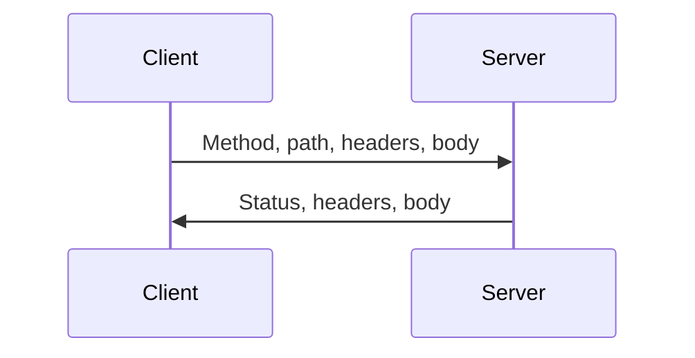
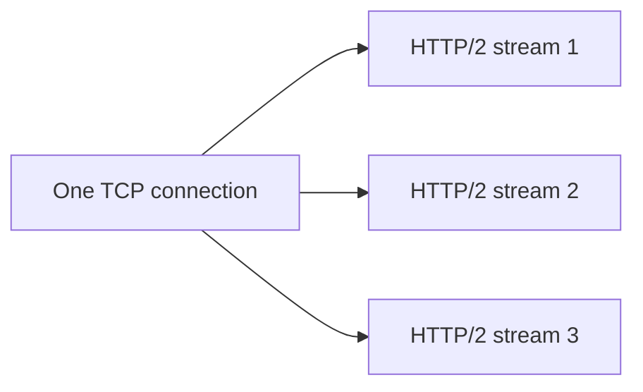
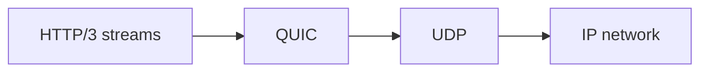

# HTTP/1.1, HTTP/2, HTTP/3, QUIC, WebSockets, and gRPC

## 1. Protocol Choice Starts with Requirements

```text
request/response document API -> HTTP
bidirectional long-lived updates -> WebSocket or streaming RPC
typed internal service calls -> often gRPC
browser/client compatibility -> HTTP and WebSocket constraints matter
loss-sensitive multiplexing -> consider HTTP/3/QUIC support
```

Choose based on client ecosystem, traffic shape, observability, security, proxies, streaming, and operational maturity—not fashionable protocol names.

## 2. HTTP Request/Response Model



HTTP defines semantics such as methods, status codes, headers, content representation, caching, authentication patterns, and intermediaries.

## 3. HTTP Method Semantics

| Method | Typical intent | Safe | Idempotent |
|---|---|---|---|
| GET | retrieve representation | yes | yes |
| HEAD | retrieve headers only | yes | yes |
| PUT | replace/create at known target | no | usually yes |
| DELETE | request removal | no | usually yes by intended final state |
| POST | submit/process/create action | no | not inherently |
| PATCH | partial update | no | depends on design |

Idempotent means repeating a successful request has the same intended final effect. It does not mean the response, logging, or timing is identical.

## 4. HTTP/1.1

HTTP/1.1 commonly uses persistent TCP connections so several sequential requests can reuse one handshake.

```text
connection
    request 1 -> response 1
    request 2 -> response 2
```

Pipelining existed but saw limited deployment because response ordering and intermediary behavior complicated it. Clients often opened multiple TCP connections to increase parallel resource loading, which costs handshakes and congestion state.

## 5. HTTP/1.1 Head-of-Line Blocking

On one HTTP/1.1 connection, a slow earlier response can delay later responses because ordering is required. Multiple connections reduce application-level blocking but add resource overhead.

TCP loss also causes transport-level blocking for bytes in one connection.

## 6. HTTP/2

HTTP/2 uses binary framing and multiplexes streams over one TCP connection.



Benefits include multiplexing, header compression, stream prioritization mechanisms, and efficient long-lived connections.

Each stream has its own logical request/response flow, but all bytes usually share TCP's ordered stream. Packet loss can therefore still affect multiple HTTP/2 streams at the transport layer.

## 7. HTTP/2 Flow Control

HTTP/2 adds stream and connection flow control. A sender must respect both levels to avoid overwhelming a peer.

Application code still needs bounded streaming and cancellation. Protocol flow control does not choose business-level queue limits for you.

## 8. HTTP/3 and QUIC

HTTP/3 uses QUIC instead of TCP as its transport. QUIC runs over UDP but provides reliable streams, encryption integration, congestion control, and connection management in user-space protocol logic.



QUIC streams can make independent progress when another stream has lost data, reducing the TCP transport-level cross-stream head-of-line effect.

## 9. QUIC Properties

QUIC commonly provides:

- multiplexed streams;
- stream-level loss recovery behavior;
- integrated TLS 1.3 handshake protection;
- connection identifiers that can support path migration;
- user-space evolution compared with kernel TCP stacks;
- congestion control and flow control.

It still experiences packet loss, congestion, NAT/firewall issues, CPU overhead for encryption, and deployment/proxy compatibility constraints.

## 10. 0-RTT Tradeoff

QUIC/TLS resumption can permit early data in some cases. Early data can be replayed by an attacker under relevant conditions.

Only idempotent, replay-safe operations should be eligible. Authentication, payment, mutation, and side effects need careful protocol policy.

## 11. WebSockets

WebSocket starts with an HTTP upgrade handshake and then provides a persistent full-duplex message channel.

```mermaid
sequenceDiagram
    participant C as Client
    participant S as Server
    C->>S: HTTP upgrade request
    S->>C: Upgrade accepted
    C<->>S: WebSocket frames/messages
```

It is useful for chat, live dashboards, collaborative editing, and server-pushed updates.

## 12. WebSocket Operational Rules

- authenticate and authorize at connection setup and message level as required;
- validate every message type, size, and rate;
- implement heartbeats/idle timeout according to environment;
- bound outbound queues for slow clients;
- handle reconnect, duplicate delivery, and missed messages;
- shard/balance connections deliberately;
- do not keep unbounded per-connection state;
- define close codes and shutdown behavior.

WebSocket delivers a channel, not a complete distributed-consistency solution.

## 13. gRPC

gRPC commonly uses Protocol Buffers for schemas and HTTP/2 for transport. It supports unary, server-streaming, client-streaming, and bidirectional-streaming RPCs.

```text
schema -> generated typed client/server contracts
client call -> HTTP/2 stream -> server handler -> status/trailers
```

The schema gives efficient binary serialization and explicit contracts. It does not remove timeouts, retries, authentication, versioning, load balancing, or partial failure.

## 14. gRPC Streaming

Streaming can reduce buffering and enable long-lived flows, but it needs:

- deadlines and cancellation;
- flow-control awareness;
- bounded message sizes;
- application acknowledgments where needed;
- reconnect/resume semantics;
- observability per stream;
- compatibility/versioning policy.

Do not use streaming merely to avoid defining pagination or completion rules.

## 15. HTTP Status and RPC Status

Transport status and application result should be distinguished.

```text
HTTP/gRPC transport succeeded
    does not automatically mean the business action committed

business action reported success
    must still be designed for retries/duplicate requests as needed
```

Return clear public error codes and keep internal causes protected from clients.

## 16. Compression

Compression can reduce bandwidth but costs CPU and can create security risk when secrets and attacker-controlled content are compressed together in certain contexts.

Use only supported compression, bound decompressed size, and protect against decompression bombs. Measure end-to-end effect rather than assuming smaller bytes always mean faster requests.

## 17. Intermediaries

Requests may traverse proxies, API gateways, CDNs, service meshes, or load balancers.

They can terminate TLS, rewrite headers, retry, cache, buffer, limit bodies, enforce authentication, and alter source-address visibility.

Trust forwarded headers only from known configured proxies. Preserve request identity/tracing safely and prevent spoofed client identity.

## 18. Interview Questions

### HTTP/1.1 versus HTTP/2?

HTTP/1.1 commonly handles sequential request/response behavior per connection. HTTP/2 multiplexes framed streams over one TCP connection, reducing application-level connection blocking but retaining TCP loss coupling.

### HTTP/2 versus HTTP/3?

HTTP/2 generally runs over TCP. HTTP/3 runs over QUIC/UDP, so independent streams can avoid TCP's cross-stream transport-level head-of-line blocking under loss.

### Is WebSocket better than HTTP?

They solve different communication shapes. WebSocket provides a persistent bidirectional channel; HTTP is strong for request/response, caching, broad tooling, and many APIs.

### Why use gRPC?

It offers schema-based typed RPC and streaming, often efficient for internal service communication. It requires operational support for HTTP/2, schema evolution, deadlines, load balancing, and observability.

### Does QUIC make UDP reliable?

QUIC is a separate protocol built over UDP that implements reliability, ordering per stream, congestion control, encryption, and connection semantics. Raw UDP remains best-effort datagrams.

## Final Rules

- protocol choice follows traffic and operational requirements;
- TCP/HTTP streams still need framing, deadlines, and backpressure;
- HTTP/2 multiplexing does not eliminate TCP loss coupling;
- HTTP/3/QUIC changes transport behavior but not distributed failure;
- WebSockets need explicit lifecycle, security, and slow-client policy;
- gRPC schemas do not remove retry/idempotency/versioning design;
- bound every message, stream, connection, and queue.

