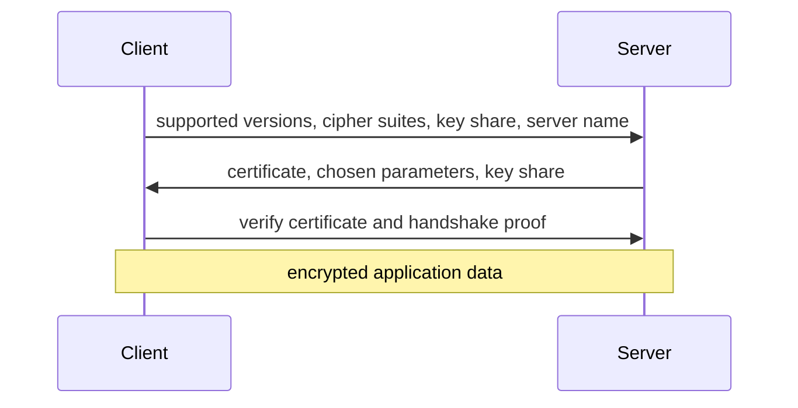
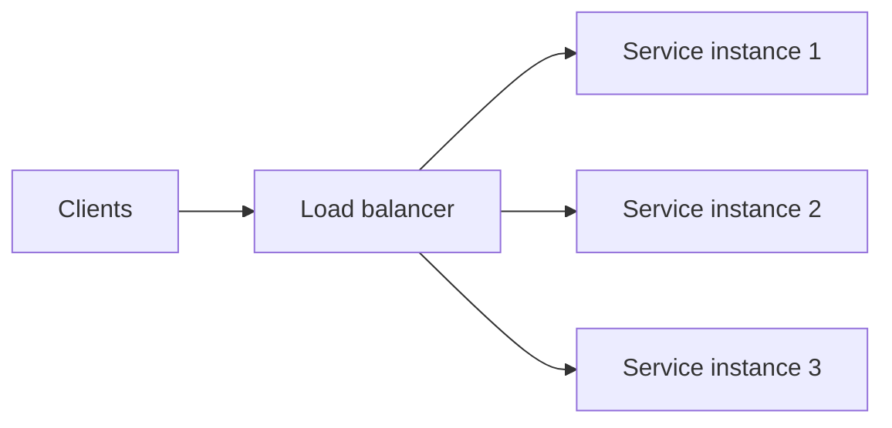
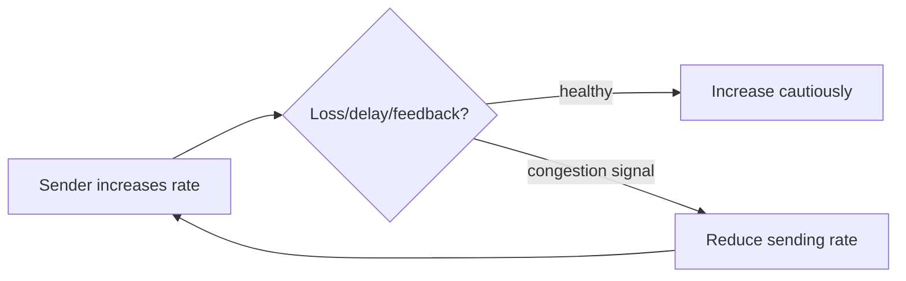

# TLS, Load Balancing, Congestion Control, and Production Reliability

## 1. TLS in Simple Words

TLS protects data in transit between endpoints. It aims to provide:

- authentication of the server, and optionally client;
- confidentiality through encryption;
- integrity against undetected modification;
- forward secrecy with modern ephemeral key exchange.



The exact handshake is protocol-version dependent. TLS 1.3 simplifies and strengthens modern negotiation compared with older designs.

## 2. Certificate Validation

When connecting to a server, a client should validate:

- certificate chain reaches a trusted authority;
- hostname/SAN matches the intended server name;
- certificate is within validity period;
- key usage and constraints are appropriate;
- revocation/policy behavior follows client/environment rules;
- protocol version and cipher policy meet security requirements.

Never disable certificate verification to “fix” a connection error in production. Find the incorrect name, trust chain, proxy, clock, or deployment configuration.

## 3. TLS Termination

TLS can terminate at a load balancer, gateway, sidecar, or application server.

```text
client -- TLS --> edge proxy -- protected internal transport --> service
```

Termination can centralize certificates and policy, but changes the trust boundary. Internal hops still need suitable encryption, authentication, network policy, and header trust rules.

## 4. Mutual TLS

Mutual TLS (mTLS) requires both client and server to present identities through certificates.

It can provide strong workload authentication, but certificate issuance, rotation, revocation, authorization mapping, observability, and incident response become operational requirements.

Authentication is not authorization. A valid client identity still needs permission checks for the action.

## 5. Session Resumption

TLS resumption can reduce handshake work for returning clients. It improves latency but introduces ticket/key rotation, replay considerations for early data, and load-balancer affinity/state choices.

Do not assume every connection is resumed. Capacity plan for full handshakes and certificate validation too.

## 6. Load Balancing in Simple Words

Load balancing distributes requests/connections across healthy capacity.



It can happen at DNS, network transport, HTTP gateway, service mesh, client library, or application shard-routing layer.

## 7. Layer 4 and Layer 7 Balancing

| Layer | Sees | Typical decisions |
|---|---|---|
| L4 transport | address, port, connection | TCP/UDP connection distribution |
| L7 application | HTTP path, host, headers, cookies, method | routing, auth, retries, caching, rate limits |

L7 has richer routing but may terminate protocols and add CPU/latency. L4 preserves more end-to-end transport behavior but has less application context.

## 8. Balancing Algorithms

- round robin: cycle across endpoints;
- weighted round robin: favor larger capacity;
- least connections/requests: choose less active endpoint;
- least response time: use measured latency;
- random with power of two choices: compare two random candidates;
- consistent hash: route related keys to stable endpoints;
- locality-aware: prefer nearby zone/node.

Every algorithm needs accurate health, capacity, and overload signals. A slow endpoint can look idle if requests are queued elsewhere.

## 9. Health Checks

```text
liveness: process should be restarted?
readiness: instance can receive this traffic now?
startup: initialization complete?
dependency health: downstream state, not always a reason to restart
```

Health checks must be cheap, bounded, authenticated where appropriate, and resistant to causing retry storms. Removing an instance from traffic must allow existing connections/work to drain according to policy.

## 10. Connection Draining

During deployment or scale-in:

```text
mark instance not ready
    -> stop new connections/requests
    -> allow existing work within deadline
    -> close remaining work deliberately
    -> terminate instance
```

Without draining, a healthy deployment can create avoidable client failures and retry load.

## 11. Retries and Load Balancers

Retries can improve transient failure handling but multiply traffic.

```text
client retries + proxy retries + service retries
    -> duplicate requests
    -> overload during failure
    -> worse latency and more failures
```

Define one coordinated retry policy with deadlines, backoff, jitter, idempotency, retry budget, and observability. Do not retry unsafe mutations without an idempotency design.

## 12. Congestion Control

Congestion control prevents senders from overwhelming the network path.



TCP and QUIC implement congestion-control algorithms. Their details evolve, but the core principle is shared capacity and feedback-driven sending.

## 13. Flow Control Versus Congestion Control

```text
flow control:      receiver says how much it can buffer/process
congestion control: network path signals safe sending rate
application backpressure: service chooses its own queue/concurrency limits
```

All three can limit throughput for different reasons. Tuning one does not fix the others.

## 14. Bandwidth-Delay Product

The bandwidth-delay product estimates data that must be in flight to fully use a path.

```text
bandwidth-delay product = path bandwidth × round-trip time
```

High-bandwidth, high-latency paths need enough window/in-flight data to maintain throughput. Large buffers also increase memory and can worsen queueing delay, so they must be bounded and measured.

## 15. Bufferbloat

Oversized queues can keep links busy but add large latency under load.

```text
arrival rate exceeds service rate
    -> queue grows
    -> latency grows
    -> timeouts/retries increase
    -> more load arrives
```

Bound queues, shed load, prioritize critical traffic, and measure tail latency. “Never drop” is often incompatible with finite memory and reliable latency.

## 16. Rate Limiting

Rate limiting protects a service or tenant quota.

Common models:

- token bucket: permits bursts up to capacity with average refill rate;
- leaky bucket: smooths output rate;
- fixed window: simple but boundary bursts;
- sliding window: more precise, higher state cost;
- concurrency limit: bounds in-flight work rather than arrival rate.

Choose a key: client identity, tenant, route, credential, endpoint, or global capacity. Validate identity before trusting it as a limiter key.

## 17. Timeouts and Deadlines

```text
client deadline
    -> gateway gets smaller remaining budget
    -> service gets smaller remaining budget
    -> database/remote calls get smaller remaining budget
```

Propagated deadlines prevent work that can no longer produce a useful response. Avoid each layer giving itself a full independent timeout; total latency can exceed the user-facing deadline.

## 18. Observability

Measure at least:

- DNS time;
- connect and TLS handshake time;
- request/response latency distribution;
- status/error/timeout rate;
- retry count and cause;
- load-balancer endpoint selection and health;
- active connections and queue depth;
- bytes in/out;
- congestion/loss evidence where available;
- per-route/tenant metrics with bounded label cardinality.

Never place raw secrets, authorization headers, or unbounded user values in logs or metric labels.

## 19. Interview Questions

### What does TLS provide?

Authentication, confidentiality, and integrity for a connection when certificate validation and endpoint configuration are correct. It does not authorize every application action by itself.

### L4 versus L7 load balancer?

L4 routes transport connections using network information. L7 understands application protocol fields such as HTTP host/path and can apply richer policies at additional complexity/cost.

### What is congestion control?

A transport mechanism that adjusts sending rate from network feedback to avoid overwhelming shared paths. It differs from receiver flow control and application backpressure.

### Why use jitter with retries?

It prevents many clients from retrying in synchronized bursts, which can repeatedly overload a recovering dependency.

### What is connection draining?

Stop new traffic to an instance while allowing existing work to finish within a deadline before shutdown.

## Final Rules

- validate TLS certificates and hostnames; do not disable verification;
- define the trust boundary when TLS terminates;
- balance using measured health, capacity, and overload signals;
- drain instances before shutdown;
- coordinate retries across layers and require idempotency where needed;
- distinguish flow control, congestion control, and application backpressure;
- propagate deadlines and bound queues;
- observe every phase of a request without leaking secrets.

