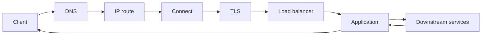

# Networking Interview Preparation and Request Diagnosis

## 1. End-to-End Request Map



When a request is slow or failing, locate the stage before changing a timeout or adding a retry.

## 2. Answer Pattern

```text
definition -> protocol mechanism -> tradeoff -> failure mode -> measurement
```

Example for HTTP/2:

```text
HTTP/2 multiplexes framed streams over one TCP connection.
It reduces application-level connection blocking and header overhead.
All streams still share TCP's ordered transport, so packet loss can delay them.
I would measure protocol negotiation, loss, stream latency, connection reuse, and proxy behavior before deciding HTTP/3 is needed.
```

## 3. Beginner Questions

### What happens when you enter a URL?

The client resolves the name, selects an address/route, establishes transport connection state, negotiates TLS for HTTPS, sends an HTTP request, receives a response, and renders/uses it. Caches, proxies, load balancers, redirects, and additional resource requests can add steps.

### IP address versus port?

An IP address routes to a network interface. A port identifies a transport service endpoint on that address.

### TCP versus UDP?

TCP is an ordered reliable byte stream with control mechanisms. UDP is best-effort datagrams; any additional reliability/ordering must be designed by a higher protocol.

### What is DNS?

It is a distributed, cached naming system that maps names to records such as addresses and aliases.

## 4. Intermediate Questions

### Why does TCP need framing above it?

TCP delivers ordered bytes, not application messages. The application protocol must delimit or length-prefix messages safely.

### What is head-of-line blocking?

Work is delayed behind earlier work. It can occur in HTTP/1.1 response ordering, TCP ordered delivery after loss, queues, and other layers. State the layer when answering.

### Why are retries dangerous?

They can duplicate mutations and amplify load during outage. Use deadlines, bounded attempts, backoff, jitter, idempotency, and retry budgets.

### What is a load balancer?

It distributes traffic across healthy capacity. Discuss layer, health checks, connection draining, algorithm, overload behavior, and observability.

## 5. Advanced Questions

### HTTP/2 versus HTTP/3?

HTTP/2 multiplexes application streams over TCP. HTTP/3 uses QUIC, which has independent streams over UDP and can avoid TCP's cross-stream transport-level blocking under loss. Both still need flow control, backpressure, TLS/security, and operational support.

### Explain congestion control.

Transport senders adapt their in-flight sending rate from feedback such as acknowledgment, delay, and loss so they do not overwhelm shared network capacity. It is different from a receiver's buffer window.

### Explain TLS termination risk.

Terminating TLS at a proxy creates a trust boundary. Traffic and identity headers after that point require protected transport, known proxy configuration, authentication/authorization, and safe forwarded-header handling.

### Why can a request time out while the server still completes it?

The client deadline may expire while work is queued, executing, or its response is lost/delayed. The server needs cancellation propagation and idempotency/deduplication policy; the client cannot infer non-execution from timeout alone.

## 6. Debugging Scenarios

### DNS works intermittently

Check resolver differences, TTL/caches, record consistency, IPv4/IPv6 paths, split-horizon rules, negative caching, authoritative health, and client resolver timeout/fallback behavior.

### Connection refused

Check target address/port, listener binding, service readiness, firewall/security group, load-balancer target registration, container port mapping, and whether the protocol expects TLS or plain transport.

### Connection timeout

Check route, firewall drop behavior, packet loss, overloaded accept queue, exhausted file descriptors, stale address, unhealthy endpoint, and connection-pool queueing.

### High p99 latency but good average

Check queue buildup, slow endpoints, tail loss/retransmission, DNS misses, TLS handshakes, GC/page faults, connection-pool saturation, retries, load imbalance, and downstream tail latency.

### WebSocket clients disconnect under load

Check idle/heartbeat policy, proxy timeouts, file-descriptor/connection limits, slow-client queue growth, event-loop lag, deployment draining, and reconnect storms.

## 7. Design Prompts

1. Design a safe retry policy for an idempotent read and a non-idempotent payment.
2. Explain how to migrate traffic between two regions using DNS and load balancers.
3. Design slow-client backpressure for a WebSocket dashboard.
4. Explain when HTTP/2 is sufficient and when HTTP/3 evaluation is justified.
5. Design client deadlines across gateway, service, and database calls.
6. Explain how to secure service-to-service traffic with mTLS and authorization.
7. Diagnose a service that succeeds locally but times out through the production load balancer.

## 8. Common Interview Mistakes

- saying UDP is always faster instead of discussing semantics and workload;
- calling TCP message-oriented;
- claiming HTTP/2 removes all head-of-line blocking;
- treating TLS as authorization;
- retrying every timeout without idempotency;
- using average latency as the only SLO metric;
- trusting forwarded client-IP headers from any caller;
- ignoring DNS caches during a cutover;
- equating a healthy process with readiness for traffic.

## 9. Final Checklist

- identify the layer where a guarantee exists;
- separate network failure, transport failure, application failure, and business outcome;
- state timeout, retry, and idempotency behavior together;
- explain load balancing with health and draining;
- mention bounded queues/connections and observability;
- end every design answer with failure handling and measurement.

[Return to the networking roadmap](00-networking-roadmap.md)

