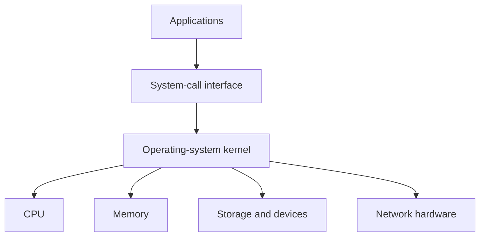
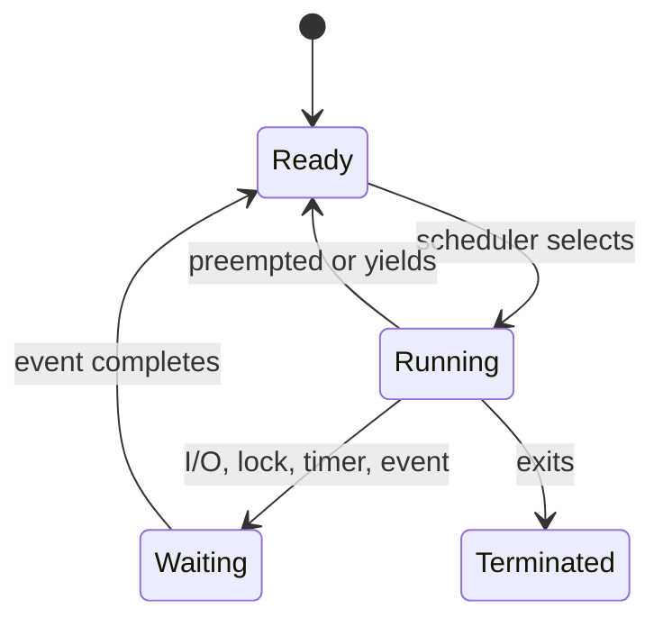
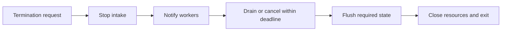

# Processes, Threads, Scheduling, Context Switching, and Signals

## 1. Operating System in Simple Words

The operating system shares hardware safely among programs. It schedules CPU time, manages memory and files, provides networking, and enforces permissions.



## 2. Process

A process is an executing program with its own virtual address space, resources, credentials, and operating-system identity.

Typical process-owned resources:

- virtual memory mappings;
- open file/socket handles;
- environment and working directory;
- security identity/capabilities;
- one or more threads;
- signal disposition and process-wide state.

```text
web service process
    address space
    open sockets
    thread A: request work
    thread B: background work
```

## 3. Thread

A thread is a schedulable execution path inside a process. Threads in one process normally share code, heap, open resources, and global state, but each has its own registers, stack, and scheduling state.

```text
one process
    shared heap and file descriptors
    thread 1 stack and registers
    thread 2 stack and registers
```

Threads are cheaper to communicate between than processes, but shared memory introduces synchronization and lifetime hazards.

## 4. Process Versus Thread

| Question | Process | Thread |
|---|---|---|
| Memory isolation? | yes by default | no within one process |
| Crash isolation? | usually stronger | one process can fail together |
| Startup cost? | higher | lower |
| Communication? | IPC/serialization/shared memory | direct shared objects with synchronization |
| Suitable for | isolation, CPU workers, separate services | coordinated in-process concurrency |

## 5. User Mode and Kernel Mode

Applications normally execute in user mode with restricted privileges. A system call enters kernel mode so the OS can perform protected work such as reading a file, creating a socket, or mapping memory.

```text
application requests read
    -> system call
    -> kernel validates and starts/serves I/O
    -> result returns to application
```

System calls are not free. They can include validation, mode transition, scheduling, copying, and device interaction. Batch work when it improves a real measured path.

## 6. Process States



The exact state names vary by OS, but ready/running/waiting/terminated is a useful model.

## 7. Scheduling

The scheduler decides which runnable thread gets a CPU and for how long. Goals conflict:

- responsiveness for interactive work;
- fairness among runnable work;
- throughput for batch work;
- priority/latency guarantees where required;
- energy efficiency;
- cache locality and reduced migration;
- preventing starvation.

Schedulers are implementation-specific. Do not assume a fixed time slice or strict priority behavior without platform evidence.

## 8. Preemptive and Cooperative Scheduling

- Preemptive: the OS can interrupt a running thread to schedule another.
- Cooperative: code must voluntarily yield; common inside event loops or user-space runtimes.

```text
preemptive OS thread: scheduler can stop it
async task: event loop usually switches at explicit await/yield points
```

Blocking a cooperative event loop delays every task sharing it.

## 9. Context Switch

A context switch changes the active thread or process.

```text
save current registers/program counter
choose next runnable thread
restore next thread registers/program counter
resume next thread
```

It can also disrupt caches, TLB entries, branch prediction, and CPU locality. A context switch is necessary work, but excessive runnable threads or blocking patterns can make it a meaningful cost.

## 10. Thread Migration

Moving a thread to another CPU can balance load but loses warm cache locality. On NUMA machines it can also turn local-memory access into remote-memory access.

Use CPU affinity only when measured benefit and operational topology justify it. Over-pinning can leave CPUs idle while pinned work queues build up.

## 11. Priority and Starvation

Higher-priority work may receive more scheduling opportunity. If lower-priority work holds a needed lock or never receives CPU time, the system can suffer priority inversion or starvation.

```text
high-priority task waits for lock
low-priority holder cannot run because medium-priority work dominates
```

Some systems provide priority inheritance for certain locks. Design should still keep critical sections short and avoid unnecessary priority dependencies.

## 12. Signals

Signals are asynchronous process notifications on POSIX-like systems.

Common examples:

- termination request;
- interrupt from terminal;
- child-process state change;
- timer expiration;
- invalid memory access;
- broken pipe.

```text
supervisor sends termination signal
    -> process stops accepting work
    -> process drains/ends work within deadline
    -> process exits
```

Signal handling is restricted: many functions are unsafe inside a low-level signal handler. Prefer a minimal handler that records/notifies and let normal application control flow perform cleanup.

## 13. Signal Delivery Nuances

- signals are not durable messages; repeated identical standard signals can coalesce;
- delivery can interrupt blocking system calls depending on API/configuration;
- a process can set disposition, ignore, block, or handle some signals;
- a fatal hardware fault signal is not a normal recoverable application error;
- Windows uses different process-control mechanisms despite some similar abstractions in runtimes.

Use a platform-aware process supervisor and application shutdown contract.

## 14. Graceful Shutdown



Never wait forever. The deadline should align with the orchestrator or service manager's termination policy.

## 15. Zombie and Orphan Processes

- Zombie: a child has exited but its parent has not collected its exit status.
- Orphan: a parent exits while a child remains; the OS adopts/reparents it according to platform policy.

Supervisors and parent processes must reap children. Repeatedly spawning children without collecting exits leaks process-table entries.

## 16. Interview Questions

### Process versus thread?

A process has an isolated virtual address space and resource set; threads are execution paths sharing a process's resources. Processes improve isolation but cost more to start and communicate with.

### What is a context switch?

The OS saves one execution context and restores another. It costs kernel/scheduler work and may reduce cache/TLB locality.

### Why can too many threads hurt performance?

They add scheduling overhead, cache pressure, lock contention, memory use, and context switching. External dependencies may also be overloaded.

### What is a signal?

An asynchronous OS notification to a process. It is suitable for events like termination request, not a reliable application queue.

### What does graceful shutdown mean?

Stop new work, notify/cancel active work, drain or finish within a deadline, flush required state, close resources, and exit with an accurate status.

## Final Rules

- choose process boundaries for isolation and deployment, not only speed;
- choose threads only with a clear shared-state strategy;
- treat scheduling as a finite resource;
- avoid oversubscription and measure context-switch pressure;
- keep signal handlers minimal;
- define bounded graceful shutdown and child reaping;
- use platform documentation for scheduling and signal specifics.

