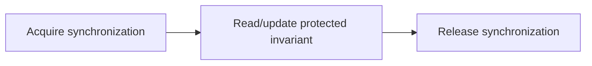
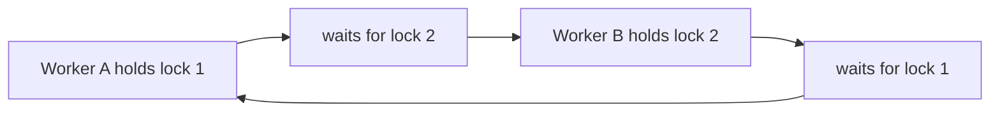

# Synchronization: Locks, Mutexes, Semaphores, Spinlocks, and Deadlocks

## 1. Why Synchronization Exists

Threads can interleave operations. A multi-step update can be incorrect even if each individual machine instruction is valid.

```text
shared inventory = 1

worker A reads 1
worker B reads 1
worker A reserves and writes 0
worker B reserves and writes 0

two reservations accepted for one item
```

The invariant is “at most one reservation.” Synchronization protects the invariant, not merely a variable.

## 2. Critical Section

A critical section is the smallest code region that must not run concurrently with conflicting work.



Keep it short. Do not perform slow network, disk, user callback, or long computation while holding a lock unless the design explicitly requires it.

## 3. Mutex

A mutex provides exclusive ownership: one holder at a time.

```text
worker A acquires mutex -> updates shared map -> releases mutex
worker B waits -> acquires mutex -> updates shared map -> releases mutex
```

Use a mutex for shared mutable state with one clear owner/protection rule.

Questions to define:

- Which fields does this mutex protect?
- Who is allowed to acquire it?
- What is the lock ordering?
- Can any operation under it block or call out?
- What happens if the owner fails?

## 4. Read-Write Lock

A read-write lock permits multiple readers or one writer.

It can help read-heavy workloads, but it adds overhead and can cause writer starvation or longer writer latency depending on implementation. A normal mutex is often better until measurements show concurrent read contention.

## 5. Recursive Lock

A recursive lock lets the same thread acquire the same lock repeatedly. It can avoid immediate self-deadlock but hides ownership depth and complicates reasoning.

Prefer a design that avoids re-entering a lock. If a platform/framework requires recursive locking, document the full invariant and call graph.

## 6. Semaphore

A semaphore holds a count of permits.

```text
three database permits
    worker acquires one permit -> may use one connection
    worker releases permit     -> another worker may proceed
```

Use a counting semaphore to bound a scarce resource: connections, CPU-intensive tasks, file descriptors, or external API concurrency.

A binary semaphore can behave similarly to a mutex, but ownership/error semantics may differ. Prefer the primitive whose contract matches the problem.

## 7. Event and Condition Variable

- Event: one state change wakes waiting work, often “ready” or “shutdown.”
- Condition variable: wait until a predicate over shared state is true.

Correct condition-variable pattern:

```text
acquire mutex
while predicate is false:
    wait (atomically releases mutex and sleeps)
perform work while predicate holds
release mutex
```

Use a loop because wakeups can be spurious and another worker can consume the condition first.

## 8. Spinlock

A spinlock repeatedly checks for a lock instead of sleeping.

```text
try lock -> unavailable -> repeatedly retry for a short time
```

It can be appropriate in kernel/low-level code when the expected hold time is extremely short and sleeping is impossible. It wastes CPU while waiting and is usually unsuitable for ordinary application-level long or blocking work.

## 9. Lock-Free Does Not Mean Coordination-Free

Atomic operations can implement counters, state flags, and specialized concurrent structures. They require precise memory-order and progress guarantees.

```text
atomic increment -> one simple counter update
complex shared state -> usually needs a higher-level design or lock
```

Lock-free algorithms can suffer from ABA, reclamation, starvation, and subtle ordering bugs. Use established libraries unless a measured requirement and expertise justify custom work.

## 10. Memory Ordering

Synchronization provides visibility and ordering between threads.

```text
producer writes data
producer publishes ready state with release
consumer observes ready state with acquire
consumer safely reads published data
```

A mutex normally provides the required ordering around lock/unlock. Do not rely on a variable “usually being visible” without defined synchronization.

## 11. Deadlock

Deadlock means work waits forever because progress is impossible.

The classic Coffman conditions are:

1. mutual exclusion;
2. hold and wait;
3. no preemption;
4. circular wait.



Break at least one condition by design.

## 12. Prevent Deadlocks

- establish one global lock order;
- acquire all required locks together only when practical;
- avoid nested locks;
- avoid callbacks/external calls while holding a lock;
- use message passing or ownership partitioning;
- use timeouts only as a diagnostic/recovery policy, not a substitute for correct ordering;
- keep transactions and locks short.

## 13. Livelock and Starvation

- Livelock: workers keep changing state but make no progress, such as synchronized retry/backoff collisions.
- Starvation: a worker waits indefinitely because others always win scheduling, lock, or resource access.

Randomized bounded backoff, fairness policies, queueing, and bounded retries can help. Measure actual behavior; retries can overload the dependency they are meant to recover from.

## 14. Priority Inversion

A high-priority task waits for a low-priority task holding a resource while medium-priority tasks prevent the low-priority task from running.

Priority inheritance can mitigate some cases, but the simplest application rule is to keep critical sections short and avoid mixing long slow work with priority-sensitive locks.

## 15. Lock Contention

Contention occurs when workers frequently wait for the same synchronization primitive.

```text
one global lock
    -> serial critical section
    -> more workers increase waiting

partitioned ownership
    -> independent locks/data
    -> more useful parallel work
```

Reduce contention by redesigning ownership, sharding state, batching, using immutable snapshots, or moving work outside the critical section. Do not blindly replace a mutex with atomics.

## 16. False Sharing Is Different from Lock Contention

Lock contention is logical waiting for one protected resource. False sharing is hardware cache-line contention between independent writes. Both can prevent scaling, but the fixes and evidence differ.

## 17. Semaphore Leak

If a worker acquires a permit and fails to release it, capacity shrinks permanently.

```text
permit acquired -> operation fails -> release skipped
    -> later workers wait forever or time out
```

Use structured acquisition/release and test cancellation/error paths.

## 18. Interview Questions

### Mutex versus semaphore?

A mutex provides exclusive ownership of a critical section. A semaphore controls a count of permits for bounded concurrent access. Use the contract that matches the resource.

### When is a spinlock appropriate?

Only for extremely short waits in low-level contexts where sleeping is impossible or more expensive. It is generally wasteful for application work or I/O.

### How do you prevent deadlock?

Define lock order, minimize nested locks, avoid blocking/callbacks under locks, partition ownership, and test contention/failure paths.

### Why must a condition-variable wait use a loop?

Wakeups can be spurious, and another worker can change shared state before the awakened worker re-acquires the lock.

### Does a mutex make a whole business operation atomic?

Only the region protected by that specific mutex. External calls, separate processes, databases, and retries need their own transaction/coordination model.

## 19. Design Decision Guide

```text
one owner can process messages -> queue/message passing
one shared small invariant      -> mutex
bounded external resource       -> semaphore
many readers, proven contention -> consider read-write lock
simple counter/flag             -> atomic via trusted library
cross-process transaction       -> database/distributed coordination, not in-process mutex
```

## Final Rules

- protect invariants, not arbitrary code regions;
- define ownership and lock order;
- keep critical sections short and non-blocking;
- acquire/release permits on every failure path;
- design away contention before choosing exotic primitives;
- use condition predicates in loops;
- treat deadlock, livelock, starvation, and priority inversion as distinct failures;
- use established atomic/concurrent libraries for complex structures.

