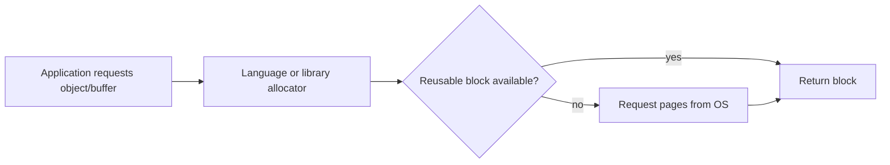

# Memory Allocation, Paging, and Memory-Mapped Files

## 1. Three Different Questions

Memory discussions often mix three layers:

```text
application allocation: which object/buffer does the program request?
runtime allocator:      how does the language/library obtain and reuse blocks?
operating system:       how are virtual pages mapped to physical memory/storage?
```

Diagnose the correct layer. A slow allocator, a memory leak, cache retention, and page-fault thrashing are different problems.

## 2. Virtual Address Space

Each process sees virtual addresses divided into mapped regions.

```text
high addresses
    shared libraries and mapped files
    memory-mapped regions
    heap / dynamic allocations
    program code and read-only data
    thread stacks
low addresses
```

Actual layout, direction, and protections differ by operating system, architecture, runtime, ASLR, and configuration.

## 3. Allocation Path

Conceptually:



Allocators use size classes, caches, arenas, and free lists to make common small allocations fast. Their behavior is implementation-specific.

## 4. Heap Fragmentation

Fragmentation means free memory exists but is split or retained in ways that make a requested allocation difficult or prevent memory from returning to the OS.

```text
used free used free used free
request one large contiguous block
    -> total free may be enough, but no large free block exists
```

Long-lived mixed-size allocation patterns can fragment heaps. Measure allocation lifetime and RSS before changing allocators or restarting workers as a workaround.

## 5. Stack Allocation

Thread stacks hold call frames and some local storage. They have bounded size and grow/configure according to OS/runtime rules.

Deep unbounded recursion can exhaust a stack. Large temporary buffers may be better allocated or streamed differently, but the language/compiler decides many implementation details.

## 6. Paging

Virtual memory is divided into fixed-size pages. The OS maps virtual pages to physical frames and permissions.

```text
virtual address = virtual page number + offset
page table maps virtual page number -> physical frame number
physical address = physical frame number + same offset
```

Pages are the OS unit for mapping, protection, reclamation, and many I/O operations. Cache lines are much smaller hardware data-transfer units.

## 7. Demand Paging

The OS can reserve virtual address space without immediately giving every page physical memory. A first access can trigger a page fault and cause physical allocation or file loading.

```text
reserve large virtual region
touch one page
    -> kernel provides/maps that page
```

This means virtual size, resident memory, and allocated application objects are related but not identical metrics.

## 8. Page Fault Types

| Event | Meaning | Typical cost |
|---|---|---|
| minor fault | mapping/page available without storage read | kernel handling overhead |
| major fault | data must be read from storage | potentially very high latency |
| protection fault | invalid permission/access | signal/exception/termination |
| copy-on-write fault | shared page is written and must be copied | allocation and copy cost |

Names and accounting vary by OS tools, but the distinction between storage I/O and ordinary mapping work matters.

## 9. Copy-on-Write

After certain process-creation or mapping operations, processes can initially share physical pages read-only.

```text
parent and child reference same page
child writes page
    -> fault
    -> OS creates private copy for child
```

Copy-on-write makes initial creation cheap, but writes can increase memory use sharply. It is not a license to fork a memory-heavy multi-threaded application without platform-specific care.

## 10. Swapping and Thrashing

Under memory pressure, the OS can reclaim pages. If active anonymous pages must repeatedly move between memory and storage, the system thrashes.


Symptoms include high I/O wait, long tail latency, low useful throughput, and process eviction by container/orchestrator limits.

## 11. Memory Overcommit

Some systems allow allocations/reservations that cannot all be backed simultaneously by physical memory. This can improve utilization but shifts failure to later page touch or OOM handling.

Production services must have explicit memory limits, load testing, bounded queues/caches, and an understood OOM policy. Do not assume an allocation success means future memory access is guaranteed.

## 12. `mmap` in Simple Words

Memory mapping maps file content or anonymous memory into a process virtual address space.


It can let the OS page file data on demand and share mapped pages between processes when appropriate.

## 13. File-Backed Mapping

Good uses can include:

- random access to large read-mostly files;
- sharing immutable data across processes;
- database/index storage engines;
- avoiding explicit repeated read-copy buffers in a proven hot path.

Risks:

- page faults move latency into ordinary-looking memory access;
- truncation or concurrent file change has platform-specific hazards;
- address-space size is not resident-memory size;
- mapped data still needs bounds/format validation;
- flushing/durability semantics are not the same as application transaction semantics.

## 14. Anonymous Mapping

Anonymous mappings provide memory not backed by a regular file. Runtimes and allocators may use them for large allocations, stacks, shared-memory mechanisms, guards, or arenas.

Application code should use a normal allocation API unless a measured system-level reason requires direct mapping.

## 15. Shared Mapping and Synchronization

Two processes can map shared pages, but shared bytes are not automatically a safe data structure.

You still need:

- layout/version contract;
- ownership and lifecycle;
- memory ordering and synchronization;
- crash recovery;
- bounds and corruption validation;
- access permissions;
- cleanup/unlink policy.

For many application problems, a database, queue, or socket protocol is easier to operate safely.

## 16. `mmap` and I/O

Memory mapping does not eliminate I/O. It asks the OS to perform I/O through the page-fault and page-cache path. Sequential streaming reads can be clearer and faster for a one-pass workload; random access can favor mapping. Measure the complete workload.

## 17. Page Cache

The OS commonly caches file data in memory. A normal read may already avoid physical storage on a cache hit.

Do not claim `mmap` is automatically “zero-copy” or automatically faster. Copies, page-cache sharing, kernel transitions, page faults, and user-space access patterns all matter.

## 18. Memory Diagnostics

Useful questions:

```text
Is the application retaining objects or buffers?
Is allocator fragmentation growing RSS?
Are page faults or swap increasing latency?
Does the process exceed a container memory limit?
Is the file page cache being mistaken for a leak?
Does one request create an unbounded result or queue?
```

Use language-runtime allocation tools, OS memory maps, resident-set metrics, page-fault counters, and production-like load tests together.

## 19. Interview Questions

### Heap allocation versus paging?

Heap allocation is a runtime/library-level request for application memory. Paging is the OS/hardware mapping of virtual pages to physical memory. One heap allocation may use existing pages or trigger new mappings later.

### What is a page fault?

An access that needs OS handling because its virtual page is absent, not resident, copy-on-write, or protected. A major fault can require storage I/O.

### What is `mmap`?

It maps file-backed or anonymous pages into virtual memory so application access uses memory addresses while the OS manages page residency and I/O.

### Why can RSS remain high after freeing objects?

The allocator may retain arenas, the OS may keep page cache, fragmentation may prevent return, or native allocations/mappings may remain. Inspect actual allocation and mapping evidence.

### When would you avoid `mmap`?

For simple sequential streaming, small files, strict predictable-latency needs with fault risk, complex concurrent modification, or when a normal I/O abstraction is safer and already fast enough.

## Final Rules

- distinguish application allocation, runtime allocation, and virtual-memory mapping;
- track working set and resident memory, not one memory number alone;
- treat page faults and swap as latency risks;
- use memory maps for a concrete access-pattern need;
- define ownership, synchronization, and durability for shared mappings;
- bound allocations, queues, caches, and result sets;
- diagnose memory behavior with runtime and OS evidence together.

