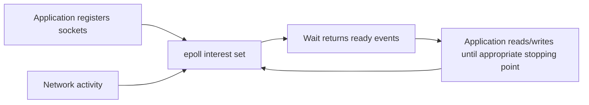
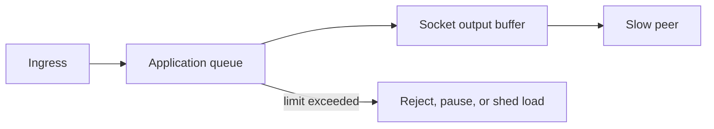
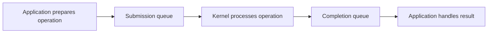

# epoll, io_uring, and Scalable I/O

This chapter uses Linux names because `epoll` and `io_uring` are Linux interfaces. Other operating systems offer related mechanisms with different APIs and semantics.

## 1. The Scaling Problem

A server may need to manage many sockets while most are idle waiting for network data.

```text
one thread per connection
    -> many blocked threads
    -> stacks, scheduling, context switches, memory pressure

event-driven I/O
    -> small number of waiters
    -> wake only when watched work is ready or completed
```

The goal is not “avoid threads at all costs.” The goal is to match concurrency model to workload and resource limits.

## 2. Blocking I/O

```text
request read from socket
    -> no bytes available
    -> calling thread sleeps
    -> wakes when bytes arrive, timeout occurs, or error happens
```

Blocking I/O is simple and often sufficient for low/moderate concurrency, worker pools, and clear request lifecycles.

## 3. Non-Blocking I/O

With non-blocking mode, a read/write attempt returns promptly when it would otherwise wait.

```text
read socket
    -> bytes available: consume some
    -> would block: return and wait for readiness notification
```

The application must track partial reads, partial writes, buffers, connection state, errors, timeouts, and cancellation.

## 4. Readiness Versus Completion

```text
readiness model:
    OS says operation may make progress now
    application performs the read/write

completion model:
    application submits operation
    OS later reports its completion result
```

`epoll` is primarily readiness-oriented. `io_uring` supports submission/completion queues and can support a broader asynchronous operation model.

## 5. `select` and `poll`

Older readiness APIs ask the kernel which descriptors are ready from a set. Their scaling and descriptor-limit characteristics vary by interface/platform.

They are useful concepts because they introduce the core rule: a readiness signal means “try to make progress,” not “the complete request is finished.”

## 6. `epoll`

`epoll` lets a Linux program register interest in many file descriptors and wait for readiness events.



The kernel tracks the interest set, avoiding repeated full-set scanning performed by simpler interfaces.

## 7. Level-Triggered and Edge-Triggered

### Level-triggered

The descriptor continues to be reported while it remains ready.

```text
socket has unread bytes -> readiness reported
application reads some bytes -> still reported if bytes remain
```

It is often easier to reason about.

### Edge-triggered

The application is notified when readiness changes.

```text
socket changes from empty to readable -> one notification
application must read until would-block
```

It can reduce repeated notifications but is easier to get wrong. If the application does not drain appropriately, it may wait forever for an edge that already occurred.

## 8. Partial Reads and Writes

TCP is a byte stream, not a message boundary.

```text
application wants to send 10 KiB
write accepts 4 KiB
    -> retain remaining 6 KiB
    -> wait for writable readiness
    -> continue later
```

Likewise, one read may receive part of a message, exactly one message, or several messages. Protocol framing and bounded buffers are mandatory.

## 9. Backpressure

If a producer accepts data faster than a socket or consumer can send/process it, buffered memory grows.



Set explicit limits for per-connection input/output buffers, total queued bytes, open connections, request body size, and worker concurrency.

## 10. `io_uring`

`io_uring` provides shared submission and completion queues between application and Linux kernel.



It can reduce certain syscall/transition overheads and supports multiple operation types, including file, network, timeout, and cancellation-related operations depending on kernel/API support.

## 11. `io_uring` Is Not Automatic Speed

It adds complexity:

- request lifetime and buffer ownership;
- completion ordering;
- cancellation races;
- queue depth and backpressure;
- kernel feature/version differences;
- security and operational patch level;
- error handling after submission;
- interaction with libraries/runtimes.

Use it when a profile and platform support justify it, often through a mature runtime or library rather than direct application-level use.

## 12. Buffer Ownership

For asynchronous I/O, a buffer must remain valid until completion.

```text
submit read into buffer
    -> do not reuse/free/mutate buffer incompatibly
    -> completion reports result
    -> only then return/reuse buffer according to ownership contract
```

Buffer pools can reduce allocation but create lifetime, security, and cross-request data-leak risks. Zero or reset buffers appropriately when required.

## 13. Cancellation

Cancellation has races:

```text
request cancel
    -> operation may already have completed
    -> operation may complete while cancellation is processed
    -> completion must be handled exactly once
```

Design operations as state machines. A timeout/cancel request is not proof that no completion will arrive.

## 14. Event Loop Fairness

An event loop must avoid letting one busy connection monopolize all work.

Useful controls:

- process a bounded amount per readiness event;
- limit per-connection queued bytes;
- yield between batches;
- use worker pools for CPU-heavy work;
- separate slow-client handling from global queues;
- measure event-loop lag and queue depth.

## 15. Choosing a Model

| Workload | Usually reasonable starting point |
|---|---|
| simple service, modest concurrency | blocking I/O with bounded workers |
| many idle network connections | event loop/readiness runtime |
| mature async runtime supports platform | use its documented I/O model |
| proven syscall/completion bottleneck on Linux | evaluate io_uring through mature library/runtime |
| CPU-heavy request work | bounded compute workers/processes, not more event-loop callbacks |

## 16. Security

- validate protocol framing and length before allocation;
- enforce timeouts for handshake, header, body, idle, and write phases;
- limit connections and buffered bytes per client;
- close invalid or slow connections deliberately;
- avoid file-descriptor leaks;
- propagate cancellation to dependent work;
- avoid exposing kernel-specific APIs directly to untrusted plugins;
- keep kernel and I/O runtime patched.

## 17. Interview Questions

### What is the difference between readiness and completion?

Readiness says an operation may progress now; the application performs it and handles partial results. Completion says a submitted operation finished with a result.

### Why does edge-triggered epoll need care?

It may notify only on state changes. The application must drain/read or write until would-block according to the chosen contract, or it can miss remaining work.

### Why can a non-blocking server still run out of memory?

Each slow connection can accumulate input/output buffers or queued tasks. Non-blocking I/O needs explicit backpressure and limits.

### What problem does io_uring solve?

It offers a queue-based asynchronous submission/completion model that can reduce overhead for suitable Linux I/O workloads. It does not remove application state, ownership, cancellation, or backpressure complexity.

## Final Rules

- choose blocking, readiness, or completion style from the workload and runtime;
- readiness does not mean complete message or complete write;
- model every connection as a bounded state machine;
- enforce per-connection and global backpressure;
- define buffer ownership until completion;
- handle cancellation/completion races;
- prefer mature runtimes and libraries for advanced I/O;
- profile before adopting kernel-specific complexity.

