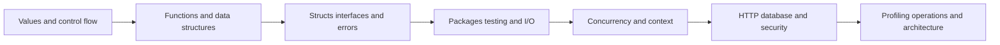

# Go - Beginner to Expert Mastery Roadmap

Go is a compiled, statically typed language designed for clear programs, fast builds, simple deployment, and practical concurrency.

These notes use the current stable Go toolchain and standard-library-first examples. Run every example, predict its output, change one value, and explain the result before moving on.

## Learning Path

### Phase 1 - Beginner Foundation

1. [Go concepts in simple words](go_fundamentals/01-go-concepts-in-simple-words.md)
2. [Toolchain, modules, packages, and execution](go_fundamentals/02-toolchain-modules-packages-and-execution.md)
3. [Variables, constants, types, conversions, and zero values](go_fundamentals/03-variables-types-conversions-and-zero-values.md)
4. [Control flow, functions, multiple returns, and defer](go_fundamentals/04-control-flow-functions-and-defer.md)
5. [Arrays, slices, maps, strings, runes, and bytes](go_fundamentals/05-arrays-slices-maps-strings-and-runes.md)

### Phase 2 - Go Program Design

6. [Pointers, structs, methods, embedding, and composition](go_types_and_design/06-pointers-structs-methods-and-composition.md)
7. [Interfaces, type assertions, generics, and iterators](go_types_and_design/07-interfaces-generics-and-iterators.md)
8. [Errors, panic, recovery, validation, and cleanup](go_types_and_design/08-errors-panic-validation-and-cleanup.md)
9. [Package API design, modules, dependencies, and workspaces](go_types_and_design/09-package-api-modules-and-dependency-design.md)
10. [Files, I/O, JSON, time, and regular expressions](go_standard_library_and_testing/10-files-io-json-time-and-regex.md)

### Phase 3 - Production Go

11. [Testing, table tests, fuzzing, examples, and benchmarks](go_standard_library_and_testing/11-testing-fuzzing-and-benchmarks.md)
12. [Goroutines, channels, select, and context](go_concurrency/12-goroutines-channels-select-and-context.md)
13. [Mutexes, atomics, concurrency patterns, and race diagnosis](go_concurrency/13-sync-atomics-patterns-and-races.md)
14. [HTTP services, databases, security, and graceful shutdown](go_production/14-http-database-security-and-shutdown.md)
15. [Performance, profiling, observability, builds, and deployment](go_production/15-performance-observability-and-deployment.md)
16. [Reflection, embedding, code generation, unsafe, and CGO](go_production/16-reflection-embedding-code-generation-unsafe-and-cgo.md)
17. [Go expert tips and production snippets](go_production/98-go-expert-tips.md)
18. [Complete concurrent HTTP project](project/99-go-course-service-project.md)

## Learning Loop

```text
Simple meaning -> smallest runnable code -> predict output -> run -> change -> failure case -> production rule -> practice
```

## From Beginner to Expert



An expert does not merely know more syntax. An expert can explain ownership, failure behavior, concurrency limits, API contracts, security boundaries, tests, and operational evidence.

## Tooling Target

Use:

- `gofmt` for formatting
- `go test ./...` for tests
- `go vet ./...` for suspicious constructs
- `go test -race ./...` for supported race checks
- `go test -fuzz=...` for fuzz targets
- `go test -bench=.` for benchmarks
- `go tool pprof` and runtime profiles for measured performance work

## Completion Standard

You can build, test, profile, secure, and operate a bounded concurrent Go service; explain when a simpler synchronous design is better; and read unfamiliar Go code without guessing its error or ownership behavior.
