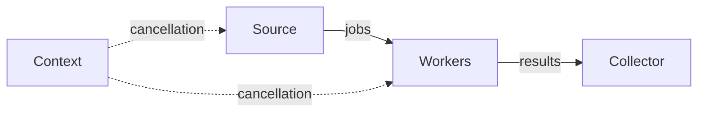

# 12 - Goroutines, Channels, Select, and Context

## Concurrency vs Parallelism

- concurrency: tasks make progress during overlapping time
- parallelism: tasks execute simultaneously on CPU capacity

Goroutines are lightweight concurrent function executions managed by the Go runtime.

## Start and Wait

```go
var group sync.WaitGroup
group.Add(1)
go func() {
	defer group.Done()
	fmt.Println("worker")
}()
group.Wait()
fmt.Println("finished")
// Output order:
// worker
// finished
```

Never start a goroutine without knowing who waits for, cancels, or owns it.

## Channels

```go
results := make(chan int)
go func() {
	results <- 42
}()
fmt.Println(<-results)
// Output: 42
```

An unbuffered send and receive synchronize.

## Buffered Channels

```go
queue := make(chan string, 2)
queue <- "first"
queue <- "second"
fmt.Println(<-queue, <-queue)
// Output: first second
```

A buffer decouples temporary rates. It does not remove the need for capacity/backpressure design.

## Directional Channels

```go
func produce(output chan<- int) {
	output <- 1
	close(output)
}

func consume(input <-chan int) {
	for value := range input {
		fmt.Println(value)
	}
}
```

Directions make contracts clear.

## Closing

The sender that owns completion closes a channel. Receivers normally do not close it.

```go
value, open := <-queue
fmt.Println(value, open)
```

Receiving from a closed drained channel returns the zero value and `false`. Sending to or closing a closed channel panics.

## Range Over Channel

```go
values := make(chan int)
go func() {
	defer close(values)
	for value := 1; value <= 3; value++ {
		values <- value
	}
}()

for value := range values {
	fmt.Println(value)
}
// Output: 1 2 3 on separate lines.
```

Without close or another stop condition, the range would wait forever.

## `select`

```go
select {
case value := <-results:
	fmt.Println(value)
case <-time.After(time.Second):
	fmt.Println("timeout")
}
```

Select waits for one ready case. If several are ready, one is chosen pseudo-randomly. A default case makes it non-blocking and can create busy loops.

## Context

Context carries cancellation, deadlines, and request-scoped values across API boundaries.

```go
func LoadCourse(ctx context.Context, id string) (Course, error) {
	select {
	case <-ctx.Done():
		return Course{}, ctx.Err()
	case course := <-lookup(id):
		return course, nil
	}
}
```

Pass context as the first parameter. Do not store it in a struct or pass nil.

## Deadline

```go
ctx, cancel := context.WithTimeout(context.Background(), 500*time.Millisecond)
defer cancel()

if err := doWork(ctx); err != nil {
	fmt.Println(err)
}
```

Always call cancel to release resources, even when the deadline expires.

## Context Values

Use context values only for request-scoped metadata crossing API boundaries, such as trace IDs. Do not use them for required business parameters or dependency injection. Use unexported typed keys to avoid collisions.

## Pipeline



Every stage must stop on cancellation and every channel must have one clear closer.

## Bounded Worker Pool

```go
func worker(ctx context.Context, jobs <-chan int, results chan<- int) {
	for {
		select {
		case <-ctx.Done():
			return
		case job, open := <-jobs:
			if !open {
				return
			}
			result := job * 2
			select {
			case results <- result:
			case <-ctx.Done():
				return
			}
		}
	}
}
```

Bound worker count, queue capacity, and operation duration.

## Goroutine Leaks

Common causes:

- send with no receiver
- receive from never-closed channel
- network call without deadline
- ticker never stopped
- background loop without cancellation
- consumer stops before producer

Use goroutine profiles and tests that cancel/stop all work.

## Concurrency Rules

- synchronous first
- document ownership and close rules
- context cancellation propagates through blocking work
- channels communicate/coordinate; mutexes protect shared state
- buffer size is a capacity policy
- avoid `time.After` repeatedly in hot loops when timer reuse matters
- never launch unbounded goroutines per untrusted input
