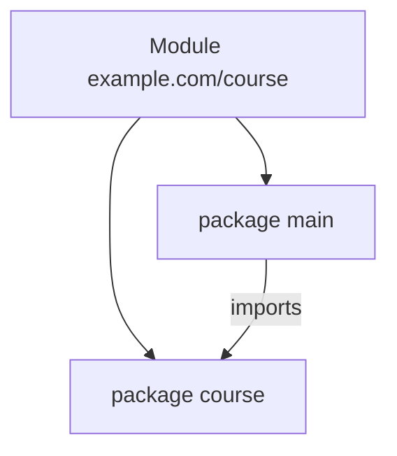

# 02 - Toolchain, Modules, Packages, and Execution

## Install and Verify

```powershell
go version
go env GOMOD
```

Use the official stable toolchain and keep `go.mod` aligned with the supported language version.

## Create a Module

```powershell
New-Item -ItemType Directory go-course
Set-Location go-course
go mod init example.com/course
```

`go.mod` identifies the module path and language/toolchain requirements.

## Minimal Structure

```text
go-course/
|-- go.mod
|-- main.go
`-- course/
    |-- course.go
    `-- course_test.go
```



## Package Rules

- files in one directory normally use one package name
- a package exposes capitalized identifiers
- import paths identify packages, not individual files
- avoid import cycles; dependency direction must be acyclic
- `main` package plus `main` function builds an executable

## Run, Build, and Install

```powershell
go run .
go build .
go test ./...
go list ./...
```

- `go run`: compile and run a main package for development
- `go build`: compile packages/executable
- `go test ./...`: test this module's packages recursively
- `go list`: inspect packages

## Initialization Order

For one package, Go initializes dependencies first, then package-level variables, then `init` functions, then `main`.

```go
package main

import "fmt"

var message = buildMessage()

func buildMessage() string {
	fmt.Println("variable initialization")
	return "ready"
}

func init() {
	fmt.Println("init")
}

func main() {
	fmt.Println(message)
}
// Output:
// variable initialization
// init
// ready
```

Avoid hidden work, network calls, and complex mutable state in `init`. Prefer explicit construction in `main`.

## Compilation Mental Model

```text
source files -> parse/type check -> compile packages -> link executable -> OS starts process -> runtime calls main
```

The Go runtime provides garbage collection, goroutine scheduling, maps, channels, timers, and other runtime services.

## Imports

```go
import (
	"fmt"
	"net/http"
)
```

Unused imports fail compilation. Import aliases should clarify genuine name conflicts, not hide package identity.

## `internal` Packages

Code under an `internal` directory can be imported only by allowed parent-tree code:

```text
example.com/course/
|-- internal/storage/
`-- cmd/server/
```

Use `internal` to enforce an implementation boundary.

## Commands

Larger repositories commonly place executables under `cmd`:

```text
cmd/
|-- api/main.go
`-- migrate/main.go
```

Keep `main` small: load configuration, construct dependencies, start the process, and handle shutdown.

## Dependency Commands

```powershell
go get example.com/dependency@version
go mod tidy
go mod verify
go mod download
```

- pin reviewed versions through `go.mod`/`go.sum`
- run `go mod tidy` after source changes
- review dependency code and licenses
- avoid unnecessary dependencies when the standard library is enough

## Workspaces

`go work` can connect several local modules during development. Do not commit a personal workspace file unless the repository intentionally uses one.

## Formatting and Documentation

```powershell
gofmt -w .
go doc ./...
go vet ./...
```

Exported names should have clear doc comments beginning with the name when they form a public API.

## Production Rules

- one clear module path
- no import cycles
- explicit dependency construction
- minimal `init`
- small `main`
- reproducible dependency versions
- build/test/vet in CI
- never place credentials in source or module configuration
