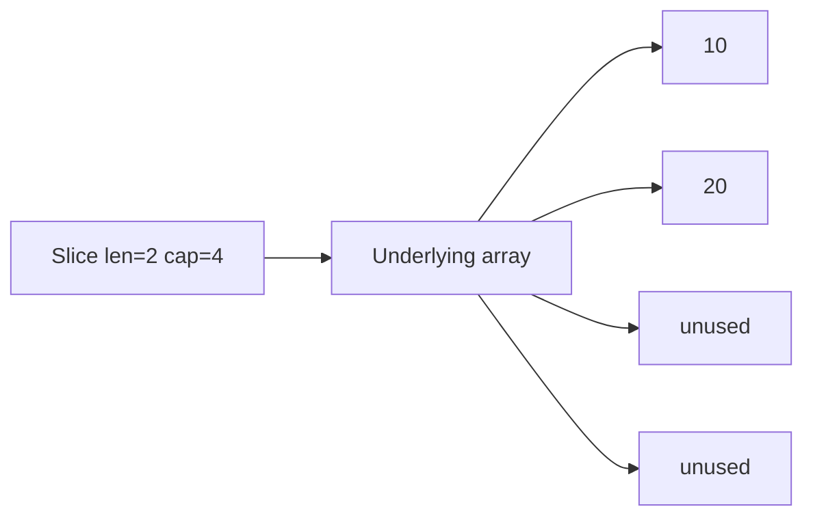

# 05 - Arrays, Slices, Maps, Strings, Runes, and Bytes

## Arrays

An array length is part of its type:

```go
values := [3]int{10, 20, 30}
fmt.Println(values, len(values))
// Output: [10 20 30] 3
```

Arrays are values. Assignment copies every element.

## Slices

A slice is a small descriptor over an underlying array: pointer, length, and capacity.



```go
values := []int{10, 20, 30}
view := values[1:]
view[0] = 99
fmt.Println(values)
// Output: [10 99 30]
```

Both slices view the same array.

## `append`

```go
values := make([]int, 0, 2)
values = append(values, 10, 20)
fmt.Println(values, len(values), cap(values))
// Output: [10 20] 2 2
```

Always use the returned slice. `append` may reuse the array or allocate a new one.

## Copying Slices

```go
source := []int{1, 2, 3}
copyOfSource := append([]int(nil), source...)
copyOfSource[0] = 99
fmt.Println(source, copyOfSource)
// Output: [1 2 3] [99 2 3]
```

This is shallow: nested reference-like values may still share data.

## Nil vs Empty Slice

```go
var nilSlice []int
emptySlice := []int{}
fmt.Println(nilSlice == nil, emptySlice == nil, len(nilSlice), len(emptySlice))
// Output: true false 0 0
```

Both can be ranged and appended. JSON encoding may distinguish `null` from `[]`; define API behavior deliberately.

## Deleting from a Slice

```go
values := []int{10, 20, 30}
index := 1
values = append(values[:index], values[index+1:]...)
fmt.Println(values)
// Output: [10 30]
```

For slices holding pointers/large objects, clear removed slots when retention matters.

## Maps

```go
scores := map[string]int{"Asha": 90}
scores["Ravi"] = 85
score, found := scores["Asha"]
fmt.Println(score, found)
// Output: 90 true
```

Missing lookup returns the value type's zero value. Use the second boolean when absence differs from a stored zero.

## Nil Map

```go
var scores map[string]int
fmt.Println(scores["Asha"])
// Output: 0
// scores["Asha"] = 90 would panic because the map is nil.
```

Create writable maps with a literal or `make`.

## Map Order and Concurrency

- iteration order is unspecified
- maps are reference-like descriptors
- concurrent read/write without synchronization is unsafe
- copy keys and sort them for deterministic output

```go
keys := make([]string, 0, len(scores))
for key := range scores {
	keys = append(keys, key)
}
slices.Sort(keys)
for _, key := range keys {
	fmt.Println(key, scores[key])
}
```

## Strings

Strings are immutable byte sequences:

```go
text := "Go語"
fmt.Println(len(text), text[0])
// Output: 5 71
```

Indexing returns a byte. Range decodes UTF-8 runes:

```go
for index, value := range "Go語" {
	fmt.Printf("%d:%c ", index, value)
}
// Output: 0:G 1:o 2:語
```

The index is the starting byte position.

## Bytes and Runes

```go
bytesValue := []byte("Go")
runes := []rune("Go語")
fmt.Println(bytesValue, runes)
// Output: [71 111] [71 111 35486]
```

Converting string to bytes/runes allocates and copies in ordinary cases.

## Building Strings

```go
var builder strings.Builder
builder.WriteString("Go")
builder.WriteByte(' ')
builder.WriteString("course")
fmt.Println(builder.String())
// Output: Go course
```

Use `strings.Builder` for repeated construction. Use `bytes.Buffer` when working with bytes and I/O.

## Unicode Limits

A rune is a code point, not necessarily a user-perceived character. Grapheme clusters may contain multiple runes. Use a Unicode segmentation library when cursor movement or character limits must match human perception.

## Expert Rules

- slices can alias; document ownership
- do not return internal mutable slices without a contract/copy
- preallocate only with evidence or known size
- distinguish nil and empty in API serialization
- sort map keys for deterministic output/tests
- use bytes/runes according to the operation
- validate UTF-8 at external boundaries when required
