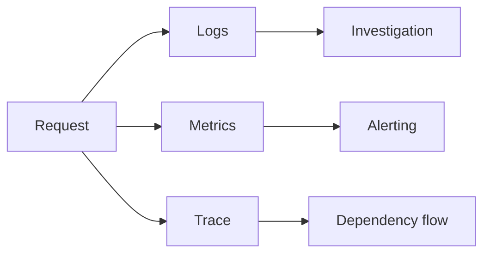

# 15 - Performance, Profiling, Observability, Builds, and Deployment

## Optimize After Measurement

1. define user/service symptom
2. reproduce realistic workload
3. capture CPU, memory, blocking, mutex, trace, and metrics evidence
4. change one thing
5. compare correctness and performance

## Benchmarks

```powershell
go test -bench=. -benchmem -count=5 ./...
```

Compare with a statistical benchmark tool when making decisions. Avoid laptop noise and compiler-eliminated work.

## CPU Profile

```powershell
go test -bench=BenchmarkWork -cpuprofile cpu.out ./package
go tool pprof cpu.out
```

Use `top`, `list`, and web views to connect cost to code.

## Memory Profile

```powershell
go test -bench=BenchmarkWork -memprofile memory.out ./package
go tool pprof memory.out
```

Distinguish allocation rate from retained live heap.

## Runtime Profiles

The runtime exposes goroutine, heap, mutex, block, thread-create, and allocation profiles. Protect debug endpoints; profiles can expose sensitive paths/data and consume resources.

## Execution Trace

```powershell
go test -trace trace.out ./package
go tool trace trace.out
```

Trace helps examine goroutine scheduling, blocking, syscalls, network waits, and GC periods.

## Common Performance Levers

- better algorithm/data structure
- fewer allocations/copies
- bounded batching
- streaming I/O
- correct database indexes/query count
- connection reuse
- reduced lock contention
- removing unnecessary goroutines/channels
- caching with explicit size/invalidation

## Allocation Awareness

Preallocate when size is known and material:

```go
result := make([]Course, 0, len(inputs))
for _, input := range inputs {
	result = append(result, convert(input))
}
```

Do not preallocate from untrusted huge counts without a limit.

## GC

Go garbage collection balances CPU, latency, and memory. Tune only with production-like profiles and service SLOs. First reduce accidental retention and allocation.

## Observability



- logs: discrete events/context
- metrics: aggregated rates, errors, duration, saturation
- traces: request path across boundaries
- profiles: resource cost in code

## Metrics

Track RED for services:

- rate
- errors
- duration

Track saturation: goroutines, queue depth, pool usage, memory, CPU, file descriptors. Avoid unbounded-cardinality labels such as raw user IDs.

## Build Information

Inject safe version/commit metadata using build flags or generated source. Expose it in diagnostics, not secrets.

```powershell
go build -trimpath -ldflags "-s -w" ./cmd/api
```

Stripping debug data reduces binary size but can reduce diagnostic detail. Choose deliberately.

## Reproducible Builds

- pinned module graph/checksums
- clean CI environment
- recorded Go version
- generated code verified
- SBOM/signing/scanning according to policy
- no credentials in build arguments/artifacts

## Containers

Use multi-stage builds, a minimal runtime image, non-root user, read-only filesystem where possible, explicit ports, health behavior, and signal-aware shutdown.

Static binaries still need CA certificates, timezone data, and libc/CGO decisions according to features.

## Deployment

- readiness before traffic
- graceful termination period longer than application drain deadline
- resource requests/limits from measurement
- bounded concurrency aligned with dependencies
- migrations as an explicit controlled step
- rollback-compatible schema/application changes

## Production Checklist

- race detector in relevant CI paths
- benchmarks/profile evidence for optimizations
- timeouts and limits
- safe structured telemetry
- SLO-aligned alerts
- versioned builds
- vulnerability/dependency checks
- graceful shutdown tested
- load test includes downstream capacity
- runbook for common failures
