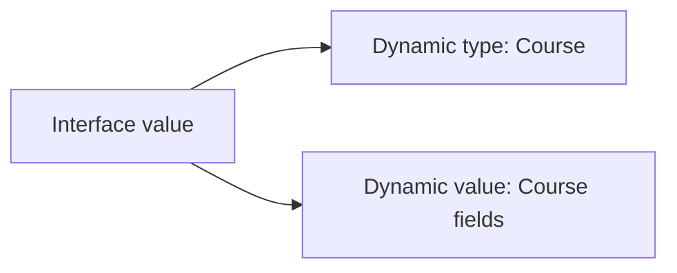

# 07 - Interfaces, Type Assertions, Generics, and Iterators

## Interfaces Describe Behavior

```go
type Writer interface {
	Write([]byte) (int, error)
}
```

A type satisfies an interface implicitly by implementing its methods.

## Small Consumer-Owned Interfaces

```go
type CourseFinder interface {
	FindByID(context.Context, string) (Course, error)
}
```

Define an interface where it is consumed. Do not create an interface for every struct “for testing.” A concrete type is simplest until multiple behavior implementations are needed.

## Interface Values

An interface value contains a dynamic type and dynamic value.



## Nil Interface Trap

```go
var pointer *Course
var value any = pointer
fmt.Println(pointer == nil, value == nil)
// Output: true false
```

The interface is non-nil because it contains dynamic type `*Course`, even though its dynamic value is nil. Return a literal nil interface when there is no value/error.

## Type Assertion

```go
var value any = "Go"
text, ok := value.(string)
fmt.Println(text, ok)
// Output: Go true
```

Without the `ok` result, a failed assertion panics.

## Type Switch

```go
func describe(value any) string {
	switch typed := value.(type) {
	case string:
		return "text:" + typed
	case int:
		return fmt.Sprintf("number:%d", typed)
	default:
		return "unknown"
	}
}

fmt.Println(describe(42))
// Output: number:42
```

Prefer precise types. `any` plus type switches is appropriate at true dynamic boundaries, not as a replacement for modeling.

## Empty Interface / `any`

`any` is an alias for `interface{}`. It accepts any value but preserves little compile-time information. Decode external JSON into a known struct when the schema is known.

## Generics

```go
func First[T any](values []T) (T, bool) {
	if len(values) == 0 {
		var zero T
		return zero, false
	}
	return values[0], true
}

value, found := First([]string{"Go", "Rust"})
fmt.Println(value, found)
// Output: Go true
```

Type parameter `T` preserves the element/result relationship.

## Constraints

```go
type Number interface {
	~int | ~int64 | ~float64
}

func Sum[T Number](values []T) T {
	var total T
	for _, value := range values {
		total += value
	}
	return total
}

fmt.Println(Sum([]int{1, 2, 3}))
// Output: 6
```

`~int` includes defined types whose underlying type is int. Constraints describe permitted type operations; they are not ordinary runtime interfaces.

## `comparable`

```go
func Contains[T comparable](values []T, target T) bool {
	for _, value := range values {
		if value == target {
			return true
		}
	}
	return false
}
```

Map keys must be comparable.

## Generics vs Interfaces

- interface value: runtime polymorphism, possibly different dynamic types in one collection
- generic function/type: compile-time relationship and supported operations
- duplication: sometimes clearer than a complex abstraction

Use generics for containers/algorithms that truly work across types. Do not genericize domain code merely to avoid two lines.

## Generic Types

```go
type Stack[T any] struct {
	values []T
}

func (stack *Stack[T]) Push(value T) {
	stack.values = append(stack.values, value)
}

func (stack *Stack[T]) Pop() (T, bool) {
	if len(stack.values) == 0 {
		var zero T
		return zero, false
	}
	index := len(stack.values) - 1
	value := stack.values[index]
	stack.values = stack.values[:index]
	return value, true
}
```

## Iterators

Modern Go supports iterator functions used with range. A sequence yields values until the consumer stops:

```go
func CountTo(maximum int) iter.Seq[int] {
	return func(yield func(int) bool) {
		for value := 1; value <= maximum; value++ {
			if !yield(value) {
				return
			}
		}
	}
}

for value := range CountTo(3) {
	fmt.Println(value)
}
// Output:
// 1
// 2
// 3
```

Use iterators when lazy traversal improves an API. A slice is simpler when the complete small result is already needed.

## Expert Rules

- keep interfaces small
- accept interfaces, return concrete types when practical
- understand typed nil interface values
- use the comma-ok assertion form
- use generics to preserve type relationships
- keep constraints minimal
- prefer slices over iterators for simple materialized results
