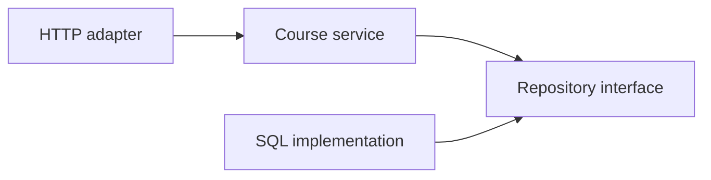

# 09 - Package APIs, Modules, Dependencies, and Workspaces

## Package Responsibility

A package should provide one cohesive capability. Name it after what it provides, not vague layers such as `utils`, `common`, or `helpers`.

```text
course/
|-- course.go       # domain values and rules
|-- service.go      # use cases
`-- repository.go   # required persistence capability
```

## Exported API

Capitalized names are exported:

```go
package course

// Course is a validated learner-facing course.
type Course struct {
	ID    string
	Title string
}

func New(id, title string) (Course, error) {
	if id == "" || title == "" {
		return Course{}, errors.New("id and title are required")
	}
	return Course{ID: id, Title: title}, nil
}
```

Keep implementation details unexported. Every exported identifier becomes a compatibility commitment.

## Accept Interfaces at the Consumer

```go
type Repository interface {
	Save(context.Context, Course) error
}

type Service struct {
	repository Repository
}
```

The consumer states only what it needs. The database package can return a concrete implementation.

## Avoid Interface Pollution

Do not define `CourseServiceInterface` beside a concrete type merely for mocks. Tests can use the concrete type unless a real boundary has multiple implementations.

## Options

For a few required values, use parameters or a config struct. Functional options help when many optional settings evolve:

```go
type Server struct {
	readTimeout time.Duration
}

type Option func(*Server) error

func WithReadTimeout(timeout time.Duration) Option {
	return func(server *Server) error {
		if timeout <= 0 {
			return errors.New("read timeout must be positive")
		}
		server.readTimeout = timeout
		return nil
	}
}
```

Do not add options for two obvious required arguments.

## Internal Dependency Direction



High-level policy owns the capability it needs. Construction connects adapters in `main`.

## Module Versions

Semantic import versioning requires major version suffixes for v2+ module paths:

```text
module example.com/course/v2
```

Breaking changes require deliberate migration. Avoid exporting more than consumers need.

## `go.mod` and `go.sum`

- `go.mod`: direct requirements, module path, replacements, language/toolchain intent
- `go.sum`: checksums for downloaded module content

Commit both according to repository policy. Do not hand-edit sums.

## Replace Directives

`replace` can point to a fork or local module. Use it deliberately and remove temporary local replacements before release.

## Workspaces

```powershell
go work init ./service ./library
go work use ./another-module
```

Workspaces support local multi-module development. CI/release must still verify each module's real dependency declarations.

## Dependency Security

```powershell
go list -m all
go mod verify
govulncheck ./...
```

Use the official vulnerability checker when installed. Review transitive changes, licenses, maintenance, and install/build behavior.

## Configuration

Parse external configuration once near startup into a validated struct:

```go
type Config struct {
	Address      string
	ReadTimeout  time.Duration
	WriteTimeout time.Duration
}
```

Reject missing/invalid values. Do not scatter environment reads through domain packages.

## Cycles and Dependency Injection

Go forbids import cycles. Do not “solve” them with a global registry. Move shared abstractions to the correct owner or redesign responsibilities.

## Expert Rules

- cohesive package names
- minimal exported surface
- consumer-owned narrow interfaces
- explicit construction
- no mutable global service locators
- semantic version awareness
- reviewed dependencies
- validated startup configuration
- architecture that naturally avoids cycles
