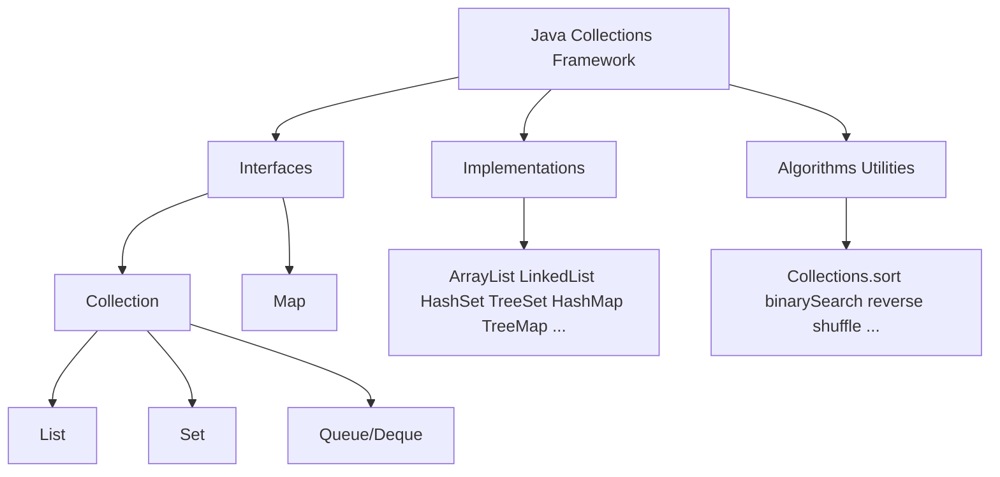

# 01 - Collection Framework Overview

## 1) Why Collection Framework Exists

Java Collections Framework gives standard interfaces, implementations, and algorithms for storing and processing groups of objects.

Without framework support, every project would reimplement common containers (list, set, map, queue).

## 2) High-Level Mental Model



Explanation:

- interfaces define contracts
- implementations provide concrete behavior and complexity
- utility algorithms work across many implementations

## 3) `Collection` vs `Map`

- `Collection<E>` models a group of elements
- `Map<K,V>` models key-value association

Important: `Map` is part of framework but does not extend `Collection`.

## 4) First Framework Example

Concept taught: Unified API style across different implementations.

```java
Collection<String> names = new ArrayList<>();
names.add("Ram");
names.add("Sita");
System.out.println(names.size());
System.out.println(names.contains("Ram"));
```

Expected output:

```text
2
true
```

## 5) Why Interfaces Matter

Concept taught: Coding to interface enables implementation swapping.

```java
List<Integer> a = new ArrayList<>();
a.add(10);
a.add(20);

List<Integer> b = new LinkedList<>(a);
System.out.println(a);
System.out.println(b);
```

Expected output:

```text
[10, 20]
[10, 20]
```

Explanation:

- same `List` contract
- different internal tradeoffs

## 6) Core Design Principles

- program to interface, not implementation
- pick structure by operations, not habit
- respect contracts (`equals/hashCode/comparator`)
- separate mutability concerns clearly

## 7) Summary

Collection Framework is a contract-first ecosystem that helps write reliable, performant, reusable data handling code.
