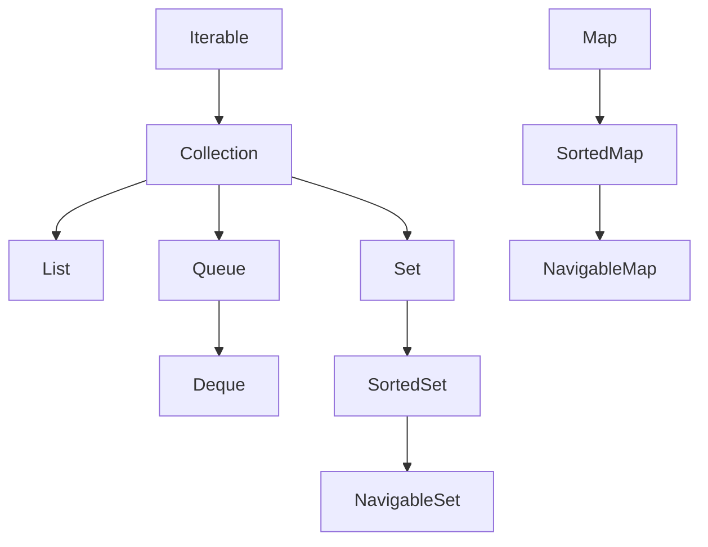

# 02 - Core Interfaces and Hierarchy

## 1) Interface Hierarchy Diagram



## 2) `Iterable` and `Collection`

`Iterable` gives iteration (`iterator`, enhanced for loop).

`Collection` adds standard methods:

- `add`, `remove`, `contains`
- `size`, `isEmpty`, `clear`
- bulk ops like `addAll`, `removeAll`, `retainAll`

Concept taught: Minimum common behavior of `Collection`.

```java
Collection<Integer> c = new ArrayList<>();
c.add(1);
c.add(2);
c.add(3);
System.out.println(c.size());
System.out.println(c.contains(2));
```

Expected output:

```text
3
true
```

## 3) `List`, `Set`, `Queue`

- `List`: ordered, duplicates allowed, index-based access
- `Set`: no duplicates
- `Queue`: typically FIFO semantics

Concept taught: Duplicate behavior difference between list and set.

```java
List<Integer> list = new ArrayList<>(List.of(1, 1, 2));
Set<Integer> set = new HashSet<>(List.of(1, 1, 2));
System.out.println(list);
System.out.println(set);
```

Possible output:

```text
[1, 1, 2]
[1, 2]
```

## 4) `Map` Family

- `Map`: key-value pairs
- `SortedMap`/`NavigableMap`: sorted key operations (`floorKey`, `ceilingKey`, etc.)

Concept taught: Map key overwrite semantics.

```java
Map<String, Integer> m = new HashMap<>();
m.put("A", 1);
m.put("A", 2);
System.out.println(m);
```

Expected output:

```text
{A=2}
```

## 5) Ordered/Sorted Views (Java 21)

Modern JDK added sequenced interfaces (`SequencedCollection`, `SequencedSet`, `SequencedMap`) for first/last and reverse view workflows.

## 6) Summary

Understanding hierarchy helps you choose the narrowest correct interface in API design.
