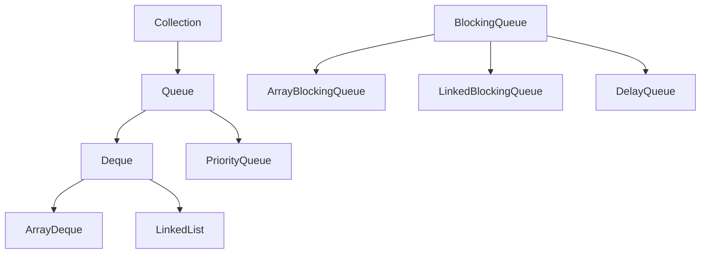

# 01 - Queue and Deque Basics

## 1) What Is `Queue`

`Queue` typically follows FIFO (First In, First Out).

- insert at tail
- remove from head

Common use cases:

- task scheduling
- buffering
- producer-consumer pipelines

## 2) What Is `Deque`

`Deque` means double-ended queue.

- insert/remove at both front and back
- can model queue and stack behavior

## 3) Hierarchy Diagram



## 4) Queue vs Deque vs Stack

- queue: FIFO
- deque: both ends
- stack: LIFO (can be done using deque)

Concept taught: FIFO behavior using queue operations.

```java
Queue<String> q = new ArrayDeque<>();
q.offer("A");
q.offer("B");
q.offer("C");
System.out.println(q.poll());
System.out.println(q.poll());
System.out.println(q);
```

Expected output:

```text
A
B
[C]
```

Concept taught: LIFO behavior using deque stack methods.

```java
Deque<Integer> st = new ArrayDeque<>();
st.push(10);
st.push(20);
st.push(30);
System.out.println(st.pop());
System.out.println(st.peek());
```

Expected output:

```text
30
20
```

## 5) Method Families

Queue style methods:

- insert: `offer`, `add`
- remove head: `poll`, `remove`
- inspect head: `peek`, `element`

Deque style adds first/last variants.

## 6) Summary

Queue and deque are workflow structures, not random-access containers. Choose them when processing order is central to the problem.
