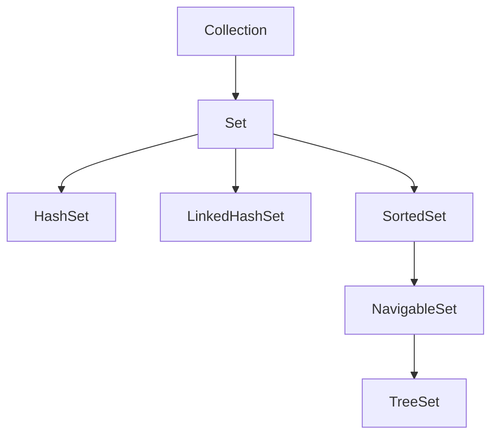

# 01 - Set Basics (Complete)

## 1) What Is `Set<E>`

`Set` is a collection that stores unique elements.

Core properties:

- no duplicate elements
- usually no index-based access
- ordering depends on implementation

## 2) Set Hierarchy



## 3) Duplicate Rejection Behavior

Concept taught: `add` returns `false` for duplicate insertion.

```java
Set<String> s = new HashSet<>();
System.out.println(s.add("java"));
System.out.println(s.add("java"));
System.out.println(s);
```

Expected output:

```text
true
false
[java]
```

## 4) Common Set Methods

- `add`, `remove`, `contains`
- `size`, `isEmpty`, `clear`
- bulk ops: `addAll`, `retainAll`, `removeAll`

Concept taught: Basic CRUD operations in set.

```java
Set<Integer> nums = new HashSet<>(Set.of(1, 2, 3));
nums.remove(2);
System.out.println(nums.contains(2));
System.out.println(nums.size());
```

Expected output:

```text
false
2
```

## 5) Set vs List

- `List`: duplicates allowed, indexed order
- `Set`: uniqueness enforced, no indexing contract

Concept taught: Dedup using set conversion.

```java
List<Integer> list = List.of(4, 2, 4, 1, 2);
Set<Integer> dedup = new HashSet<>(list);
System.out.println(dedup);
```

Possible output:

```text
[1, 2, 4]
```

## 6) Where Set Is Used

- deduplication
- fast membership checks
- permission flags
- visited tracking in graph traversal

## 7) Summary

Use `Set` when uniqueness and membership tests are primary concerns.
