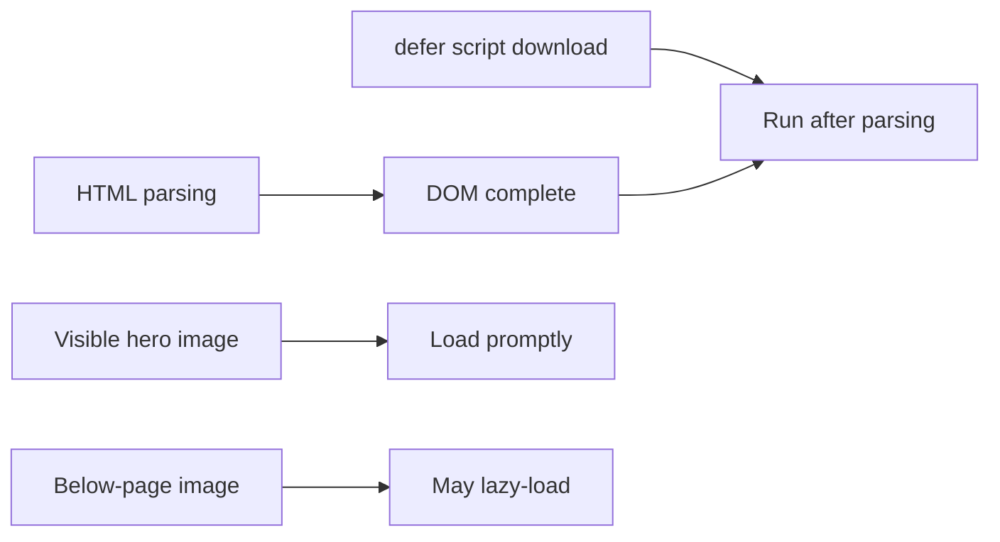
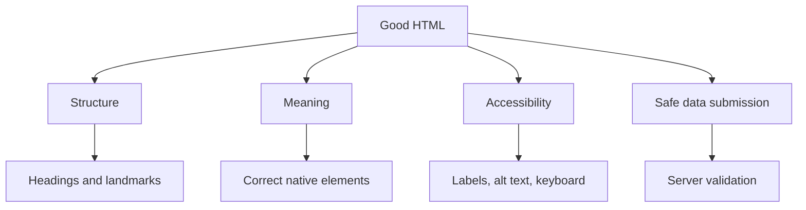

# HTML MCQs: read code, then explain the idea

There are 50 questions: 30 code-snippet questions and 20 theory questions. Try to predict the answer before revealing it.

## Part A: code-snippet MCQs (1-30)

### How to read the HTML visuals

```text
SOURCE CODE                 BROWSER RESULT                 DOCUMENT MEANING
<button>Save</button>       [ Save ]                       action control
<a href="/help">Help</a>    Help                           navigation link
<h1>Notes</h1>              Notes                          page heading
```

For each question, first identify the element and its attributes, then predict both the visible result and the meaning the browser records.

### 1. What rendering mode does this request?

```html
<!doctype html>
<html lang="en"></html>
```

- A. Quirks mode
- B. XML mode
- C. Modern standards mode
- D. JavaScript strict mode

**Answer: C.** The HTML doctype requests modern standards mode.

### 2. What does the label activate when clicked?

```html
<label for="email">Email</label>
<input id="email" type="email" />
```

- A. The input with `name="email"`
- B. The input with `id="email"`
- C. Every email input
- D. No input

**Answer: B.** A label's `for` value connects to an input's `id`.

### 3. Which value is sent as the form field key?

```html
<input id="user-email" name="email" type="email" value="a@example.com" />
```

- A. `user-email`
- B. `a@example.com`
- C. `email`
- D. `type`

**Answer: C.** Forms submit a control's `name` and its value.

### 4. What is this button's default behavior inside a form?

```html
<form>
  <button>Save</button>
</form>
```

- A. It resets the form
- B. It submits the form
- C. It does nothing
- D. It opens a link

**Answer: B.** A button in a form defaults to `type="submit"`.

### 5. What is the correct alternative text choice here?

```html

```

- A. The browser hides the image visually
- B. The image cannot load
- C. Assistive technology treats it as decorative
- D. The image has no size

**Answer: C.** Empty `alt` is correct for a purely decorative image.

### 6. What extra attribute protects this new-tab link?

```html
<a href="https://example.com" target="_blank" rel="noopener noreferrer">Resource</a>
```

- A. `href`
- B. `target`
- C. `rel`
- D. Link text

**Answer: C.** `noopener` prevents the opened page from getting an opener reference.

### 7. Which element receives the fragment navigation?

```html
<a href="#practice">Practice</a>
<section id="practice"><h2>Practice</h2></section>
```

- A. The anchor
- B. The section
- C. The heading only
- D. The document head

**Answer: B.** `#practice` targets the element whose `id` is `practice`.

### 8. What does this landmark identify?

```html
<main>
  <h1>Course notes</h1>
</main>
```

- A. Secondary content
- B. Site navigation
- C. The page's unique main content
- D. A footer

**Answer: C.** `main` represents the primary content of the page.

### 9. Which heading hierarchy is best for this content?

```html
<h1>CSS guide</h1>
<h2>Selectors</h2>
<h3>Class selectors</h3>
```

- A. It is a logical outline
- B. `h3` must appear before `h2`
- C. Every heading should be `h1`
- D. Heading level controls only font size

**Answer: A.** The nested topics move from the page subject to section to subsection.

### 10. Which value will be submitted for the selected radio button?

```html
<label><input type="radio" name="contact" value="email" checked /> Email</label>
<label><input type="radio" name="contact" value="phone" /> Phone</label>
```

- A. `contact=email`
- B. `contact=phone`
- C. Both values
- D. No value because radio buttons cannot submit

**Answer: A.** The checked control submits its shared `name` and its own `value`.

#### Visual checkpoint: questions 1-10

```text
Browser page
+--------------------------------------------------+
| Course notes                           [Save]     |
|                                                  |
| Email                                            |
| [ learner@example.com________________ ]          |
|                                                  |
| Preferred contact                               |
| (*) Email        ( ) Phone                       |
+--------------------------------------------------+

DOM relationships
label for="email" ------> input id="email"
input name="email" -----> submitted key `email`
checked radio -----------> submitted value `email`
button in form ----------> submit by default
```

### 11. What does `required` do in this normal browser submission?

```html
<input name="displayName" required />
```

- A. It encrypts the value
- B. It blocks submission while the field is empty
- C. It trims whitespace on the server
- D. It makes the name unique

**Answer: B.** It supplies client-side validation; the server must still validate.

### 12. What happens after selecting the first option?

```html
<select name="country">
  <option value="">Choose a country</option>
  <option value="in">India</option>
</select>
```

- A. `country=Choose a country`
- B. `country=in`
- C. `country=`
- D. The field is not submitted

**Answer: C.** The selected option's `value` is an empty string.

### 13. What relationship do these cells express?

```html
<tr>
  <th scope="row">Monday</th>
  <td>30</td>
</tr>
```

- A. `Monday` labels the row
- B. `30` labels the row
- C. Both cells are column headers
- D. The markup is invalid

**Answer: A.** `scope="row"` makes the header describe the row's data cell.

### 14. Why are width and height useful here?

```html

```

- A. They guarantee the image file is 800 by 450 pixels
- B. They reserve layout space before the image loads
- C. They make the image decorative
- D. They make the image responsive by themselves

**Answer: B.** The browser can reserve the aspect-ratio space and reduce layout shift.

### 15. When does this script run?

```html
<script src="app.js" defer></script>
```

- A. Before HTML parsing begins
- B. Immediately when it downloads, in any order
- C. After HTML parsing, in deferred-script order
- D. Only after a button click

**Answer: C.** `defer` preserves order and runs after document parsing.

### 16. What can JavaScript read from this element?

```html
<button data-course-id="html-101">Open</button>
```

- A. `button.dataset.courseId`, which is `"html-101"`
- B. `button.courseId`, which is a number
- C. `button.id`, which is `"html-101"`
- D. Nothing; custom attributes are invalid

**Answer: A.** `data-course-id` is exposed through the `dataset` camel-cased property.

### 17. Why is this preferable to a clickable `div`?

```html
<button type="button">Show answer</button>
```

- A. It is always blue
- B. It has native button semantics, focus, and keyboard behavior
- C. It navigates automatically
- D. It needs no CSS

**Answer: B.** Native controls provide expected behavior before custom code is added.

### 18. What does this grouping communicate?

```html
<fieldset>
  <legend>Preferred contact</legend>
  <label><input type="checkbox" name="updates" /> Send updates</label>
</fieldset>
```

- A. The checkbox is disabled
- B. The controls belong to a named group
- C. The legend is only visual text
- D. A table is being created

**Answer: B.** `fieldset` groups related controls and `legend` names the group.

### 19. What does this source-selection rule allow?

```html
<picture>
  <source media="(min-width: 60rem)" srcset="wide.jpg" />
  
</picture>
```

- A. It loads every image at once
- B. It uses `wide.jpg` when the media condition matches
- C. It makes `small.jpg` decorative
- D. It creates a background image

**Answer: B.** The browser may choose the matching source; the `img` remains the fallback and carries the `alt`.

### 20. What does this tell a screen reader?

```html
<nav aria-label="Course navigation">
  <a href="/html">HTML</a>
</nav>
```

- A. The link is disabled
- B. This navigation landmark is named "Course navigation"
- C. The navigation is hidden
- D. The page language changes

**Answer: B.** The label distinguishes this navigation region from other navigation landmarks.

#### Visual checkpoint: questions 11-20

```text
Logical page regions
+--------------------------------------------------+
| HEADER                                           |
|   NAV: Course navigation                         |
+--------------------------------------------------+
| MAIN                                             |
|   ARTICLE                                        |
|     SECTION                                      |
+--------------------------------------------------+

Image choice
[ informative photo ] -> useful alt text
[ decorative divider ] -> alt=""

Table relationship
column header
      |
      v
+----------+---------+
| Day      | Minutes |
+----------+---------+
| Monday ->| 30      |
+----------+---------+
  row header
```

### 21. What does `tabindex="-1"` do here?

```html
<main id="content" tabindex="-1">...</main>
```

- A. Removes the main region from the DOM
- B. Puts it first in the Tab order
- C. Allows programmatic focus without adding normal Tab-stop focus
- D. Disables all child controls

**Answer: C.** It is useful as a focus destination, such as after a skip link or route change.

### 22. Which request method is represented?

```html
<form action="/search" method="get">
  <input name="q" value="html" />
</form>
```

- A. The query is normally placed in the URL
- B. The request body is encrypted
- C. The form cannot be submitted
- D. The browser sends a `POST` request

**Answer: A.** `GET` is commonly used for safe, repeatable searches.

### 23. What kind of input behavior does this request?

```html
<input name="birthday" type="date" />
```

- A. A multi-line text area
- B. Date-oriented browser validation and input UI where supported
- C. A password field
- D. An upload control

**Answer: B.** An accurate input type gives the browser useful semantics and assistance.

### 24. What does this media element provide?

```html
<video controls>
  <track kind="captions" src="lesson.en.vtt" srclang="en" label="English" />
</video>
```

- A. Captions as a text alternative option
- B. Automatic translation of every page
- C. A required video poster
- D. Faster video downloading

**Answer: A.** A captions track provides timed text for the video.

### 25. Which content should be written in this element?

```html
<pre><code></code></pre>
```

- A. A navigation menu
- B. A table layout
- C. Code whose whitespace should be preserved
- D. A form label

**Answer: C.** `pre` preserves whitespace and `code` identifies code content.

### 26. What does this metadata control?

```html
<meta name="viewport" content="width=device-width, initial-scale=1.0" />
```

- A. The document language
- B. The initial mobile layout viewport behavior
- C. The page title
- D. The script load order

**Answer: B.** It lets mobile browsers use the device width for layout.

### 27. What is invalid in this snippet?

```html
<p>Read this <div>important note</div> today.</p>
```

- A. Nothing; any element may be inside a paragraph
- B. A `div` cannot be nested inside a `p`
- C. `p` elements need an `id`
- D. `div` elements require `role="note"`

**Answer: B.** A paragraph cannot contain a block `div`; the browser repairs this unexpectedly.

### 28. What list meaning does this convey?

```html
<ol>
  <li>Install tools</li>
  <li>Create a page</li>
</ol>
```

- A. The items are alternatives
- B. The items form an ordered sequence
- C. The items are table rows
- D. The items are navigation landmarks

**Answer: B.** Use `ol` when the order carries meaning.

### 29. What is the safest default for untrusted user text?

```html
<p id="comment"></p>
```

- A. Insert it with `innerHTML`
- B. Set the element's `textContent`
- C. Put it in a `style` attribute
- D. Put it in `alt` regardless of purpose

**Answer: B.** Text content does not parse the supplied string as HTML.

### 30. Which image should normally avoid lazy loading?

```html

```

- A. The main image visible when the page first opens
- B. A below-the-fold gallery image
- C. A decorative footer image
- D. An image inside a closed dialog

**Answer: A.** The primary visible image should load promptly to avoid delaying useful content.

#### Visual checkpoint: questions 21-30



```text
Keyboard focus model
Tab order: [Link] -> [Input] -> [Button]
tabindex="-1": programmatic focus target, not a normal Tab stop
```

## Part B: theory MCQs (31-50)

### Theory concept map



### 31. What is HTML's primary responsibility?

- A. Database storage
- B. Page structure and meaning
- C. Network routing
- D. Visual animation

**Answer: B.** HTML describes content; CSS styles it and JavaScript adds behavior.

### 32. When should an `a` element be used?

- A. To perform an in-page action
- B. To navigate to a URL or fragment
- C. To create a dialog
- D. To group inputs

**Answer: B.** Links are destinations; buttons are actions.

### 33. How many `id` values may be duplicated in one document?

- A. Zero; each `id` must be unique
- B. Two
- C. Any number in different sections
- D. One per class

**Answer: A.** Duplicate IDs break relationships, fragments, and JavaScript selection.

### 34. What should informative image `alt` describe?

- A. The filename
- B. Its purpose or information in the current context
- C. Every pixel color
- D. The CSS class

**Answer: B.** Alternative text communicates what the image contributes.

### 35. Which attribute links a label to an input explicitly?

- A. Matching `for` and `id`
- B. Matching `class`
- C. Matching `name`
- D. Matching `type`

**Answer: A.** That association creates the accessible label relationship.

### 36. Why is a placeholder not a label?

- A. It cannot contain letters
- B. It disappears during entry and is not a reliable accessible name
- C. It submits with the form
- D. It creates a button

**Answer: B.** Keep a visible, persistent label for every control.

### 37. What does ARIA usually add?

- A. CSS layout
- B. Semantics, not missing behavior
- C. Server validation
- D. Faster images

**Answer: B.** Prefer native HTML because it supplies both semantics and behavior.

### 38. What must always validate a submitted form value?

- A. CSS
- B. The browser only
- C. The server
- D. The page title

**Answer: C.** Client-side validation improves usability but cannot be trusted for security.

### 39. When is a table appropriate?

- A. For page layout
- B. For data with row/column relationships
- C. For a two-button toolbar
- D. For a site header

**Answer: B.** Use CSS layout for visual arrangement.

### 40. What is a semantic element?

- A. An element with a class
- B. An element whose tag communicates content role
- C. Any visible element
- D. A CSS-only element

**Answer: B.** `nav`, `main`, and `article` express roles beyond visual shape.

### 41. What does browser-side validation improve most directly?

- A. User feedback before submission
- B. Server authorization
- C. Password encryption
- D. Database indexing

**Answer: A.** It gives quick feedback, while server validation supplies trust.

### 42. Why should focus indicators remain visible?

- A. They make colors brighter
- B. Keyboard users need to know the active control
- C. They reduce network traffic
- D. They change tab titles

**Answer: B.** Visible focus is essential for keyboard navigation.

### 43. What does `defer` solve for a normal page script?

- A. It guarantees server security
- B. It lets the script wait until HTML parsing is complete
- C. It converts JavaScript to CSS
- D. It adds a form label

**Answer: B.** Deferred scripts can safely work with parsed document content.

### 44. Why is `lang` important on the root element?

- A. It sets CSS colors
- B. It declares the document language to tools such as screen readers
- C. It changes the HTTP method
- D. It makes IDs unique

**Answer: B.** Language metadata improves pronunciation and processing.

### 45. What is the safest general rule for untrusted content?

- A. Treat it as HTML by default
- B. Treat it as text unless there is a carefully sanitized HTML requirement
- C. Put it in an attribute
- D. Hide it with CSS

**Answer: B.** Parsing untrusted strings as HTML can create XSS vulnerabilities.

### 46. Why should heading levels follow an outline?

- A. Their default font size must never change
- B. They communicate document structure for navigation and understanding
- C. They make images load sooner
- D. They prevent CSS from applying

**Answer: B.** Use CSS for visual size, not heading-level misuse.

### 47. What is `main` normally limited to per page?

- A. No limit
- B. One unique main-content region
- C. One per section
- D. One per paragraph

**Answer: B.** It identifies the page's primary content.

### 48. Why should external pages in an `iframe` have a title?

- A. To speed up rendering
- B. To identify the embedded content to assistive technology
- C. To enable form submission
- D. To select a CSS class

**Answer: B.** The title tells users what the frame contains.

### 49. What is the best first accessibility technique?

- A. Add ARIA everywhere
- B. Use native semantic HTML correctly
- C. Remove keyboard focus
- D. Use clickable `div` elements

**Answer: B.** Native elements provide the most reliable baseline.

### 50. Why validate HTML markup?

- A. It guarantees an attractive design
- B. It catches invalid structure before browsers repair it unpredictably
- C. It replaces browser testing
- D. It creates SEO keywords

**Answer: B.** Valid markup produces a more reliable DOM and better accessibility foundation.
