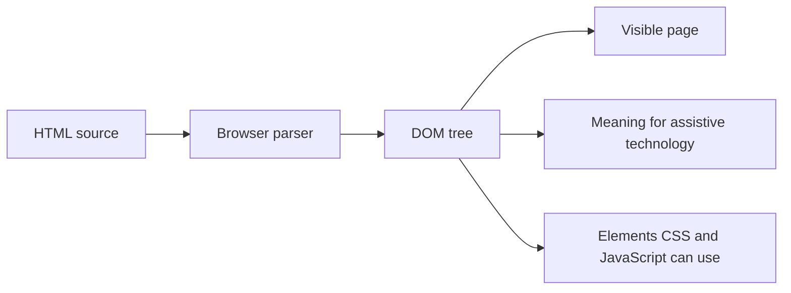
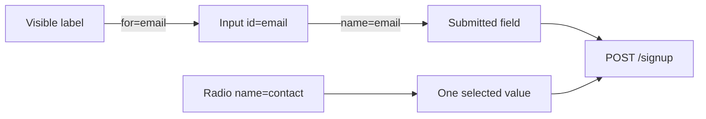
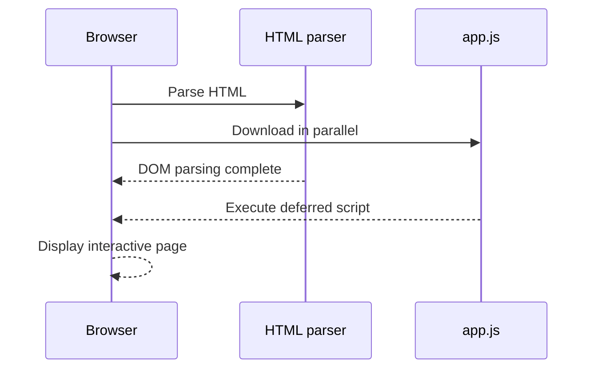

# HTML: learn the structure before the styling

HTML is the meaning and structure of a web page. It tells the browser, search engines, and assistive technology what each part of the page *is*. CSS decides how it looks. JavaScript decides how it behaves.

Think of a simple page as a document with a title, sections, text, links, images, and controls. Start by describing that document well; styling comes afterwards.

## Visual map: from HTML source to browser page



```text
Browser tab: Study guide
+--------------------------------------------------+
| Study guide                                      |
|                                                  |
| Learn one concept, then practise it.             |
+--------------------------------------------------+
```

The browser sketch represents visible output, not extra HTML syntax.

## 1. How the browser turns HTML into a page

### The idea

The browser reads HTML from top to bottom and builds a tree called the **Document Object Model (DOM)**. Every element becomes a node in that tree. CSS and JavaScript use the same tree later.

### See it in code

```html
<main>
  <h1>Study plan</h1>
  <p>Learn one concept, then practise it.</p>
</main>
```

### What the browser understands

```text
main
|- h1: Study plan
`- p: Learn one concept, then practise it.
```

`h1` is a heading and `p` is a paragraph. The indentation is not what creates the relationship; nesting the tags is. Indent anyway, because it lets people read the structure quickly.

### Remember

- An **element** is the complete thing: `<p>Hello</p>`.
- An **opening tag** starts an element and a **closing tag** ends it.
- Some elements have no content or closing tag, for example `img`, `input`, `meta`, and `link`.
- Invalid nesting makes the browser repair the DOM. Write valid markup instead of relying on that repair.

### Visual connection: nesting becomes a tree

```text
HTML source                     DOM relationship

<main>                          main
  <h1>Study plan</h1>           |-- h1
  <p>Practise daily.</p>        `-- p
</main>

Indentation helps readers see the same parent-child relationship
that the browser records in the DOM.
```

## 2. Begin every page with a complete document

### The idea

The document shell gives the browser essential instructions before it displays visible content.

### See it in code

```html
<!doctype html>
<html lang="en">
  <head>
    <meta charset="UTF-8" />
    <meta name="viewport" content="width=device-width, initial-scale=1.0" />
    <meta name="description" content="A beginner-friendly study guide." />
    <title>Study guide</title>
  </head>
  <body>
    <main>
      <h1>Study guide</h1>
    </main>
  </body>
</html>
```

### Connect each line to its job

- `<!doctype html>` requests modern standards mode. Put it first.
- `<html lang="en">` declares the page language. Screen readers use it to choose pronunciation rules.
- `charset="UTF-8"` lets the document represent a wide range of characters reliably.
- `viewport` makes the layout use the device width on a phone rather than a pretend desktop-width page.
- `title` labels the browser tab and is commonly used as a search-result title.
- `description` is a short summary that search tools may use.
- `head` contains document information; `body` contains the page content.

## 3. Elements, attributes, IDs, and classes

### The idea

Tags provide meaning. **Attributes** provide extra information or configuration for that tag.

### See it in code

```html
<input id="email" class="field" name="email" type="email" required />
```

### Read the code aloud

This creates an input whose unique document identifier is `email`, whose reusable styling hook is `field`, whose submitted form key is `email`, and whose browser-provided input behavior is for an email address. It must be filled in before the browser permits normal form submission.

### Important differences

| Attribute | Main purpose | Rule to remember |
|---|---|---|
| `id` | Identify one element in this document | It must be unique. |
| `class` | Group elements for CSS or JavaScript | Many elements can share it. |
| `name` | Name a form value when it is submitted | Inputs without it are usually not submitted. |
| `data-*` | Store small application-specific data | JavaScript reads `data-user-id` as `element.dataset.userId`. |

Boolean attributes work by presence. `disabled="false"` still disables an input because `disabled` is present. Remove the attribute to make it false.

## 4. Write content with its real meaning

### The idea

Use a tag because of what the content means, not because of the default visual style. CSS can change visual style later without changing the document meaning.

### See it in code

```html
<h1>Healthy snacks</h1>
<p>Choose food that keeps you full between meals.</p>

<h2>Fruit</h2>
<p>An apple is easy to carry.</p>

<ul>
  <li>Apple</li>
  <li>Banana</li>
</ul>
```

### Connect the concepts

`h1` is the page's main subject. `h2` begins a subsection of that subject. A list is not merely a group of lines: `ul` says the order does not matter, while `ol` says it does.

```html
<p>Press <kbd>Ctrl</kbd> + <kbd>S</kbd> to save.</p>
<p><strong>Warning:</strong> this action cannot be undone.</p>
<blockquote cite="https://example.com/source">
  Practise a little every day.
</blockquote>
<pre><code>const answer = 42;</code></pre>
```

- `strong` means importance; `em` means emphasis in the sentence.
- `kbd` represents keyboard input.
- `blockquote` represents a long quotation.
- `pre` preserves whitespace and `code` represents code.

Do not choose headings to make text large. Keep heading levels in a logical outline, then use CSS for size.

## 5. Use semantic page regions

### The idea

Semantic elements explain the role of a region. They make pages easier to navigate for people and tools.

### See it in code

```html
<header>
  <a href="/">Study Hub</a>
  <nav aria-label="Primary navigation">
    <a href="/notes">Notes</a>
    <a href="/quiz">Quiz</a>
  </nav>
</header>

<main>
  <article>
    <h1>How to make a study plan</h1>
    <section>
      <h2>Choose a time</h2>
      <p>Start with a small, repeatable session.</p>
    </section>
  </article>
  <aside>Related: a five-minute review checklist</aside>
</main>

<footer>Copyright 2026 Study Hub</footer>
```

### Browser landmark sketch

```text
+--------------------------------------------------+
| HEADER: Study Hub       NAV: Notes | Quiz        |
+--------------------------------------------------+
| MAIN                                             |
|  ARTICLE: How to make a study plan               |
|   SECTION: Choose a time                         |
|   Start with a small, repeatable session.        |
|                                                  |
|  ASIDE: Five-minute review checklist             |
+--------------------------------------------------+
| FOOTER: Copyright 2026 Study Hub                 |
+--------------------------------------------------+
```

The tags do not draw these borders. The sketch shows the logical regions; CSS controls their actual appearance.

### Choose the right element

- `header` and `footer`: introductory or closing content for a page or section.
- `nav`: a meaningful group of navigation links.
- `main`: the one unique main-content region of the page.
- `article`: content that could stand on its own, such as a post or product review.
- `section`: a themed group, normally with its own heading.
- `aside`: related but secondary information.
- `div` and `span`: neutral grouping elements when no semantic choice fits.

## 6. Links, buttons, and images: choose by purpose

### The idea

A link changes location. A button performs an action. They may look similar, but users expect different behavior from each one.

### See it in code

```html
<a href="/pricing">View pricing</a>
<button type="button">Show study tips</button>

<a href="#practice">Jump to practice</a>
<section id="practice">
  <h2>Practice</h2>
</section>
```

The anchor has a URL in `href`, so it is navigation. The button has an action and may be used with JavaScript. `#practice` links to the element whose `id` is `practice`.

### Images need an equivalent text purpose

```html


```

The first image adds information, so its `alt` communicates that information. The second is decoration, so empty `alt` tells assistive technology to skip it. Never use a filename or the word "image" as alternative text.

For an external tab, protect the opener relationship:

```html
<a href="https://example.com" target="_blank" rel="noopener noreferrer">Open resource</a>
```

## 7. Build forms that people can complete

### The idea

A form collects user input. Every control needs a clear label, an appropriate type, and a name for submission.

### See it in code

```html
<form action="/signup" method="post">
  <label for="email">Email address</label>
  <input
    id="email"
    name="email"
    type="email"
    autocomplete="email"
    required
  />

  <fieldset>
    <legend>How should we contact you?</legend>
    <label><input type="radio" name="contact" value="email" checked /> Email</label>
    <label><input type="radio" name="contact" value="phone" /> Phone</label>
  </fieldset>

  <button type="submit">Create account</button>
</form>
```

### Browser form sketch

```text
Email address
+--------------------------------------+
| learner@example.com                  |
+--------------------------------------+

How should we contact you?
(*) Email   ( ) Phone

[ Create account ]
```



### What happens when it is submitted

The label's `for="email"` points to the input's `id="email"`; clicking the label focuses that input. The browser sends values using their `name` attributes, such as `email=...` and `contact=email`. The shared radio `name` makes the choices mutually exclusive.

### Rules that prevent common bugs

- Use a real `label`; placeholder text disappears and is not a replacement.
- Buttons in a form submit by default. Write `type="button"` for a non-submit action.
- Use `GET` for safe, repeatable reads such as search. It puts data in the URL.
- Use `POST` for a state-changing request. It puts data in the request body, but it is not encryption.
- `required`, `minlength`, and `pattern` improve the browser experience. The server must still validate every value.
- Put custom error instructions near the field and connect them with `aria-describedby` when needed.

## 8. Represent data, media, and responsive images correctly

### The idea

A table represents relationships in rows and columns. Media needs controls and accessible alternatives. Responsive images should avoid downloading more data than the layout needs.

### See it in code

```html
<table>
  <caption>Weekly study time</caption>
  <thead>
    <tr><th scope="col">Day</th><th scope="col">Minutes</th></tr>
  </thead>
  <tbody>
    <tr><th scope="row">Monday</th><td>30</td></tr>
  </tbody>
</table>
```

### Browser table sketch

```text
Weekly study time
+----------+---------+
| Day      | Minutes |
+==========+=========+
| Monday   | 30      |
+----------+---------+

Column headers: Day, Minutes
Row header: Monday
Data cell: 30
```

`caption` names the table. `th` says a cell is a header, and `scope` tells whether it labels a column or row. Do not use a table only to arrange a page layout.

```html
<video controls width="640">
  <source src="lesson.mp4" type="video/mp4" />
  <track kind="captions" src="lesson.en.vtt" srclang="en" label="English" />
</video>


```

`srcset` gives the browser choices; `sizes` describes rendered width so it can choose wisely. `width` and `height` reserve space to reduce layout shift. Do not lazy-load a main image that is immediately visible.

## 9. Make the default experience accessible

### The idea

Accessibility is not an optional add-on. A semantic, keyboard-friendly HTML page usually helps everyone, including people using a phone, a slow connection, or assistive technology.

### Build from this checklist

- Use native controls such as `button`, `input`, and `select` before adding ARIA roles.
- Ensure every operation works with a keyboard and the focus indicator stays visible.
- Give links specific text: `Read the CSS guide`, not `Click here`.
- Use headings in an understandable order and landmark elements to make navigation faster.
- Do not communicate state with color alone; add text, an icon with a label, or another cue.
- Use ARIA only to add missing meaning. ARIA does not add keyboard behavior to a `div` pretending to be a button.

```html
<a class="skip-link" href="#main-content">Skip to main content</a>
<main id="main-content" tabindex="-1">
  <h1>Notes</h1>
</main>
```

The skip link lets keyboard users bypass repeated navigation. `tabindex="-1"` allows JavaScript or a fragment to focus the main region without putting it in normal Tab order.

## 10. Load resources safely and predictably

### The idea

HTML controls when the browser discovers styles, scripts, and embedded content. Small choices here affect speed, order, and security.

### See it in code

```html
<link rel="stylesheet" href="styles.css" />
<script src="app.js" defer></script>
```

### Loading timeline



`defer` downloads a classic script while HTML is being parsed, then runs it after parsing in document order. That makes it a good default for scripts that use the DOM. `async` runs as soon as it finishes downloading, so independent analytics-style scripts may use it, but their order is not guaranteed. `type="module"` scripts are deferred by default.

Never put untrusted text into HTML. Use text APIs in JavaScript, validate form data on the server, and use a strong Content Security Policy in a real application. Give each `iframe` a useful `title` and use the minimum `sandbox` permissions it needs.

## 11. Put the pieces together

This small page connects structure, semantics, navigation, an image, and a form.

```html
<!doctype html>
<html lang="en">
  <head>
    <meta charset="UTF-8" />
    <meta name="viewport" content="width=device-width, initial-scale=1.0" />
    <title>One useful habit</title>
  </head>
  <body>
    <header>
      <nav aria-label="Primary"><a href="/">Study Hub</a></nav>
    </header>
    <main>
      <article>
        <h1>Review yesterday's notes</h1>
        <p>Spend five minutes recalling ideas before reading them again.</p>
        
        <form action="/reminders" method="post">
          <label for="reminder-email">Email for a reminder</label>
          <input id="reminder-email" name="email" type="email" required />
          <button type="submit">Send reminder</button>
        </form>
      </article>
    </main>
  </body>
</html>
```

### Approximate browser result

```text
+--------------------------------------------------+
| Study Hub                                        |
+--------------------------------------------------+
| Review yesterday's notes                         |
| Spend five minutes recalling ideas before        |
| reading them again.                              |
|                                                  |
| [ learner reviewing notes image - 800 x 450 ]    |
|                                                  |
| Email for a reminder                             |
| [____________________________] [ Send reminder ] |
+--------------------------------------------------+
```

Before styling it, check the document outline, Tab through it, submit the empty form, and inspect the elements in browser developer tools. That feedback loop is how concepts become reliable habits.

## Learning path: beginner to expert

1. Write valid page shells, headings, paragraphs, lists, links, and images.
2. Choose semantic landmarks and distinguish links from buttons.
3. Build labeled forms and understand submitted `name`/`value` pairs.
4. Test keyboard access, screen-reader names, and zoomed text.
5. Learn loading behavior, metadata, responsive media, and security boundaries.
6. Validate markup and review the DOM the browser actually created.
