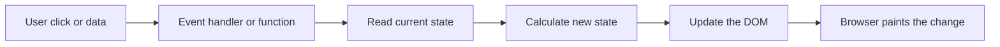
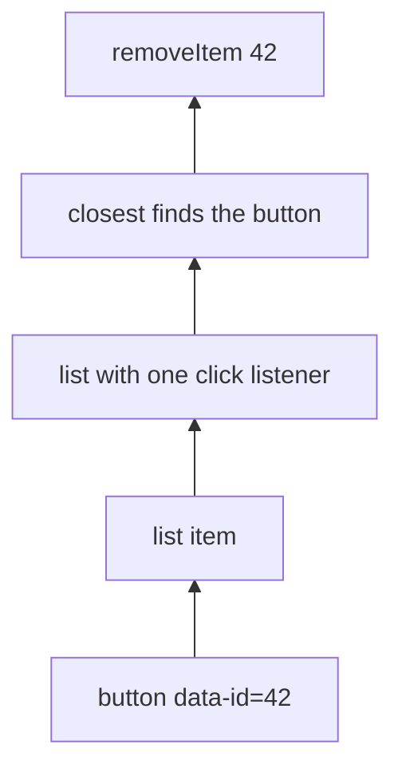
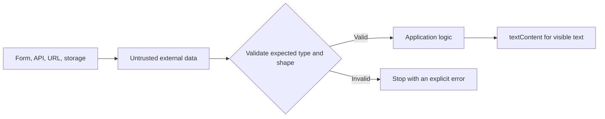

# JavaScript: make data and pages respond safely

JavaScript is the language that calculates with data and changes a web page after it loads. It is dynamically typed, which means a variable may hold different kinds of values at different times. That flexibility makes clear names, explicit checks, and small functions especially important.

Use this learning loop: predict what a snippet does, run it, inspect the result, then change one line and predict again.

## Visual map: how JavaScript changes a page



Not every JavaScript result is visible on the page, so these notes show three kinds of output:

```text
Browser: [ Saved ]          Console: "Saved"          Memory: user ---> { name: "Asha" }
```

## 1. Values, variables, and identity

### The idea

A variable is a named binding to a value. Use `const` when the binding will not be reassigned and `let` when it will. Avoid `var` in modern code because its function scope and hoisting rules are harder to reason about.

### See it in code

```js
const user = { name: "Asha" };
let completedLessons = 0;

completedLessons += 1;
user.name = "Priya";
```

`completedLessons` must be `let` because the binding changes. `user` can remain `const`: the binding still points at the same object even though a property inside that object changed. `const` does not make an object immutable.

### Know the value categories

Primitive values are `string`, `number`, `bigint`, `boolean`, `undefined`, `symbol`, and `null`. Objects, arrays, functions, maps, and sets are reference values.

```js
const first = { topic: "HTML" };
const second = first;
second.topic = "CSS";

console.log(first.topic); // "CSS"
```

Both bindings refer to the same object. Copy deliberately when you need a new outer object: `const updated = { ...first, topic: "JavaScript" };`. Spread creates a **shallow** copy; nested objects remain shared.

### Reference visual

```text
first  -----+
            +----> { topic: "CSS" }
second -----+

Changing the shared object through `second` is visible through `first`.

updated ---------> { topic: "JavaScript" }
                    a different outer object
```

## 2. Compare and choose values deliberately

### The idea

JavaScript can convert values automatically, but implicit conversion creates surprising results. Prefer strict equality and make conversions explicit.

### See it in code

```js
console.log(0 == false);  // true: values are converted
console.log(0 === false); // false: type and value must match

const count = Number("12");
if (Number.isNaN(count)) {
  throw new TypeError("Count must be a number");
}
```

Use `===` and `!==` in normal application code. `typeof null` is historically `"object"`, so check for null with `value === null`.

### `||` and `??` solve different problems

```js
const retries = 0;
const withOr = retries || 3;       // 3
const withNullish = retries ?? 3;  // 0
```

`||` uses the right side for any falsy left value. `??` uses it only for `null` or `undefined`. Choose `??` when `0`, `false`, and `""` are valid values.

```js
const city = user.address?.city;
```

Optional chaining stops and returns `undefined` if `address` is `null` or `undefined`; it does not validate data or create missing properties.

## 3. Control flow keeps decisions readable

### The idea

Control flow chooses which code runs. Prefer explicit conditions and early returns so the successful path stays easy to see.

### See it in code

```js
function formatScore(score) {
  if (!Number.isFinite(score)) {
    throw new TypeError("Score must be a finite number");
  }
  if (score < 0 || score > 100) {
    throw new RangeError("Score must be from 0 to 100");
  }
  return `${score}%`;
}
```

The validation cases leave immediately. The final return is the normal path, so it does not need to be nested under several `else` blocks.

Use `for...of` to read values from an array. `for...in` reads enumerable property keys and is rarely the right choice for arrays.

## 4. Work with objects and arrays without hidden mutation

### The idea

Objects group named fields. Arrays keep ordered values. Many array methods return a new array, while a few mutate the original. Know which is which.

### See it in code

```js
const learner = { name: "Asha", city: "Pune" };
const { name } = learner;
const movedLearner = { ...learner, city: "Delhi" };

const scores = [60, 75, 90];
const doubled = scores.map((score) => score * 2);
const passing = scores.filter((score) => score >= 70);
const firstPassing = scores.find((score) => score >= 70);
const total = scores.reduce((sum, score) => sum + score, 0);
```

Read each method as a question:

- `map`: what value should replace every item?
- `filter`: which items should remain?
- `find`: what is the first matching item?
- `some`: does any item match?
- `every`: do all items match?
- `reduce`: how do items become one accumulated result?
- `forEach`: perform a side effect for each item; it returns `undefined`.

### Array-method visual

```text
Input: [60, 75, 90]

map(score => score + 5)       -> [65, 80, 95]   transform every item
filter(score => score >= 70)  -> [75, 90]       keep matching items
find(score => score >= 70)    -> 75             return first match
reduce((sum, score) => ...)   -> 225            combine into one value
```

### Mutation example

```js
const numbers = [10, 2, 1];
const sortedCopy = numbers.toSorted((left, right) => left - right);

console.log(numbers);    // [10, 2, 1]
console.log(sortedCopy); // [1, 2, 10]
```

`sort()` changes the original array and compares as strings unless given a comparator. `toSorted()` returns a sorted copy. If it is not available in your target environment, copy before sorting: `[...numbers].sort((a, b) => a - b)`.

## 5. Functions, scope, and closures

### The idea

Functions are reusable values. They receive input, do one clear job, and return a result. Scope determines which variables a function can access.

### See it in code

```js
function createCounter() {
  let count = 0;

  return function nextCount() {
    count += 1;
    return count;
  };
}

const next = createCounter();
console.log(next()); // 1
console.log(next()); // 2
```

`nextCount` is a **closure**: it remembers `count` from the call to `createCounter` that created it. Closures power private state, event handlers, callbacks, and factory functions.

### Closure visual

```text
createCounter() call
+----------------------------------+
| remembered variable: count = 2   |
|                                  |
| next() --------------------------+----> can still access count
+----------------------------------+

Call 1: count 0 -> 1
Call 2: count 1 -> 2
```

`let` and `const` are block-scoped. Do not read them before their declaration is initialized. A function declaration can be called before its source line; a function expression assigned to a `const` cannot.

## 6. Understand `this`, classes, and modules

### The idea

For a normal function, `this` comes from how the function is called. Arrow functions capture the surrounding `this` instead of creating their own.

### See it in code

```js
const learner = {
  name: "Asha",
  greeting() {
    return `Hello, ${this.name}`;
  },
};

console.log(learner.greeting()); // "Hello, Asha"
```

The method call `learner.greeting()` sets `this` to `learner`. If you pass the method as a bare callback, that connection can be lost. Use `bind` when a callback needs a particular receiver.

Classes are clearer syntax over JavaScript's prototype inheritance:

```js
class Account {
  #balance = 0;

  deposit(amount) {
    if (!Number.isFinite(amount) || amount <= 0) {
      throw new RangeError("Amount must be a positive number");
    }
    this.#balance += amount;
  }

  get balance() {
    return this.#balance;
  }
}
```

Modules make dependencies explicit:

```js
// math.js
export function add(left, right) {
  return left + right;
}

// app.js
import { add } from "./math.js";
```

Modules have their own scope, run in strict mode, and load once. Prefer small modules with clear exports rather than one large file with hidden dependencies.

## 7. Promises, async functions, and the event loop

### The idea

JavaScript runs synchronous code on one call stack. The browser handles timers, network work, and input outside that stack, then schedules callbacks to run later.

### See it in code

```js
console.log("start");
Promise.resolve().then(() => console.log("promise"));
setTimeout(() => console.log("timer"), 0);
console.log("end");

// start, end, promise, timer
```

### Event-loop timeline

```text
Time ------------------------------------------------------------>

Call stack:   console(start)  schedule  schedule  console(end)  empty
Console:      start                                  end
Microtasks:                          [promise]                 -> promise
Task queue:                                    [timer]         -> timer

Final order: start -> end -> promise -> timer
```

After current synchronous code finishes, Promise callbacks (microtasks) run before the next timer or input task. This ordering explains many asynchronous results.

```js
async function loadUser(id) {
  const response = await fetch(`/api/users/${encodeURIComponent(id)}`);
  if (!response.ok) {
    throw new Error(`Request failed: ${response.status}`);
  }
  return response.json();
}
```

An `async` function always returns a Promise. `await` pauses only that async function; it does not freeze the page. `fetch` rejects on network failure but not ordinary HTTP 404 or 500 responses, so check `response.ok`.

Use `Promise.all` for independent requests when every result is required. Use `Promise.allSettled` when you need every outcome even if some fail. Cancel work that is no longer useful with `AbortController`.

## 8. Change the DOM with events, not unsafe strings

### The idea

The DOM is the browser's in-memory representation of HTML. JavaScript can select elements, react to user events, and update content.

### See it in code

```js
const status = document.querySelector("#status");
const saveButton = document.querySelector("#save");

if (!status || !saveButton) {
  throw new Error("Required page elements are missing");
}

saveButton.addEventListener("click", () => {
  status.textContent = "Saved";
});
```

`querySelector` returns an element or `null`, so check it before use. `textContent` creates text, not HTML. Prefer it for external or user-provided data; inserting that data with `innerHTML` can create an XSS vulnerability.

### Event delegation

```js
list.addEventListener("click", (event) => {
  const target = event.target;
  if (!(target instanceof Element)) return;

  const button = target.closest("button[data-id]");
  if (!button || !list.contains(button)) return;

  removeItem(button.dataset.id);
});
```

Click events bubble from a button through its ancestors. One listener on the list can therefore serve current and future item buttons. `preventDefault()` stops an element's built-in action, such as form navigation. Use `stopPropagation()` rarely because it can break other listeners.

### DOM and event-bubbling visual



```text
Before click                     After click
+----------------------+         +----------------------+
| Learn HTML       [x] | click   | Learn CSS        [x] |
| Learn CSS        [x] |  ---->  +----------------------+
+----------------------+
```

## 9. Handle errors and client storage carefully

### The idea

Throw errors when a function cannot meet its contract. Catch an error only when you can recover, add useful context, or clean up.

```js
try {
  const user = await loadUser("42");
  renderUser(user);
} catch (error) {
  showError("We could not load your profile. Please try again.");
}
```

`localStorage` and `sessionStorage` store strings only. Serialize structured data deliberately:

```js
localStorage.setItem("preferences", JSON.stringify({ theme: "dark" }));
const preferences = JSON.parse(localStorage.getItem("preferences") ?? "{}");
```

Do not store secrets or authentication tokens in browser storage. Treat all external text as untrusted, avoid unsafe HTML insertion, validate data at server boundaries, and use secure cookies for session authentication where appropriate.

### Trust-boundary visual



## 10. Measure before optimizing

Keep the main thread responsive. Use browser developer tools to find long tasks before changing code. Debounce noisy input such as search, throttle continuous work such as scroll handling, batch DOM reads and writes, and move truly heavy calculations to a Web Worker when needed.

Remove event listeners, timers, observers, and subscriptions when their owner is destroyed. Otherwise, a closure can keep unnecessary data alive and cause memory leaks.

## Learning path: beginner to expert

1. Predict values, equality, conditions, and array results by hand.
2. Write small functions with validated input and clear return values.
3. Learn object copying, array mutation, scope, closures, and `this`.
4. Use modules to make dependencies explicit.
5. Build DOM features with safe text updates and event delegation.
6. Learn Promise ordering, fetch error handling, cancellation, and cleanup.
7. Measure performance and protect browser code from untrusted input.
