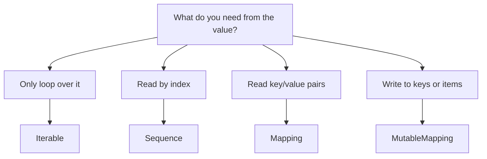

# `collections.abc` and Typing: Beginner-to-Expert Notes

## 1. Learning goals

By the end of this note, you should be able to:

- type collection-oriented functions with the right ABC from `collections.abc`;
- tell the difference between `Iterable`, `Sequence`, `Mapping`, and `MutableMapping`;
- write runtime checks with ABCs when needed;
- design APIs around behavior instead of concrete classes.

## 2. Prerequisites

- Basic Python syntax
- Lists, dictionaries, tuples, and loops
- A little familiarity with type hints

## 3. Topic at a glance

`collections.abc` gives you abstract base classes that describe what a value can do.
They help you say "I need something mapping-like" instead of "I need exactly a `dict`."

### Minimal first example

```python
from collections.abc import Iterable, Mapping


def summarize(config: Mapping[str, int], values: Iterable[int]) -> int:
    return config.get("base", 0) + sum(values)


print(summarize({"base": 10}, [1, 2, 3]))
```

Output:

```text
16
```

Why this output?

The function reads a value from the mapping and adds it to the sum of the iterable.

Roadmap: first we build the mental model, then we learn the main ABCs, then we compare them, and finally we practice choosing the right contract.

## 4. Core vocabulary

| Term | Plain-language meaning | Example |
| --- | --- | --- |
| `Iterable` | Something you can loop over | `list`, `tuple`, `set` |
| `Iterator` | Something that produces values one at a time | `iter([1, 2, 3])` |
| `Sequence` | Ordered, indexable, read-only collection behavior | `list`, `tuple`, `str` |
| `MutableSequence` | A sequence you can change in place | `list` |
| `Mapping` | Read-only dictionary-like behavior | `dict`, `ChainMap` |
| `MutableMapping` | Dictionary-like behavior with writes | `dict`, `defaultdict` |
| `Protocol` | A typing contract based on behavior, not inheritance | custom structural types |

## 5. Mental model



Pick the narrowest contract that still covers the behavior you need.
That keeps the API clearer and makes misuse easier to catch.

## 6. Foundations

### 6.1 `Iterable` means "can be looped over"

```python
from collections.abc import Iterable


def total(values: Iterable[int]) -> int:
    return sum(values)


print(total([1, 2, 3]))
```

Output:

```text
6
```

Practical takeaway: use `Iterable` when you only need to loop through values once.

### 6.2 `Sequence` means "ordered and indexable"

```python
from collections.abc import Sequence


def first_and_last(items: Sequence[str]) -> tuple[str, str]:
    return items[0], items[-1]


print(first_and_last(("a", "b", "c")))
print(first_and_last(["x", "y"]))
```

Output:

```text
('a', 'c')
('x', 'y')
```

Practical takeaway: use `Sequence` when you need indexing, length, or slicing.

### 6.3 `Mapping` means "dictionary-like read access"

```python
from collections.abc import Mapping


def summarize(config: Mapping[str, int]) -> int:
    return config.get("base", 0) + config.get("bonus", 0)


print(summarize({"base": 10, "bonus": 4}))
```

Output:

```text
14
```

Practical takeaway: use `Mapping` when you only need to read keys and values.

## 7. How it works

ABCs describe behavior, not concrete storage.
That means your function can accept more than one concrete type as long as the object behaves correctly.

For example:

- `Mapping` accepts `dict`, `defaultdict`, `ChainMap`, and other mapping-like objects.
- `Sequence` accepts `list`, `tuple`, and `str`.
- `Iterable` accepts almost anything that can be looped over.

## 8. Core operations or methods

### Runtime validation with `isinstance()`

```python
from collections.abc import Mapping


def load_settings(obj: object) -> dict[str, int]:
    if not isinstance(obj, Mapping):
        raise TypeError("Expected mapping-like input")
    return dict(obj)


print(load_settings({"a": 1, "b": 2}))
```

Output:

```text
{'a': 1, 'b': 2}
```

### Typed inversion with a mapping contract

```python
from collections.abc import Mapping


def invert_unique(data: Mapping[str, int]) -> dict[int, str]:
    result: dict[int, str] = {}
    for key, value in data.items():
        if value in result:
            raise ValueError("values must be unique")
        result[value] = key
    return result


print(invert_unique({"a": 1, "b": 2}))
```

Output:

```text
{1: 'a', 2: 'b'}
```

### `MutableMapping` when writes are required

Use `MutableMapping` only when the function needs to change the mapping.

## 9. Guided examples

### Example 1: Read from any mapping-like object

```python
from collections.abc import Mapping


def get_timeout(config: Mapping[str, int]) -> int:
    return config.get("timeout", 30)


print(get_timeout({"timeout": 60}))
```

Output:

```text
60
```

### Example 2: Sum anything iterable

```python
from collections.abc import Iterable


def total(values: Iterable[int]) -> int:
    return sum(values)


print(total((2, 3, 5)))
```

Output:

```text
10
```

### Example 3: Use a sequence when indexing matters

```python
from collections.abc import Sequence


def middle(items: Sequence[str]) -> str:
    return items[len(items) // 2]


print(middle(["a", "b", "c"]))
```

Output:

```text
b
```

## 10. Common patterns and real-world applications

- Type read-only config as `Mapping`.
- Type a list of values that may be a tuple or list as `Sequence`.
- Type one-pass inputs such as generator pipelines as `Iterable`.
- Use `MutableMapping` for APIs that edit dictionaries in place.
- Use `Protocol` when you want structural compatibility without inheritance.

## 11. Common mistakes, misconceptions, and failure cases

### Mistake 1: Requiring `dict` when `Mapping` is enough

If your function only reads keys and values, do not force callers to pass exactly a `dict`.

### Mistake 2: Using `Iterable` when you need indexing

An `Iterable` can be looped over, but it does not promise `items[0]` or slicing.

### Mistake 3: Using the wrong mutability contract

If the function writes to the object, type it as `MutableMapping`, not `Mapping`.

### Mistake 4: Confusing runtime checks with static typing

Type hints help tools and readers, but they do not enforce behavior by themselves.
Use `isinstance()` if you need a runtime check.

## 12. Comparison and decision guide

| Need | Best choice | Why | Avoid when |
| --- | --- | --- | --- |
| Loop through values once | `Iterable` | Broad and flexible | You need indexing |
| Index by position | `Sequence` | Read-only ordered access | You need mutation-only operations |
| Read key/value pairs | `Mapping` | Narrow and clear | You must write to keys |
| Update keys and values | `MutableMapping` | Reflects write behavior | You only need read access |
| Behavior-based structural typing | `Protocol` | Flexible without inheritance | You need an ABC runtime check |

Selection rule:

- Choose the narrowest type that matches the behavior.
- Do not use a concrete type unless the concrete type itself matters.

## 13. Efficiency, limitations, safety, and best practices

- Narrower contracts make APIs easier to understand.
- `Iterable` is the broadest choice, but it gives the least information.
- `Sequence` is better when callers need position-based behavior.
- `Mapping` is better when callers only need lookup behavior.
- Runtime ABC checks are useful at boundaries, especially when input comes from outside your code.

Best practices:

- Keep input contracts as small as possible.
- Convert to a concrete type only when you truly need one.
- Do not overstate the guarantees your function actually needs.

## 14. Advanced concepts

### `Protocol` versus `ABC`

`ABC` is useful when you want a known interface and runtime checks.
`Protocol` is useful when you want structural typing, meaning any object with the right methods can satisfy the contract.

This is especially useful for collection-like APIs that should accept more than one concrete class.

## 15. Interview or assessment knowledge

- Why use `Mapping` instead of `dict`? It makes the function more flexible and more honest about what it needs.
- Why use `Sequence` instead of `list`? It allows tuples and other ordered read-only containers.
- Why use `Iterable` instead of `Sequence`? It says you only need to traverse the values.
- When should you use `MutableMapping`? When the function changes keys or values.

## 16. Practice exercises

1. Write a function that accepts a `Mapping[str, int]` and returns the value for `"port"` or `0`.
2. Write a function that accepts a `Sequence[str]` and returns the first item.
3. Write a function that accepts an `Iterable[int]` and returns the sum.
4. Add a runtime check that raises `TypeError` when the input is not mapping-like.
5. Rewrite a function typed with `dict` so it uses `Mapping` instead.

### Solutions

#### Solution 1

```python
from collections.abc import Mapping


def get_port(config: Mapping[str, int]) -> int:
    return config.get("port", 0)


print(get_port({"port": 8080}))
```

Output:

```text
8080
```

#### Solution 2

```python
from collections.abc import Sequence


def first_item(items: Sequence[str]) -> str:
    return items[0]


print(first_item(["alpha", "beta"]))
```

Output:

```text
alpha
```

#### Solution 3

```python
from collections.abc import Iterable


def total(values: Iterable[int]) -> int:
    return sum(values)


print(total([1, 2, 3, 4]))
```

Output:

```text
10
```

#### Solution 4

```python
from collections.abc import Mapping


def load_settings(obj: object) -> dict[str, int]:
    if not isinstance(obj, Mapping):
        raise TypeError("Expected mapping-like input")
    return dict(obj)


print(load_settings({"x": 1}))
```

Output:

```text
{'x': 1}
```

#### Solution 5

```python
from collections.abc import Mapping


def read_timeout(config: Mapping[str, int]) -> int:
    return config.get("timeout", 30)


print(read_timeout({"timeout": 45}))
```

Output:

```text
45
```

## 17. Summary cheat sheet

| Contract | What it means | Best use |
| --- | --- | --- |
| `Iterable` | You can loop over it | One-pass traversal |
| `Sequence` | Ordered and indexable | Position-based access |
| `Mapping` | Dictionary-like read access | Lookup-only APIs |
| `MutableMapping` | Dictionary-like write access | In-place updates |
| `Protocol` | Behavior-based typing | Flexible structural contracts |

## 18. Mastery checklist and next steps

- [ ] I can explain the difference between `Iterable`, `Sequence`, and `Mapping`.
- [ ] I can choose `MutableMapping` only when writes are needed.
- [ ] I can explain why `Mapping` is usually better than `dict` in a function signature.
- [ ] I know when runtime `isinstance()` checks are useful.
- [ ] I can describe the difference between `Protocol` and `ABC`.

Next topics:

- `collections` module types
- `heapq` and `bisect`
- specialized sequence types
- `itertools`
