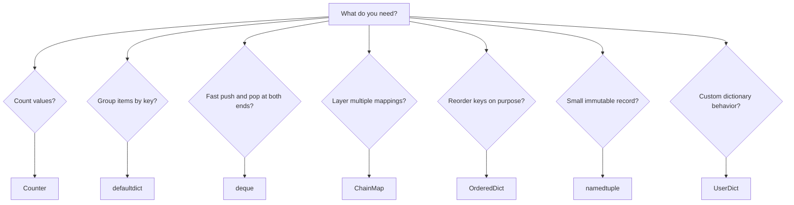

# `collections` Module Mastery: Beginner-to-Expert Notes

## 1. Learning goals

By the end of this note, you should be able to:

- choose the right `collections` type for counting, grouping, queues, layered lookups, and records;
- write simple examples with `Counter`, `defaultdict`, `deque`, `ChainMap`, `OrderedDict`, and `namedtuple`;
- avoid the most common beginner mistakes;
- explain why these types exist instead of forcing `list` and `dict` to do every job.

## 2. Prerequisites

- Basic Python syntax
- Lists, dictionaries, tuples, and loops
- Function calls and method calls

## 3. Topic at a glance

`collections` is a standard-library module that adds specialized container types for common patterns.
Think of it like a toolbox with purpose-built tools: one tool for counting, one for queues, one for layered config, and so on.

### Minimal first example

```python
from collections import Counter

items = ["apple", "banana", "apple"]
print(Counter(items).most_common())
```

Output:

```text
[('apple', 2), ('banana', 1)]
```

Why this output?

`Counter` counts each item, and `most_common()` returns the items sorted by frequency.

Roadmap: first we build the mental model, then we learn each type, then we compare them, and finally we practice choosing the right one.

## 4. Core vocabulary

| Term | Plain-language meaning | Example |
| --- | --- | --- |
| `Counter` | A dictionary that counts how many times each value appears | `Counter(["a", "a", "b"])` |
| `defaultdict` | A dictionary that creates a default value for missing keys | `defaultdict(list)` |
| `deque` | A double-ended queue with fast adds/removes at both ends | `deque([1, 2, 3])` |
| `ChainMap` | A view that searches multiple dictionaries in order | `ChainMap(env, defaults)` |
| `OrderedDict` | A dictionary with order-focused methods | `move_to_end()` |
| `namedtuple` | A small immutable record with named fields | `Point(x=2, y=5)` |
| `UserDict` | A safe wrapper for customizing dictionary behavior | `class MyDict(UserDict)` |

## 5. Mental model

Use the container that matches the job you need to do.



Key idea: do not start with the container and then force the problem into it. Start with the problem, then pick the tool.

## 6. Foundations

### 6.1 Counting values with `Counter`

`Counter` is the easiest way to count repeated values.

```python
from collections import Counter

items = ["apple", "banana", "apple", "pear"]
counts = Counter(items)

print(counts["apple"])
print(counts.most_common(2))
```

Output:

```text
2
[('apple', 2), ('banana', 1)]
```

Why this output?

`Counter` stores each item as a key and its frequency as the value.

Practical takeaway: use `Counter` whenever you find yourself writing a manual counting loop.

### 6.2 Grouping values with `defaultdict`

`defaultdict(list)` creates an empty list the first time a key appears.

```python
from collections import defaultdict

groups = defaultdict(list)
records = [("ENG", "Ana"), ("HR", "Raj"), ("ENG", "Mia")]

for dept, name in records:
    groups[dept].append(name)

print(groups["ENG"])
print(groups["HR"])
```

Output:

```text
['Ana', 'Mia']
['Raj']
```

Why this output?

The first time a department appears, `defaultdict` creates `[]`, then `append()` adds the names.

Practical takeaway: use `defaultdict` when missing keys should create a usable default automatically.

### 6.3 Fast queue work with `deque`

`deque` is built for fast work at both ends.

```python
from collections import deque

queue = deque(["task-1", "task-2"])
queue.append("task-3")
first = queue.popleft()

print(first)
print(list(queue))
```

Output:

```text
task-1
['task-2', 'task-3']
```

Why this output?

`append()` adds to the right side, and `popleft()` removes from the left side.

Practical takeaway: use `deque` for queues, BFS, and sliding-window style work.

## 7. How it works

`collections` types mostly behave like their built-in cousins, but each one adds a focused behavior:

- `Counter` tracks frequencies.
- `defaultdict` fills in missing values from a factory function.
- `deque` keeps both-end operations fast.
- `ChainMap` searches several mappings in order.
- `OrderedDict` gives you explicit order control.
- `namedtuple` gives you a compact immutable record.
- `UserDict` gives you a safer subclassing surface.

## 8. Core operations or methods

### `Counter`

- `update()` adds counts from new data.
- `subtract()` reduces counts.
- `most_common()` returns the highest-frequency items.

```python
from collections import Counter

counts = Counter("banana")
counts.update("band")
print(counts["a"])
print(counts.most_common(2))
```

Output:

```text
4
[('a', 4), ('n', 3)]
```

### `defaultdict`

- The factory runs only when a missing key is accessed with `[]`.
- `get()` does not create the key.

```python
from collections import defaultdict

groups = defaultdict(list)
print(groups.get("ENG"))
print("ENG" in groups)
print(groups["ENG"])
print("ENG" in groups)
```

Output:

```text
None
False
[]
True
```

### `deque`

- `append()` and `appendleft()` add items.
- `pop()` and `popleft()` remove items.
- `rotate()` shifts the queue.

```python
from collections import deque

dq = deque([1, 2, 3])
dq.rotate(1)
print(list(dq))
```

Output:

```text
[3, 1, 2]
```

### `ChainMap`

- Searches the first mapping first, then the next one, and so on.
- Useful for layered configuration.

```python
from collections import ChainMap

defaults = {"timeout": 30, "retries": 2}
env = {"timeout": 60}
cfg = ChainMap(env, defaults)

print(cfg["timeout"])
print(cfg["retries"])
```

Output:

```text
60
2
```

### `OrderedDict`

- `move_to_end()` moves a key to one side.

```python
from collections import OrderedDict

od = OrderedDict([("a", 1), ("b", 2), ("c", 3)])
od.move_to_end("a")
print(list(od.keys()))
```

Output:

```text
['b', 'c', 'a']
```

### `namedtuple`

- Creates a lightweight immutable record.
- Field names are easy to read.

```python
from collections import namedtuple

Point = namedtuple("Point", ["x", "y"])
p = Point(2, 5)

print(p.x + p.y)
print(p._asdict())
```

Output:

```text
7
{'x': 2, 'y': 5}
```

### `UserDict`

- Use it when you want custom dictionary behavior without fighting the built-in `dict` internals.

## 9. Guided examples

### Example 1: Count word frequency

```python
from collections import Counter

words = ["red", "blue", "red", "green", "blue", "red"]
counts = Counter(words)

print(counts["red"])
print(counts.most_common(2))
```

Output:

```text
3
[('red', 3), ('blue', 2)]
```

### Example 2: Group people by department

```python
from collections import defaultdict

people = [("ENG", "Ana"), ("HR", "Raj"), ("ENG", "Mia"), ("HR", "Zoe")]
departments = defaultdict(list)

for dept, name in people:
    departments[dept].append(name)

print(departments["ENG"])
print(departments["HR"])
```

Output:

```text
['Ana', 'Mia']
['Raj', 'Zoe']
```

### Example 3: Build a simple task queue

```python
from collections import deque

tasks = deque(["download", "parse"])
tasks.append("save")
print(tasks.popleft())
print(list(tasks))
```

Output:

```text
download
['parse', 'save']
```

## 10. Common patterns and real-world applications

- Use `Counter` for logs, tags, token counts, and inventory counts.
- Use `defaultdict(list)` for grouping records by category.
- Use `deque` for BFS, job queues, and sliding windows.
- Use `ChainMap` for config layering such as defaults, environment values, and user overrides.
- Use `OrderedDict` when key order must be manipulated intentionally.
- Use `namedtuple` for small read-only records returned from functions.

## 11. Common mistakes, misconceptions, and failure cases

### Mistake 1: Expecting `defaultdict.get()` to create a default

```python
from collections import defaultdict

groups = defaultdict(list)
print(groups.get("ENG"))
print("ENG" in groups)
print(groups["ENG"])
print("ENG" in groups)
```

Output:

```text
None
False
[]
True
```

Rule to remember: only `groups["ENG"]` creates the default value.

### Mistake 2: Using a list as a queue

`list.pop(0)` works, but it shifts all remaining items and gets slow as the list grows.
Use `deque.popleft()` instead.

### Mistake 3: Assuming `ChainMap` merges everything into a new dict

`ChainMap` is a live view over several mappings. It searches them in order instead of copying them.

### Mistake 4: Using `OrderedDict` just for normal insertion order

In modern Python, plain `dict` already keeps insertion order. Use `OrderedDict` only when you need order-specific methods such as `move_to_end()`.

## 12. Comparison and decision guide

| Need | Best choice | Why | Avoid when |
| --- | --- | --- | --- |
| Count repeated values | `Counter` | Built for frequencies | You need custom aggregation rules |
| Group items by key | `defaultdict(list)` | Removes grouping boilerplate | Missing keys should stay invalid |
| Queue from both ends | `deque` | Fast end operations | You need heavy random indexing |
| Layer configs | `ChainMap` | Reads multiple mappings in order | You need a real merged copy |
| Reorder keys intentionally | `OrderedDict` | Has order-control methods | Plain insertion order is enough |
| Small immutable record | `namedtuple` | Compact and readable | You need mutable fields |

Selection rule:

- If the job is counting, start with `Counter`.
- If the job is grouping, start with `defaultdict`.
- If the job is queue-like, start with `deque`.
- If the job is layered lookup, start with `ChainMap`.
- If the job is an ordered record, start with `namedtuple`.

## 13. Efficiency, limitations, safety, and best practices

| Type | Strength | Limitation |
| --- | --- | --- |
| `Counter` | Fast counting and frequency math | It is still a dictionary, so memory grows with unique keys |
| `defaultdict` | Removes missing-key boilerplate | Missing keys are created automatically, which may hide mistakes |
| `deque` | Fast at both ends | Random indexing is slower than list indexing |
| `ChainMap` | No copying for layered lookup | Lookups search each mapping in order |
| `OrderedDict` | Explicit order operations | Usually unnecessary if you only need insertion order |
| `namedtuple` | Lightweight immutable record | Fields cannot be updated in place |

Best practices:

- Prefer explicit output formatting when the result is shown to users.
- Use the narrowest container that matches the job.
- Do not create missing keys unless that behavior is actually intended.

## 14. Advanced concepts

### Counter arithmetic

`Counter` supports useful frequency math such as intersection and union.

### `deque(maxlen=...)`

Use `maxlen` when you want a fixed-size rolling buffer.

```python
from collections import deque

window = deque([1, 2, 3], maxlen=3)
window.append(4)
print(list(window))
```

Output:

```text
[2, 3, 4]
```

### `namedtuple._replace()`

Use `_replace()` to create a new record with one changed field.

### `UserDict` for custom behavior

If you need to normalize keys, log writes, or add validation, subclass `UserDict` instead of trying to fight `dict` directly.

## 15. Interview or assessment knowledge

- Why use `Counter` instead of a manual loop? It is simpler and communicates intent.
- Why use `deque` instead of `list` for a queue? End operations are faster and more natural.
- Why use `defaultdict`? It removes repetitive initialization code.
- Why use `ChainMap`? It gives layered lookup without copying every mapping.
- When is `OrderedDict` still useful? When you need explicit reordering methods.

## 16. Practice exercises

1. Use `Counter` to count the items in `["a", "b", "a", "c"]`.
2. Use `defaultdict(list)` to group `("ENG", "Ana")` and `("ENG", "Mia")`.
3. Use `deque` to add `"c"` after `["a", "b"]` and remove the first item.
4. Use `ChainMap` to read `"timeout"` from `{"timeout": 60}` and `{"timeout": 30, "retries": 2}`.
5. Use `namedtuple` to store `Point(2, 5)` and print the sum of the fields.

### Solutions

#### Solution 1

```python
from collections import Counter

print(Counter(["a", "b", "a", "c"])["a"])
```

Output:

```text
2
```

#### Solution 2

```python
from collections import defaultdict

groups = defaultdict(list)
for dept, name in [("ENG", "Ana"), ("ENG", "Mia")]:
    groups[dept].append(name)

print(groups["ENG"])
```

Output:

```text
['Ana', 'Mia']
```

#### Solution 3

```python
from collections import deque

dq = deque(["a", "b"])
dq.append("c")
print(dq.popleft())
print(list(dq))
```

Output:

```text
a
['b', 'c']
```

#### Solution 4

```python
from collections import ChainMap

cfg = ChainMap({"timeout": 60}, {"timeout": 30, "retries": 2})
print(cfg["timeout"])
```

Output:

```text
60
```

#### Solution 5

```python
from collections import namedtuple

Point = namedtuple("Point", ["x", "y"])
p = Point(2, 5)
print(p.x + p.y)
```

Output:

```text
7
```

## 17. Summary cheat sheet

| Need | Use | Remember |
| --- | --- | --- |
| Count values | `Counter` | Frequencies first |
| Group records | `defaultdict(list)` | Missing key creates default |
| Queue behavior | `deque` | Fast at both ends |
| Layered config | `ChainMap` | Lookup is ordered |
| Reorder keys | `OrderedDict` | Use when order operations matter |
| Small record | `namedtuple` | Immutable and readable |

## 18. Mastery checklist and next steps

- [ ] I can explain what each `collections` type is for.
- [ ] I can choose between `Counter`, `defaultdict`, `deque`, and `ChainMap`.
- [ ] I know why `defaultdict.get()` does not create keys.
- [ ] I know when `OrderedDict` is unnecessary.
- [ ] I can write small examples with printed output from memory.

Next topics:

- `heapq` and `bisect`
- `collections.abc` and typing
- specialized sequence types
- `itertools`
