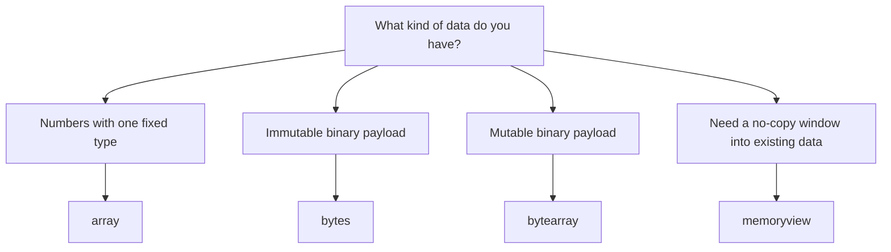

# Specialized Sequence Types: Beginner-to-Expert Notes

## 1. Learning goals

By the end of this note, you should be able to:

- choose between `array`, `bytes`, `bytearray`, and `memoryview`;
- explain when binary or memory-sensitive types are better than `list`;
- understand the difference between copying data and viewing the same data;
- avoid the most common text-versus-binary mistakes.

## 2. Prerequisites

- Lists, strings, and slicing
- Basic Python functions and print output
- A little comfort with bytes and file or network data

## 3. Topic at a glance

These sequence types are for situations where plain `list` is not the best fit.
Use them when you need compact numeric storage, binary data, or zero-copy access.

### Minimal first example

```python
from array import array

nums = array("i", [1, 2, 3])
nums.append(4)
print(nums.tolist())
```

Output:

```text
[1, 2, 3, 4]
```

Why this output?

`array("i")` stores signed integers, and `append(4)` adds one more value to the sequence.

Roadmap: first we build the mental model, then we learn each type, then we compare them, and finally we practice choosing the right one.

## 4. Core vocabulary

| Term | Plain-language meaning | Example |
| --- | --- | --- |
| `array.array` | A typed numeric sequence | `array("i", [1, 2, 3])` |
| `bytes` | Immutable binary data | `b"ABC"` |
| `bytearray` | Mutable binary data | `bytearray(b"ABC")` |
| `memoryview` | A view over existing binary data without copying | `memoryview(data)` |
| Buffer protocol | The shared binary interface these objects use | `bytearray`, `bytes`, `memoryview` |

## 5. Mental model



Start with the data shape, then choose the container that matches how you will read or change it.

## 6. Foundations

### 6.1 `array.array` stores one numeric type efficiently

```python
from array import array

nums = array("i", [1, 2, 3])
nums.append(4)

print(nums.tolist())
```

Output:

```text
[1, 2, 3, 4]
```

Why this output?

The type code `"i"` means signed integer, so the array accepts integers and keeps them in a compact form.

Practical takeaway: use `array` when you need a compact numeric sequence and all items share one type.

### 6.2 `bytes` is immutable, `bytearray` is mutable

```python
raw = b"ABC"
buf = bytearray(raw)
buf[0] = ord("Z")

print(raw)
print(bytes(buf))
```

Output:

```text
b'ABC'
b'ZBC'
```

Why this output?

`bytes` cannot be changed in place, but `bytearray` can.

Practical takeaway: use `bytes` for read-only payloads and `bytearray` when you need to edit the data.

### 6.3 `memoryview` lets you view data without copying it

```python
data = bytearray(b"abcdefgh")
part = memoryview(data)[2:6]
part[0] = ord("X")

print(data)
print(bytes(part))
```

Output:

```text
bytearray(b'abXdefgh')
b'Xdef'
```

Why this output?

`memoryview` points at the original buffer, so changing the slice changes the original data too.

Practical takeaway: use `memoryview` when you want to avoid unnecessary copies.

## 7. How it works

`memoryview` does not own the data. It points to an existing buffer object.
That is why it is fast and memory-friendly for slicing large binary data.

`bytes` is immutable, so Python can safely share or cache it.
`bytearray` and `array` are mutable, so changes update the underlying sequence in place.

## 8. Core operations or methods

### `array.array`

- `append()` adds one typed item.
- `extend()` adds many typed items.
- `tolist()` converts to a regular list for display or debugging.

### `bytes`

- Slicing returns another `bytes` object.
- Concatenation creates a new immutable value.

### `bytearray`

- `append()` and `extend()` mutate the buffer.
- Item assignment changes a single byte.

### `memoryview`

- Slicing usually creates another view, not a copy.
- The view reflects changes in the underlying buffer.

```python
buf = bytearray(b"hi")
buf.extend(b"!")
print(buf)
```

Output:

```text
bytearray(b'hi!')
```

## 9. Guided examples

### Example 1: Store integers compactly

```python
from array import array

values = array("i", [10, 20, 30])
values.append(40)

print(values.tolist())
```

Output:

```text
[10, 20, 30, 40]
```

### Example 2: Edit binary data safely

```python
payload = bytearray(b"HELLO")
payload[1] = ord("A")

print(bytes(payload))
```

Output:

```text
b'HALLO'
```

### Example 3: Read a slice without copying

```python
data = bytearray(b"abcdefgh")
window = memoryview(data)[3:6]

print(bytes(window))
```

Output:

```text
b'def'
```

## 10. Common patterns and real-world applications

- Use `array` for numeric data where memory matters.
- Use `bytes` for file contents, protocol packets, and other read-only binary payloads.
- Use `bytearray` when you need to build or modify binary content.
- Use `memoryview` when you want to inspect or edit a slice without copying.

## 11. Common mistakes, misconceptions, and failure cases

### Mistake 1: Mixing text and binary data

`str` is text. `bytes` is binary. They are not interchangeable.

### Mistake 2: Treating `bytes` like a mutable sequence

```python
payload = b"ABC"
payload[0] = 90
```

Output:

```text
TypeError: 'bytes' object does not support item assignment
```

Correct approach:

```python
payload = bytearray(b"ABC")
payload[0] = 90
print(bytes(payload))
```

Output:

```text
b'ZBC'
```

### Mistake 3: Assuming `memoryview` makes a copy

It usually does not. It points at the original buffer.

### Mistake 4: Forgetting that `array` has a type code

The type code decides what kind of values the array can store.

## 12. Comparison and decision guide

| Need | Best choice | Why | Avoid when |
| --- | --- | --- | --- |
| General-purpose sequence | `list` | Flexible and familiar | You need compact numeric storage |
| Compact numbers of one type | `array.array` | Lower overhead for typed data | Your items are mixed types |
| Read-only binary payload | `bytes` | Immutable and safe to share | You need in-place edits |
| Mutable binary payload | `bytearray` | Easy to modify | You need an immutable value |
| No-copy slice into data | `memoryview` | Avoids extra allocation | You need a completely independent copy |

Selection rule:

- Start with `list` for general app logic.
- Move to `array` for compact numeric data.
- Use `bytes` for immutable binary content.
- Use `bytearray` when the content must change.
- Use `memoryview` when copying would be wasteful.

## 13. Efficiency, limitations, safety, and best practices

| Type | Strength | Limitation |
| --- | --- | --- |
| `array` | Compact numeric storage | One type only |
| `bytes` | Immutable and hashable | Cannot be edited in place |
| `bytearray` | Mutable binary buffer | Still a binary type, not text |
| `memoryview` | Zero-copy access | The underlying data still controls mutability |

Best practices:

- Convert to text only with an explicit encoding step.
- Use `bytes` when sharing read-only binary data.
- Use `bytearray` when you need repeated edits.
- Use `memoryview` for performance-sensitive binary processing.

## 14. Advanced concepts

### Buffer sharing

`memoryview` is powerful because it lets multiple objects refer to the same underlying data.
That is useful in parsers, file readers, and networking code where copying large payloads would be expensive.

### Type codes in `array`

The type code controls the item type, so choose it carefully.

## 15. Interview or assessment knowledge

- Why use `array` instead of `list`? It can be more compact for numeric data.
- Why use `bytes` instead of `bytearray`? It is immutable and safer to share.
- Why use `bytearray` instead of `bytes`? You need to modify the data.
- Why use `memoryview`? It avoids copying when you only need a slice or a view.

## 16. Practice exercises

1. Create an `array("i", [2, 4, 6])` and append `8`.
2. Change the second byte of `bytearray(b"CAT")` to `"O"`.
3. Create a `memoryview` of `bytearray(b"hello")` and print the middle three bytes.
4. Explain why `payload = b"ABC"; payload[0] = 90` fails.
5. Choose the right type for a read-only binary file payload.

### Solutions

#### Solution 1

```python
from array import array

values = array("i", [2, 4, 6])
values.append(8)
print(values.tolist())
```

Output:

```text
[2, 4, 6, 8]
```

#### Solution 2

```python
buf = bytearray(b"CAT")
buf[1] = ord("O")
print(bytes(buf))
```

Output:

```text
b'COT'
```

#### Solution 3

```python
data = bytearray(b"hello")
print(bytes(memoryview(data)[1:4]))
```

Output:

```text
b'ell'
```

#### Solution 4

`bytes` is immutable, so item assignment is not allowed.

#### Solution 5

Use `bytes`.

## 17. Summary cheat sheet

| Need | Use | Remember |
| --- | --- | --- |
| Compact numeric data | `array` | One fixed type |
| Immutable binary data | `bytes` | Safe to share |
| Mutable binary data | `bytearray` | Editable in place |
| No-copy slice | `memoryview` | Views the same buffer |

## 18. Mastery checklist and next steps

- [ ] I can explain the difference between text and binary data.
- [ ] I can choose between `bytes` and `bytearray`.
- [ ] I understand that `memoryview` avoids copying.
- [ ] I know when `array` is better than `list`.
- [ ] I can write a small example with printed output for each type.

Next topics:

- `collections` module types
- `heapq` and `bisect`
- `collections.abc` and typing
- `itertools`
