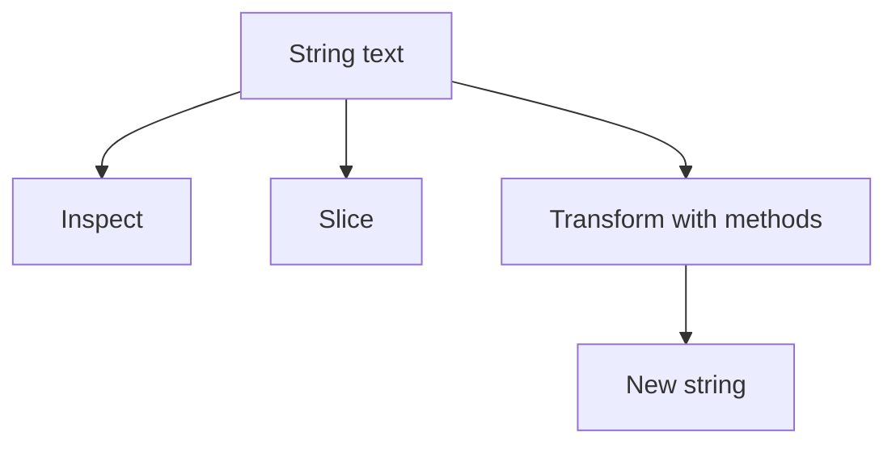

# `str` in Python: Beginner-to-Expert Notes

## 1. Learning goals

By the end of this note, you should be able to:

- treat strings as immutable text sequences;
- use common string methods for cleaning and formatting;
- slice and search strings safely;
- recognize when text handling needs explicit validation.

## 2. Prerequisites

- Basic Python variables and lists
- Slicing and method calls

## 3. Topic at a glance

A string is ordered text in Python.
It behaves like a sequence of characters, but it is immutable.

### Minimal first example

```python
text = "python"
print(text.upper())
```

Output:

```text
PYTHON
```

Why this output?

`upper()` returns a new string with uppercase letters.

Roadmap: first we build the mental model, then we learn core methods, then we compare string operations with other sequence types, and finally we practice safe text handling.

## 4. Core vocabulary

| Term | Plain-language meaning | Example |
| --- | --- | --- |
| String | immutable text sequence | `"hello"` |
| Slice | part of a string | `text[1:4]` |
| Immutable | cannot be changed in place | strings |
| Method | operation on a string | `strip()`, `split()` |
| Encoding | text-to-bytes rule | UTF-8 |

## 5. Mental model



## 6. Foundations

### 6.1 Strings are immutable

```python
text = "cat"
print(text.replace("c", "b"))
print(text)
```

Output:

```text
bat
cat
```

### 6.2 Slicing extracts parts

```python
text = "python"
print(text[0:3])
print(text[-3:])
```

Output:

```text
pyt
hon
```

### 6.3 `split()` and `join()`

```python
text = "ana,raj,mia"
parts = text.split(",")
print(parts)
print(" | ".join(parts))
```

Output:

```text
['ana', 'raj', 'mia']
ana | raj | mia
```

## 7. How it works

String methods do not change the original string.
They return a new string or a new list depending on the operation.

## 8. Core operations or methods

- `upper()`
- `lower()`
- `strip()`
- `split()`
- `join()`
- `replace()`
- slicing

## 9. Guided examples

### Example 1: Clean text

```python
text = "  Ana  "
print(text.strip())
```

Output:

```text
Ana
```

### Example 2: Break text into parts

```python
text = "one,two,three"
print(text.split(","))
```

Output:

```text
['one', 'two', 'three']
```

### Example 3: Build a sentence

```python
words = ["hello", "world"]
print(" ".join(words))
```

Output:

```text
hello world
```

## 10. Common patterns and real-world applications

- cleaning user input;
- parsing simple text formats;
- formatting messages;
- creating readable output.

## 11. Common mistakes, misconceptions, and failure cases

### Mistake 1: Expecting string methods to modify in place

They return new strings.

### Mistake 2: Confusing text and bytes

Text is `str`; binary data is `bytes`.

### Mistake 3: Forgetting to strip input

Whitespace often needs explicit removal before validation.

## 12. Comparison and decision guide

| Need | Best choice | Why |
| --- | --- | --- |
| Text handling | `str` | immutable and expressive |
| Character list editing | list of chars | easier for complex edits |
| Binary data | `bytes` | not text |

## 13. Efficiency, limitations, safety, and best practices

- strings are immutable, so repeated concatenation can cost more than building once;
- use explicit encoding when moving between text and bytes;
- validate external text before trusting it.

## 14. Advanced concepts

- string formatting;
- Unicode awareness;
- normalization in text-heavy systems.

## 15. Interview or assessment knowledge

- Why are strings immutable?
- What does `split()` return?
- What does `join()` do?
- Why is `strip()` commonly used?

## 16. Practice exercises

1. Uppercase a string.
2. Strip whitespace from text.
3. Split a comma-separated string.
4. Join a list of words.
5. Explain the difference between `str` and `bytes`.

### Solutions

#### Solution 1

```python
print("python".upper())
```

Output:

```text
PYTHON
```

#### Solution 2

```python
print("  hello  ".strip())
```

Output:

```text
hello
```

#### Solution 3

```python
print("a,b,c".split(","))
```

Output:

```text
['a', 'b', 'c']
```

#### Solution 4

```python
print(" ".join(["hello", "world"]))
```

Output:

```text
hello world
```

#### Solution 5

`str` is text, while `bytes` is binary data.

## 17. Summary cheat sheet

| Method | Use |
| --- | --- |
| `upper()` | uppercase |
| `strip()` | remove outer whitespace |
| `split()` | break into pieces |
| `join()` | combine pieces |
| `replace()` | swap text |

## 18. Mastery checklist and next steps

- [ ] I can explain that strings are immutable.
- [ ] I can use common string methods.
- [ ] I can slice text safely.
- [ ] I know when to validate text input.

Next topics:

- `list.md`
- `tuple.md`
- `set.md`
- `dict.md`
