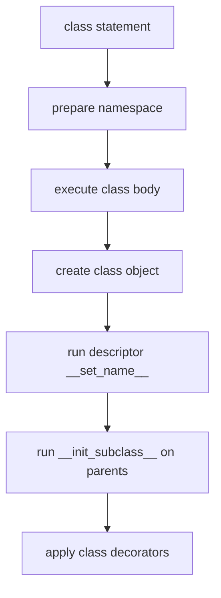

# Class Creation, Descriptors, and Metaclasses: Beginner-to-Expert Notes

## 1. Learning goals

By the end of this note, you should be able to:

- explain that classes are objects too;
- understand the order of class creation hooks;
- use descriptors to control attribute access;
- use `__init_subclass__` and class decorators before metaclasses;
- explain when a metaclass is justified and when it is not.

## 2. Prerequisites

- Classes, methods, and inheritance
- Basic understanding of object attributes
- Familiarity with ABCs or protocols is helpful but not required

## 3. Topic at a glance

Python lets you customize how classes are built and how attributes behave.
This is powerful, but it is also advanced, so the simple tools should come first.

### Minimal first example

```python
class Course:
    category = "programming"


print(type(Course).__name__)
print(Course.category)
```

Output:

```text
type
programming
```

Why this output?

`Course` is itself an object, and its class is `type`.

Roadmap: first we build the mental model, then we learn descriptors and class hooks, then we compare simpler alternatives with metaclasses, and finally we practice safe usage.

## 4. Core vocabulary

| Term | Plain-language meaning | Example |
| --- | --- | --- |
| Metaclass | A class that creates classes | `type` |
| Descriptor | An object that controls attribute access | `property`-style field |
| `__set_name__` | Hook that tells a descriptor its attribute name | field name setup |
| `__init_subclass__` | Hook that runs when a class is subclassed | registration |
| Class decorator | Function that receives and may replace a class | `@registered` |
| `__prepare__` | Hook that chooses the class-body namespace | custom mapping |
| ABCMeta | Metaclass used by abstract base classes | `ABC` |

## 5. Mental model



The class body runs immediately when Python reaches the class statement.
The metaclass and related hooks decide how the final class object is built.

## 6. Foundations

### 6.1 Classes are objects

```python
class Course:
    category = "programming"


print(type(Course).__name__)
print(Course.category)
```

Output:

```text
type
programming
```

Practical takeaway: a class can be inspected and manipulated like any other object.

### 6.2 The class body executes immediately

```python
print("before")


class Course:
    print("inside class body")
    title = "Python"


print(Course.title)
```

Output:

```text
before
inside class body
Python
```

Practical takeaway: class bodies run at definition time, which is usually import time.

### 6.3 A descriptor controls attribute access

```python
class PositiveInteger:
    def __set_name__(self, owner, name) -> None:
        self.storage_name = f"_{name}"

    def __get__(self, instance, owner):
        if instance is None:
            return self
        return getattr(instance, self.storage_name)

    def __set__(self, instance, value: int) -> None:
        if not isinstance(value, int):
            raise TypeError("value must be an int")
        if value <= 0:
            raise ValueError("value must be positive")
        setattr(instance, self.storage_name, value)


class Course:
    duration_hours = PositiveInteger()

    def __init__(self, duration_hours: int) -> None:
        self.duration_hours = duration_hours


course = Course(12)
print(course.duration_hours)
```

Output:

```text
12
```

Practical takeaway: descriptors are a clean way to centralize attribute rules.

## 7. How it works

Class creation is a pipeline.
The class body creates names, the metaclass turns that namespace into a class object, descriptors receive their attribute names, and subclass hooks or decorators may add more behavior.

This is why the order matters: each hook has a different job.

## 8. Core operations or methods

### `__set_name__`

Lets a descriptor learn the attribute name it was assigned to.

### `__init_subclass__`

Runs when a subclass is defined and is usually simpler than a metaclass for registration or validation.

### Class decorators

Receive the finished class and can register or modify it.

### `__prepare__`

Chooses the namespace used while the class body runs.

### Metaclasses

Control class construction itself.

```python
def title(self: object) -> str:
    return "Python Internals"


Course = type(
    "Course",
    (),
    {
        "category": "programming",
        "title": title,
    },
)

course = Course()
print(type(course).__name__)
print(course.title())
```

Output:

```text
Course
Python Internals
```

## 9. Guided examples

### Example 1: Dynamic class creation

```python
def title(self: object) -> str:
    return "Python Internals"


Course = type(
    "Course",
    (),
    {
        "category": "programming",
        "title": title,
    },
)


course = Course()
print(type(course).__name__)
print(course.title())
```

Output:

```text
Course
Python Internals
```

### Example 2: `__init_subclass__` for registration

```python
class Parser:
    _registry: dict[str, type["Parser"]] = {}

    def __init_subclass__(cls, *, format_name: str, **kwargs) -> None:
        super().__init_subclass__(**kwargs)
        if not format_name:
            raise ValueError("format_name must not be empty")
        cls._registry[format_name] = cls


class JsonParser(Parser, format_name="json"):
    pass


print(Parser._registry["json"].__name__)
```

Output:

```text
JsonParser
```

### Example 3: Class decorator registration

```python
registry: dict[str, type[object]] = {}


def registered(cls):
    registry[cls.__name__] = cls
    return cls


@registered
class Course:
    pass


print(registry["Course"].__name__)
```

Output:

```text
Course
```

## 10. Common patterns and real-world applications

- Descriptors power `property`, ORMs, validation fields, and computed attributes.
- `__init_subclass__` is good for subclass registration and simple class rules.
- Class decorators are good for registration or small class-level transformations.
- Metaclasses are used by frameworks that need to control class construction deeply.

## 11. Common mistakes, misconceptions, and failure cases

### Mistake 1: Reaching for a metaclass first

Use a normal function, descriptor, decorator, or `__init_subclass__` first.

### Mistake 2: Doing side effects during class creation

Avoid network calls, database work, or other unpredictable work when the class is being defined.

### Mistake 3: Using metaclasses when ABCs already solve the problem

If you just need an abstract interface, `ABC` is clearer.

### Mistake 4: Making descriptor behavior surprising

Attribute hooks should be predictable and documented.

## 12. Comparison and decision guide

| Need | Best choice | Why | Avoid when |
| --- | --- | --- | --- |
| Simple transformation | function | easiest to understand | no transformation is needed |
| Attribute control | descriptor | centralizes field rules | the attribute is plain data |
| Subclass registration | `__init_subclass__` | simpler than metaclass | non-subclass classes need the rule |
| Final class decoration | class decorator | clean and local | subclasses must inherit the rule automatically |
| Interface enforcement | ABC | explicit and familiar | structural typing is enough |
| Deep class-family control | metaclass | powerful but rare | a simpler hook works |

Selection rule:

- Prefer the simplest hook that solves the problem.
- Use a metaclass only when simpler tools cannot enforce the requirement.

## 13. Efficiency, limitations, safety, and best practices

- Keep class-creation hooks deterministic.
- Avoid hidden I/O in class bodies, decorators, or metaclasses.
- Document any registry or automatic behavior clearly.
- Be careful with metaclass conflicts when mixing frameworks.

Best practices:

- Learn descriptors before metaclasses.
- Prefer `__init_subclass__` and decorators first.
- Keep advanced hooks narrow and intentional.

## 14. Advanced concepts

### `__prepare__`

This hook can customize the namespace used while the class body executes.

```python
class PreparedMeta(type):
    @classmethod
    def __prepare__(metacls, name, bases, **kwargs):
        print(f"prepare {name}")
        return {}


class Course(metaclass=PreparedMeta):
    pass
```

Output:

```text
prepare Course
```

### ABCs already use a metaclass

```python
from abc import ABC, abstractmethod


class Repository(ABC):
    @abstractmethod
    def find(self, course_id: str) -> str | None:
        raise NotImplementedError


print("defined")
```

Output:

```text
defined
```

## 15. Interview or assessment knowledge

- Why are classes objects in Python?
- What is a descriptor?
- When is `__init_subclass__` better than a metaclass?
- Why should metaclasses be rare in application code?
- Why do ABCs already cover many interface problems?

## 16. Practice exercises

1. Explain what `type(Course).__name__` prints and why.
2. Write a simple descriptor that validates a positive integer.
3. Explain why `__init_subclass__` is usually enough for registration.
4. Show one reason to prefer a class decorator over a metaclass.
5. Explain what `__prepare__` does in one sentence.

### Solutions

#### Solution 1

It prints `type` because the class object `Course` is itself created by the `type` metaclass.

#### Solution 2

```python
class PositiveInteger:
    def __set_name__(self, owner, name) -> None:
        self.storage_name = f"_{name}"

    def __get__(self, instance, owner):
        if instance is None:
            return self
        return getattr(instance, self.storage_name)

    def __set__(self, instance, value: int) -> None:
        if not isinstance(value, int):
            raise TypeError("value must be an int")
        if value <= 0:
            raise ValueError("value must be positive")
        setattr(instance, self.storage_name, value)


class Course:
    duration_hours = PositiveInteger()

    def __init__(self, duration_hours: int) -> None:
        self.duration_hours = duration_hours


print(Course(3).duration_hours)
```

Output:

```text
3
```

#### Solution 3

`__init_subclass__` is simpler because it runs only when a subclass is defined and does not replace the class construction process.

#### Solution 4

A class decorator is easier to read when you only want to register or lightly adjust the finished class.

#### Solution 5

`__prepare__` chooses the mapping used for the class body namespace.

## 17. Summary cheat sheet

| Hook | Best use |
| --- | --- |
| Descriptor | control one attribute |
| `__init_subclass__` | register or validate subclasses |
| Class decorator | transform one finished class |
| `__prepare__` | customize class namespace |
| Metaclass | rare deep class-construction control |

## 18. Mastery checklist and next steps

- [ ] I know that classes are objects too.
- [ ] I understand the class creation pipeline.
- [ ] I can explain a descriptor in plain language.
- [ ] I can choose `__init_subclass__` or a decorator before a metaclass.
- [ ] I know when a metaclass is justified.

Next topics:

- `10_dataclasses_protocols_and_domain_modeling.md`
- `12_dunder_methods_and_object_lifecycle.md`
- `Abstraction, API Design and Abstract Classes.md`
- `SOLID Principles in Python.md`
