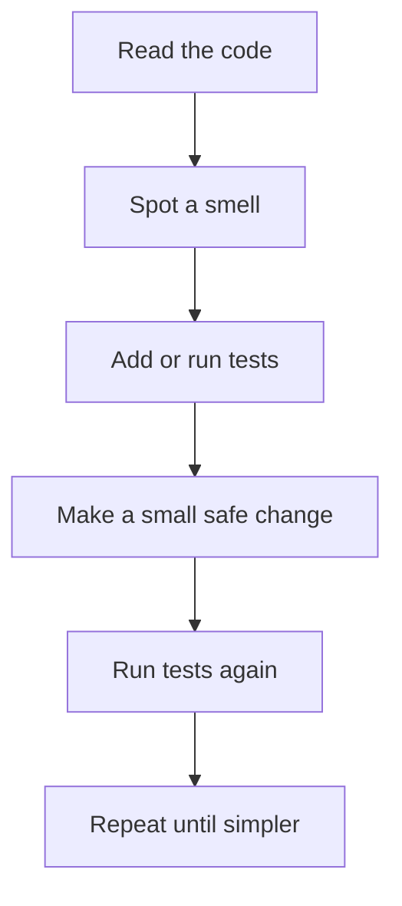

# Code Smells and Refactoring Playbook: Beginner-to-Expert Notes

## 1. Learning goals

By the end of this note, you should be able to:

- recognize common OOP code smells;
- choose a safe refactoring move for a specific smell;
- keep behavior unchanged while improving structure;
- decide when not to refactor yet;
- explain refactoring choices in a review or interview.

## 2. Prerequisites

- Basic Python classes and functions
- Unit test awareness
- A little familiarity with method and class responsibilities

## 3. Topic at a glance

A code smell is a sign that code may be harder to understand, test, or change than it should be.
It is not always a bug, but it is often a warning.

### Minimal first example

```python
def shipping_cost(weight_kg: float) -> float:
    if weight_kg <= 1:
        return 5.0
    return 5.0 + (weight_kg - 1) * 2.0


print(shipping_cost(3.0))
```

Output:

```text
9.0
```

Why this output?

The first kilogram costs `5.0`, and the extra `2.0` kilograms cost `2.0 * 2.0 = 4.0`.

Roadmap: first we build the mental model, then we learn the main refactoring moves, then we compare options, and finally we practice on small examples.

## 4. Core vocabulary

| Term | Plain-language meaning | Example |
| --- | --- | --- |
| Code smell | A warning sign that design may be getting hard to maintain | giant class |
| Refactoring | Changing structure without changing behavior | split a long method |
| God class | One class with too many responsibilities | validation + DB + email |
| Shotgun surgery | One change forces many edits | one rule spread across many files |
| Primitive obsession | Using plain strings/numbers where domain types would help | `"USD"` everywhere |
| Feature envy | A method uses another object's data too much | method mostly reads another object |
| Extract method | Pull part of a function into a new function | smaller helper |
| Extract class | Split responsibilities into separate classes | validator + notifier |

## 5. Mental model



Refactoring is safest when each step is small and behavior is checked often.

## 6. Foundations

### 6.1 Refactor behavior, not guesses

Do not change structure just because it looks different.
Change structure because it clearly helps readability, testability, or maintainability.

### 6.2 Use tests as safety rails

If the behavior is important, capture it before changing structure.

### 6.3 Prefer small steps

One rename, one extraction, one responsibility split at a time is easier to verify.

## 7. How it works

The safe refactoring loop is simple:

1. identify the smell;
2. describe the current behavior;
3. write or run tests;
4. make one small improvement;
5. verify the tests still pass;
6. repeat.

## 8. Core operations or methods

### Extract method

Use when one function contains a clearly named subtask.

### Extract class

Use when one class is doing too much.

### Replace conditional with strategy

Use when one `if/elif` chain represents several real behaviors.

### Introduce value object or parameter object

Use when primitive values are hiding important domain meaning.

### Move method

Use when a method mostly uses another object's data and belongs there.

### Introduce abstraction

Use when multiple implementations need the same contract.

## 9. Guided examples

### Example 1: Extract a method from a long function

```python
def format_total(price: float, tax_rate: float) -> str:
    tax = price * tax_rate
    total = price + tax
    return f"total={total:.2f}"


print(format_total(100.0, 0.1))
```

Output:

```text
total=110.00
```

### Example 2: Replace a conditional with strategy behavior

```python
class StandardShipping:
    def cost(self, weight_kg: float) -> float:
        return 5.0 + max(0.0, weight_kg - 1) * 2.0


class ExpressShipping:
    def cost(self, weight_kg: float) -> float:
        return 12.0 + max(0.0, weight_kg - 1) * 3.0


print(StandardShipping().cost(3.0))
print(ExpressShipping().cost(3.0))
```

Output:

```text
9.0
18.0
```

### Example 3: Replace primitive obsession with a value object

```python
from dataclasses import dataclass


@dataclass(frozen=True)
class Money:
    amount: float
    currency: str


money = Money(10.0, "USD")
print(money)
```

Output:

```text
Money(amount=10.0, currency='USD')
```

## 10. Common patterns and real-world applications

- Split validation, persistence, and notification into separate classes.
- Replace repeated conditionals with clearer behavior objects.
- Introduce domain types for money, ids, dates, and quantities.
- Keep the public API stable while improving internals.

## 11. Common mistakes, misconceptions, and failure cases

### Mistake 1: Refactoring without tests

You may break behavior and not notice.

### Mistake 2: Over-abstracting too early

Not every `if` statement needs a strategy class.

### Mistake 3: Refactoring unstable code too aggressively

If requirements are still moving, keep the design simple.

### Mistake 4: Treating smell detection as a rigid formula

Smells are signals. Judgment still matters.

## 12. Comparison and decision guide

| Smell | Likely fix | Why | Avoid when |
| --- | --- | --- | --- |
| God class | extract class | reduces responsibility load | the class is still small |
| Long method | extract method | easier to read and test | the method is already clear |
| Shotgun surgery | move behavior closer to data | reduces spread | the change is truly rare |
| Primitive obsession | value object | adds domain meaning | the value is truly trivial |
| Feature envy | move method | improves cohesion | the dependency is temporary |

Selection rule:

- If a code change keeps touching many places, look for a design split.
- If a function is too long, look for named substeps.
- If plain primitives hide domain meaning, consider a value object.

## 13. Efficiency, limitations, safety, and best practices

- Refactoring should preserve behavior.
- Small changes are easier to review and safer to deploy.
- Do not rename or split code in ways that make it harder to follow.
- Keep the refactoring aligned with actual usage, not theoretical elegance.

Best practices:

- Add tests before risky structural changes.
- Keep the public API stable if possible.
- Stop when the code is clearly simpler, not when it is maximally abstract.

## 14. Advanced concepts

### Behavioral versus structural change

Refactoring changes structure.
Feature work changes behavior.
Keep those concerns separate when possible.

### Incremental refactoring

Large improvements should be broken into small reviewable steps.

## 15. Interview or assessment knowledge

- How do you refactor safely in production?
- When should you replace a conditional with polymorphism?
- What does primitive obsession mean?
- What smell suggests a class has too many responsibilities?
- When should you avoid refactoring immediately?

## 16. Practice exercises

1. Identify one smell in a class that validates, saves, and emails.
2. Describe one safe first refactoring step.
3. Explain why a long function is harder to test.
4. Choose a smell that suggests a value object.
5. Explain when not to refactor yet.

### Solutions

#### Solution 1

That class is a god class because it has too many responsibilities.

#### Solution 2

Add or run tests before splitting responsibilities.

#### Solution 3

A long function mixes too many concerns, so it is harder to reason about and verify.

#### Solution 4

Primitive obsession.

#### Solution 5

Do not refactor immediately when requirements are unstable or tests are missing.

## 17. Summary cheat sheet

| Smell | Refactor move |
| --- | --- |
| God class | extract class |
| Long method | extract method |
| Shotgun surgery | move behavior / split responsibility |
| Primitive obsession | introduce value object |
| Feature envy | move method |
| Repeated conditionals | strategy or polymorphism |

## 18. Mastery checklist and next steps

- [ ] I can spot the common OOP smells.
- [ ] I can choose a safe first refactoring step.
- [ ] I understand why tests come first.
- [ ] I know when not to refactor yet.
- [ ] I can explain the improvement without changing behavior.

Next topics:

- `11_dependency_injection_and_testability.md`
- `12_dunder_methods_and_object_lifecycle.md`
- `14_oop_clean_code_interview_case_studies.md`
- `SOLID Principles in Python.md`
