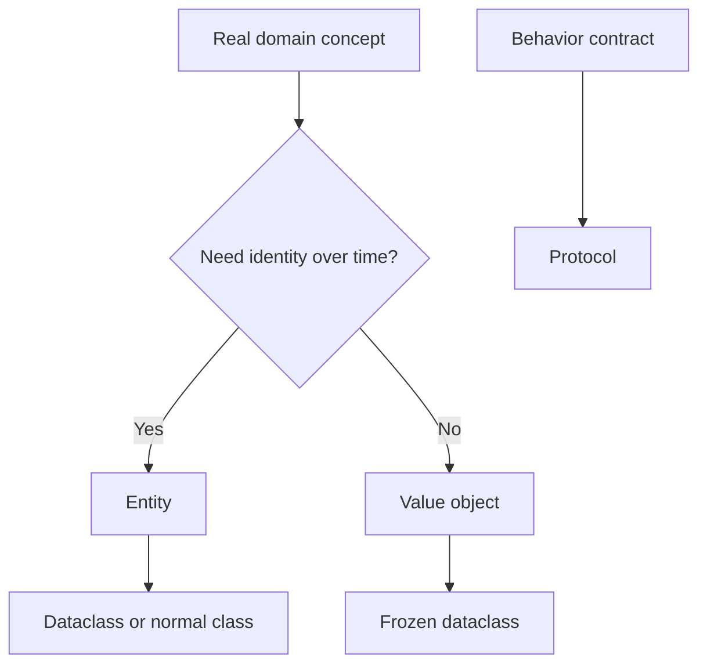

# Dataclasses, Protocols, and Domain Modeling: Beginner-to-Expert Notes

## 1. Learning goals

By the end of this note, you should be able to:

- decide when a dataclass is the right model for a domain object;
- use `frozen=True`, `slots=True`, and `default_factory` correctly;
- enforce simple invariants with `__post_init__`;
- use `Protocol` to describe behavior without hard inheritance;
- distinguish value objects from entities in domain modeling.

## 2. Prerequisites

- Basic Python classes
- Functions, type hints, and dictionaries
- A little familiarity with object state and validation

## 3. Topic at a glance

Dataclasses reduce repetitive class boilerplate.
Protocols describe behavior contracts without forcing a class hierarchy.
Domain modeling means shaping your classes around the real business concepts.

### Minimal first example

```python
from dataclasses import dataclass


@dataclass(slots=True)
class Product:
    sku: str
    price: float
    quantity: int


product = Product("P-100", 19.99, 3)
print(product)
```

Output:

```text
Product(sku='P-100', price=19.99, quantity=3)
```

Why this output?

The dataclass automatically gives `Product` a readable `__repr__`, so printing the object shows its fields.

Roadmap: first we build the mental model, then we learn the core dataclass features, then we compare design choices, and finally we practice modeling real domain objects.

## 4. Core vocabulary

| Term | Plain-language meaning | Example |
| --- | --- | --- |
| Dataclass | A class that generates common boilerplate automatically | `@dataclass` |
| Frozen dataclass | A dataclass whose fields cannot be changed after creation | `@dataclass(frozen=True)` |
| `default_factory` | A function that creates a fresh default value | `field(default_factory=list)` |
| Invariant | A rule that must always stay true | balance must not be negative |
| Value object | A value-based, usually immutable concept | money amount and currency |
| Entity | An object that keeps identity over time | account, user, order |
| Protocol | A behavior contract based on methods, not inheritance | `charge()` |
| `__post_init__` | A hook that runs after dataclass initialization | validation after construction |

## 5. Mental model



Use dataclasses to make the data shape clear.
Use protocols when multiple different classes should satisfy the same behavior.

## 6. Foundations

### 6.1 Dataclasses remove boilerplate

```python
from dataclasses import dataclass


@dataclass
class Product:
    sku: str
    price: float
    quantity: int


product = Product("P-100", 19.99, 3)
print(product)
```

Output:

```text
Product(sku='P-100', price=19.99, quantity=3)
```

Practical takeaway: use a dataclass when the class mainly stores data and the default generated methods are a good fit.

### 6.2 Frozen dataclasses model value objects

```python
from dataclasses import dataclass


@dataclass(frozen=True)
class Money:
    amount: float
    currency: str


money = Money(12.5, "USD")
print(money.amount)
```

Output:

```text
12.5
```

Practical takeaway: use `frozen=True` when the object should not change after it is created.

### 6.3 `default_factory` creates a fresh mutable value

```python
from dataclasses import dataclass, field


@dataclass
class Cart:
    items: list[str] = field(default_factory=list)


cart = Cart()
cart.items.append("book")
print(cart.items)
```

Output:

```text
['book']
```

Practical takeaway: use `default_factory` instead of a mutable default like `[]`.

### 6.4 `__post_init__` enforces invariants

```python
from dataclasses import dataclass


@dataclass
class Account:
    balance: float

    def __post_init__(self) -> None:
        if self.balance < 0:
            raise ValueError("balance cannot be negative")


account = Account(100.0)
print(account.balance)
```

Output:

```text
100.0
```

Practical takeaway: use `__post_init__` for validation that must happen after all fields are assigned.

## 7. How it works

When Python sees `@dataclass`, it generates common methods such as `__init__`, `__repr__`, and equality methods unless you override them.

When `frozen=True`, the dataclass prevents normal attribute reassignment after construction.

When `slots=True`, the dataclass reduces attribute storage overhead and blocks accidental new attributes.

## 8. Core operations or methods

### `field(default_factory=...)`

Use this for lists, dictionaries, sets, or any other mutable default that should be fresh for each object.

### `__post_init__()`

Use this to validate invariant rules after object creation.

### `frozen=True`

Use this for value objects that should not be mutated.

### `slots=True`

Use this when you want leaner instances and fewer accidental attributes.

### `Protocol`

Use it to describe behavior that multiple unrelated classes can provide.

```python
from dataclasses import dataclass
from typing import Protocol


class PaymentGateway(Protocol):
    def charge(self, amount: float) -> str:
        ...


@dataclass
class FakeGateway:
    prefix: str = "TXN"

    def charge(self, amount: float) -> str:
        return f"{self.prefix}-{int(amount)}"


def place_order(gateway: PaymentGateway, amount: float) -> str:
    return gateway.charge(amount)


print(place_order(FakeGateway(), 42.0))
```

Output:

```text
TXN-42
```

Why this output?

The function only needs something with a `charge()` method, so the concrete class can vary.

## 9. Guided examples

### Example 1: Simple product model

```python
from dataclasses import dataclass


@dataclass(slots=True)
class Product:
    sku: str
    price: float
    quantity: int


product = Product("P-101", 29.5, 2)
print(product)
```

Output:

```text
Product(sku='P-101', price=29.5, quantity=2)
```

### Example 2: Immutable money value

```python
from dataclasses import dataclass


@dataclass(frozen=True)
class Money:
    amount: float
    currency: str


money = Money(99.0, "USD")
print(money)
```

Output:

```text
Money(amount=99.0, currency='USD')
```

### Example 3: Cart with a safe list default

```python
from dataclasses import dataclass, field


@dataclass
class Cart:
    items: list[str] = field(default_factory=list)


cart = Cart()
cart.items.append("pen")
cart.items.append("notebook")
print(cart.items)
```

Output:

```text
['pen', 'notebook']
```

## 10. Common patterns and real-world applications

- Use dataclasses for input/output models and simple domain objects.
- Use frozen dataclasses for value objects such as money, coordinates, or identifiers.
- Use `default_factory` for collections owned by one instance.
- Use protocols for services that may have multiple implementations.

## 11. Common mistakes, misconceptions, and failure cases

### Mistake 1: Using a mutable default directly

Wrong:

```python
from dataclasses import dataclass


@dataclass
class Cart:
    items: list[str] = []
```

Correct:

```python
from dataclasses import dataclass, field


@dataclass
class Cart:
    items: list[str] = field(default_factory=list)
```

Rule to remember: never use a shared mutable default for per-instance data.

### Mistake 2: Using a dataclass for a class with heavy behavior

If the class has complicated logic, a normal class may be clearer.

### Mistake 3: Forgetting invariants

If balance cannot be negative, validate it at construction time.

### Mistake 4: Forcing inheritance when a protocol is enough

If the code only needs a method contract, a `Protocol` is often cleaner.

## 12. Comparison and decision guide

| Need | Best choice | Why | Avoid when |
| --- | --- | --- | --- |
| Simple data holder | `dataclass` | low boilerplate | the class has complex lifecycle rules |
| Immutable value object | `frozen=True` dataclass | protects state | the object must change often |
| Fresh mutable default | `default_factory` | avoids shared state | the field is not mutable |
| Behavioral contract | `Protocol` | flexible substitution | you need runtime inheritance rules |
| Strict runtime interface | ABC | explicit inheritance contract | structural typing is enough |

Selection rule:

- Start with a dataclass for plain data.
- Use `frozen=True` for values that should not change.
- Use `Protocol` when behavior matters more than the class hierarchy.

## 13. Efficiency, limitations, safety, and best practices

- `slots=True` can reduce memory and prevent accidental attributes.
- `frozen=True` makes value objects safer to share.
- `default_factory` prevents hidden shared mutable state.
- Keep validation close to construction so invalid objects fail fast.

Best practices:

- Keep field names meaningful and domain-oriented.
- Validate important invariants in one place.
- Use protocols to reduce coupling between services and implementations.

## 14. Advanced concepts

### Entity versus value object

- Entity: identity matters over time.
- Value object: the value itself matters, not identity.

### Structural typing with `Protocol`

Protocols let you say "any object with the right method is acceptable."
That is useful when different implementations should be swappable.

## 15. Interview or assessment knowledge

- Why use a dataclass instead of a normal class?
- When should a model be frozen?
- Why is `default_factory` better than a mutable default?
- What problem does `Protocol` solve?
- How do you enforce an invariant in a dataclass?

## 16. Practice exercises

1. Create a dataclass for `Product` with `sku`, `price`, and `quantity`.
2. Make a frozen dataclass for `Money`.
3. Create a `Cart` with a fresh list for `items`.
4. Add a `__post_init__` check that rejects negative balances.
5. Define a `Protocol` for a gateway with a `charge()` method.

### Solutions

#### Solution 1

```python
from dataclasses import dataclass


@dataclass
class Product:
    sku: str
    price: float
    quantity: int


print(Product("P-1", 10.0, 2))
```

Output:

```text
Product(sku='P-1', price=10.0, quantity=2)
```

#### Solution 2

```python
from dataclasses import dataclass


@dataclass(frozen=True)
class Money:
    amount: float
    currency: str


print(Money(7.5, "USD"))
```

Output:

```text
Money(amount=7.5, currency='USD')
```

#### Solution 3

```python
from dataclasses import dataclass, field


@dataclass
class Cart:
    items: list[str] = field(default_factory=list)


cart = Cart()
cart.items.append("pen")
print(cart.items)
```

Output:

```text
['pen']
```

#### Solution 4

```python
from dataclasses import dataclass


@dataclass
class Account:
    balance: float

    def __post_init__(self) -> None:
        if self.balance < 0:
            raise ValueError("balance cannot be negative")


print(Account(5.0).balance)
```

Output:

```text
5.0
```

#### Solution 5

```python
from typing import Protocol


class PaymentGateway(Protocol):
    def charge(self, amount: float) -> str:
        ...


print("defined")
```

Output:

```text
defined
```

## 17. Summary cheat sheet

| Concept | Remember |
| --- | --- |
| Dataclass | reduces boilerplate |
| Frozen dataclass | immutable value object |
| `default_factory` | fresh mutable default |
| `__post_init__` | validate after init |
| `Protocol` | behavior contract |
| Domain modeling | identity vs value matters |

## 18. Mastery checklist and next steps

- [ ] I can choose between dataclass, frozen dataclass, and normal class.
- [ ] I can explain why `default_factory` matters.
- [ ] I can enforce a simple invariant in `__post_init__`.
- [ ] I can explain when a protocol is better than inheritance.
- [ ] I can model a simple domain object clearly.

Next topics:

- `11_dependency_injection_and_testability.md`
- `12_dunder_methods_and_object_lifecycle.md`
- `Composition vs Inheritance and Clean Code.md`
- `SOLID Principles in Python.md`
