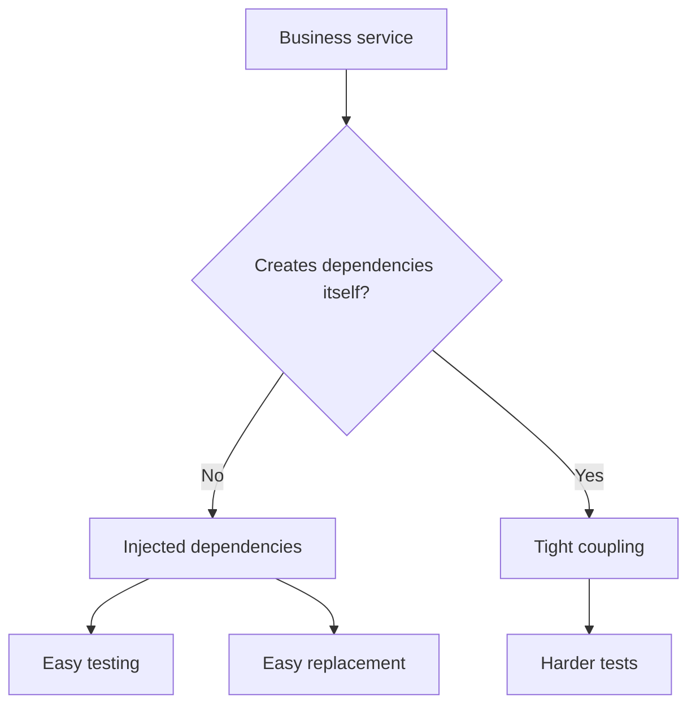

# Dependency Injection and Testability: Beginner-to-Expert Notes

## 1. Learning goals

By the end of this note, you should be able to:

- explain why dependency injection makes code easier to test;
- use constructor injection and function injection correctly;
- recognize the composition root;
- build simple test doubles such as fakes and stubs;
- keep side effects at the edges of the system.

## 2. Prerequisites

- Basic classes and methods
- Functions and return values
- A little comfort with unit testing ideas

## 3. Topic at a glance

Dependency injection means giving an object the things it depends on instead of creating those things inside the object.
It is like handing a worker the right tools instead of hiding the tools in a locked room.

### Minimal first example

```python
class OrderService:
    def __init__(self, payment_gateway, notifier) -> None:
        self.payment_gateway = payment_gateway
        self.notifier = notifier

    def place_order(self, amount: float) -> str:
        txn = self.payment_gateway.charge(amount)
        self.notifier.send(f"order confirmed: {txn}")
        return txn


class FakeGateway:
    def charge(self, amount: float) -> str:
        return "TXN-FAKE-1"


class FakeNotifier:
    def __init__(self) -> None:
        self.messages: list[str] = []

    def send(self, message: str) -> None:
        self.messages.append(message)


notifier = FakeNotifier()
service = OrderService(FakeGateway(), notifier)
print(service.place_order(25.0))
print(notifier.messages)
```

Output:

```text
TXN-FAKE-1
['order confirmed: TXN-FAKE-1']
```

Why this output?

The service does not create real external dependencies. It uses the fake gateway and notifier that were injected into it.

Roadmap: first we build the mental model, then we learn the main DI styles, then we compare options, and finally we practice designing testable services.

## 4. Core vocabulary

| Term | Plain-language meaning | Example |
| --- | --- | --- |
| Dependency | Something a class or function needs to do its job | gateway, notifier |
| Injection | Passing a dependency in from outside | constructor parameter |
| Constructor injection | Supplying dependencies in `__init__` | `OrderService(gateway, notifier)` |
| Function injection | Supplying dependencies as function arguments | `send_email(client, message)` |
| Composition root | The top-level place where objects are wired together | `build_service()` |
| Fake | A simple working replacement used in tests | `FakeGateway` |
| Stub | A replacement that returns predefined data | fixed response object |
| Contract test | A test that checks all implementations follow the same behavior | run same tests on all gateways |

## 5. Mental model



The more a class creates on its own, the harder it is to substitute and test.

## 6. Foundations

### 6.1 Constructor injection keeps services replaceable

```python
class OrderService:
    def __init__(self, payment_gateway, notifier) -> None:
        self.payment_gateway = payment_gateway
        self.notifier = notifier

    def place_order(self, amount: float) -> str:
        txn = self.payment_gateway.charge(amount)
        self.notifier.send(f"order confirmed: {txn}")
        return txn


class FakeGateway:
    def charge(self, amount: float) -> str:
        return "TXN-FAKE-1"


class FakeNotifier:
    def __init__(self) -> None:
        self.messages: list[str] = []

    def send(self, message: str) -> None:
        self.messages.append(message)


notifier = FakeNotifier()
service = OrderService(FakeGateway(), notifier)
print(service.place_order(25.0))
print(notifier.messages)
```

Output:

```text
TXN-FAKE-1
['order confirmed: TXN-FAKE-1']
```

Practical takeaway: inject the things that vary or talk to the outside world.

### 6.2 Function injection is useful for small operations

```python
def send_receipt(send_message, order_id: str) -> str:
    message = f"receipt for {order_id}"
    send_message(message)
    return message


messages: list[str] = []


def fake_send_message(message: str) -> None:
    messages.append(message)


print(send_receipt(fake_send_message, "ORD-1"))
print(messages)
```

Output:

```text
receipt for ORD-1
['receipt for ORD-1']
```

Practical takeaway: inject functions when the behavior is small and direct.

### 6.3 The composition root wires the system together

```python
def build_order_service() -> str:
    return "wired"


print(build_order_service())
```

Output:

```text
wired
```

Practical takeaway: create real dependencies in one place at the edge of the program.

## 7. How it works

Dependency injection separates behavior from setup.
The business object should focus on the business rule, while a top-level wiring function decides which concrete implementations to pass in.

That separation makes tests simple because you can swap the real dependency for a fake one.

## 8. Core operations or methods

### Constructor injection

Pass dependencies through `__init__`.

### Function injection

Pass dependencies as function arguments.

### Fakes

Use a simple working implementation that behaves predictably in tests.

### Contract tests

Use the same test suite to verify every implementation of the same interface.

```python
class FakeGateway:
    def charge(self, amount: float) -> str:
        return "TXN-FAKE-1"


print(FakeGateway().charge(10.0))
```

Output:

```text
TXN-FAKE-1
```

## 9. Guided examples

### Example 1: Testable payment flow

```python
class PaymentService:
    def __init__(self, gateway) -> None:
        self.gateway = gateway

    def pay(self, amount: float) -> str:
        return self.gateway.charge(amount)


class FakeGateway:
    def charge(self, amount: float) -> str:
        return "TXN-123"


print(PaymentService(FakeGateway()).pay(42.0))
```

Output:

```text
TXN-123
```

### Example 2: Inject a notifier

```python
class Notifier:
    def send(self, message: str) -> None:
        print(message)


class OrderService:
    def __init__(self, notifier: Notifier) -> None:
        self.notifier = notifier

    def confirm(self) -> None:
        self.notifier.send("order confirmed")


OrderService(Notifier()).confirm()
```

Output:

```text
order confirmed
```

### Example 3: Swap implementations without changing the service

```python
class EmailNotifier:
    def send(self, message: str) -> None:
        print(f"email: {message}")


class SmsNotifier:
    def send(self, message: str) -> None:
        print(f"sms: {message}")


def notify_user(notifier, message: str) -> None:
    notifier.send(message)


notify_user(EmailNotifier(), "hello")
notify_user(SmsNotifier(), "hello")
```

Output:

```text
email: hello
sms: hello
```

## 10. Common patterns and real-world applications

- Inject database clients, HTTP clients, message senders, and payment gateways.
- Keep domain logic pure when possible.
- Put wiring in one place instead of scattering object creation everywhere.
- Use fakes in tests to avoid slow or flaky external calls.

## 11. Common mistakes, misconceptions, and failure cases

### Mistake 1: Creating dependencies inside the service

That makes the class harder to test and harder to replace.

### Mistake 2: Using a hidden service locator

If the dependency comes from a global container, the code becomes less explicit.

### Mistake 3: Injecting too much

If every tiny thing is injected, the code becomes noisy and hard to read.

### Mistake 4: Mixing business rules and infrastructure setup

Keep the rule in the service and the setup in the composition root.

## 12. Comparison and decision guide

| Style | Best use | Why | Avoid when |
| --- | --- | --- | --- |
| Constructor injection | object-based services | explicit and testable | the dependency is a one-off function |
| Function injection | small helpers | very simple and direct | the logic is a large stateful object |
| Service locator | almost never | hides wiring | you want clear dependencies |
| Composition root | application startup | centralizes wiring | you are inside business logic |

Selection rule:

- Use constructor injection for most services.
- Use function injection for simple stateless helpers.
- Keep the composition root at the outer edge of the system.

## 13. Efficiency, limitations, safety, and best practices

- DI improves testability and flexibility, but too much indirection adds noise.
- Keep external effects at the boundary of the system.
- Prefer explicit dependencies over hidden global state.
- Use the smallest design that makes the code easy to test.

Best practices:

- Inject what varies.
- Keep objects focused on one job.
- Use fakes for tests that would otherwise touch external systems.

## 14. Advanced concepts

### Boundary segregation

Domain logic should stay as deterministic as possible.
Adapters for databases, files, and APIs should live at the edges.

### Contract tests

If several classes claim to implement the same behavior, run the same tests against all of them.

## 15. Interview or assessment knowledge

- Why does DI improve unit testing?
- What is the difference between constructor and function injection?
- What is a composition root?
- Why is a hidden service locator harder to reason about?
- What is a fake, and why is it useful?

## 16. Practice exercises

1. Write an `OrderService` that receives a gateway and notifier.
2. Write a fake gateway that returns a fixed transaction id.
3. Write a function that injects a send function.
4. Explain what belongs in a composition root.
5. Describe one DI anti-pattern and why it is harmful.

### Solutions

#### Solution 1

```python
class OrderService:
    def __init__(self, gateway, notifier) -> None:
        self.gateway = gateway
        self.notifier = notifier

    def place_order(self, amount: float) -> str:
        txn = self.gateway.charge(amount)
        self.notifier.send(f"order confirmed: {txn}")
        return txn


print("defined")
```

Output:

```text
defined
```

#### Solution 2

```python
class FakeGateway:
    def charge(self, amount: float) -> str:
        return "TXN-FAKE-1"


print(FakeGateway().charge(5.0))
```

Output:

```text
TXN-FAKE-1
```

#### Solution 3

```python
def notify(send_message, message: str) -> str:
    send_message(message)
    return message


messages: list[str] = []
notify(messages.append, "hello")
print(messages)
```

Output:

```text
['hello']
```

#### Solution 4

The composition root is the top-level place where concrete objects are created and wired together.

#### Solution 5

A service locator hides dependencies, which makes code harder to understand and test.

## 17. Summary cheat sheet

| Concept | Remember |
| --- | --- |
| Injection | pass dependencies in |
| Constructor injection | best default for services |
| Function injection | good for small helpers |
| Composition root | wire objects at the edge |
| Fake | predictable test replacement |
| Contract test | same behavior, many implementations |

## 18. Mastery checklist and next steps

- [ ] I can explain why injected dependencies are easier to test.
- [ ] I can choose between constructor and function injection.
- [ ] I know what the composition root is.
- [ ] I can use a fake in a test.
- [ ] I can keep business logic separate from setup.

Next topics:

- `10_dataclasses_protocols_and_domain_modeling.md`
- `12_dunder_methods_and_object_lifecycle.md`
- `Composition vs Inheritance and Clean Code.md`
- `SOLID Principles in Python.md`
