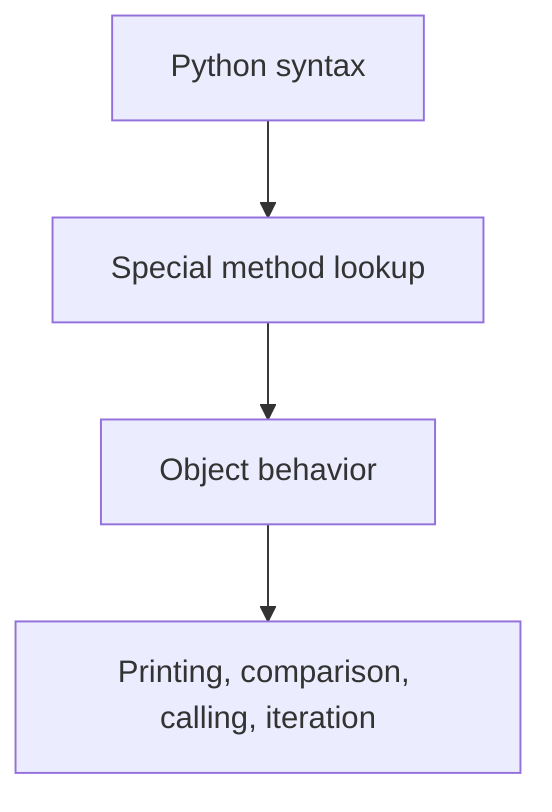

# Dunder Methods and Object Lifecycle: Beginner-to-Expert Notes

## 1. Learning goals

By the end of this note, you should be able to:

- explain what dunder methods are and why Python uses them;
- write readable `__repr__` and `__str__` methods;
- understand equality, hashing, container, callable, and context-manager hooks;
- explain the difference between `__new__` and `__init__`;
- know when `__slots__` is useful and when it is not.

## 2. Prerequisites

- Basic classes and objects
- Methods, attributes, and printing objects
- A little familiarity with dictionaries and sets

## 3. Topic at a glance

Dunder methods are special methods with names like `__repr__` and `__len__`.
They let your objects behave naturally in Python syntax.

### Minimal first example

```python
class Course:
    def __init__(self, title: str) -> None:
        self.title = title

    def __repr__(self) -> str:
        return f"Course(title={self.title!r})"


course = Course("Python")
print(course)
print(repr(course))
```

Output:

```text
Course(title='Python')
Course(title='Python')
```

Why this output?

When `__str__` is not defined, `print()` falls back to `__repr__`.

Roadmap: first we build the mental model, then we learn the major dunder categories, then we compare choices, and finally we practice using them safely.

## 4. Core vocabulary

| Term | Plain-language meaning | Example |
| --- | --- | --- |
| Dunder method | A special method with double underscores | `__repr__` |
| `__repr__` | Developer-friendly object representation | `Course(title='Python')` |
| `__str__` | User-friendly string form | `"Python course"` |
| `__eq__` | Equality comparison hook | `a == b` |
| `__hash__` | Hash value for sets and dict keys | `hash(obj)` |
| `__call__` | Makes an object callable like a function | `policy(value)` |
| Descriptor | Object controlling attribute access | `property` |
| `__slots__` | Restricts instance attributes | no `__dict__` by default |

## 5. Mental model



Python syntax such as `print()`, `==`, `in`, `len()`, and `()` often maps to a dunder method behind the scenes.

## 6. Foundations

### 6.1 `__repr__` should be precise

```python
class Course:
    def __init__(self, title: str) -> None:
        self.title = title

    def __repr__(self) -> str:
        return f"Course(title={self.title!r})"


course = Course("Python")
print(course)
print(repr(course))
```

Output:

```text
Course(title='Python')
Course(title='Python')
```

Practical takeaway: make `__repr__` useful for debugging and logging.

### 6.2 `__str__` should be readable for humans

```python
class Course:
    def __init__(self, title: str) -> None:
        self.title = title

    def __repr__(self) -> str:
        return f"Course(title={self.title!r})"

    def __str__(self) -> str:
        return f"Course: {self.title}"


course = Course("Python")
print(course)
print(str(course))
```

Output:

```text
Course: Python
Course: Python
```

Practical takeaway: use `__str__` for user-facing output and `__repr__` for debugging output.

### 6.3 `__eq__` and `__hash__` must agree

```python
class User:
    def __init__(self, user_id: int) -> None:
        self.user_id = user_id

    def __eq__(self, other: object) -> bool:
        return isinstance(other, User) and self.user_id == other.user_id

    def __hash__(self) -> int:
        return hash(self.user_id)


users = {User(1), User(1)}
print(len(users))
```

Output:

```text
1
```

Practical takeaway: if two objects compare equal, they must also hash the same when they are hashable.

### 6.4 `__call__` turns an object into a callable

```python
class Discount:
    def __init__(self, rate: float) -> None:
        self.rate = rate

    def __call__(self, amount: float) -> float:
        return amount * (1 - self.rate)


discount = Discount(0.1)
print(discount(100.0))
```

Output:

```text
90.0
```

Practical takeaway: use `__call__` when an object behaves like a configurable function.

## 7. How it works

Python looks up special methods on the class, not on the instance dictionary in the usual way.
That is why `len(obj)` calls `obj.__len__()`, `obj1 == obj2` calls equality logic, and `with obj:` calls context-manager hooks.

`__new__` creates the instance.
`__init__` configures the already-created instance.

## 8. Core operations or methods

### Printing methods

- `__repr__` for debugging
- `__str__` for human-friendly display

### Comparison methods

- `__eq__` for equality
- `__lt__`, `__le__`, `__gt__`, `__ge__` for meaningful ordering

### Container methods

- `__len__`
- `__iter__`
- `__contains__`
- `__getitem__`

### Callable and context-manager methods

- `__call__`
- `__enter__`
- `__exit__`

### Lifecycle methods

- `__new__`
- `__init__`

### Memory-related method

- `__slots__`

```python
class Bag:
    def __init__(self, items: list[str]) -> None:
        self.items = items

    def __len__(self) -> int:
        return len(self.items)

    def __contains__(self, item: str) -> bool:
        return item in self.items


bag = Bag(["apple", "banana"])
print(len(bag))
print("apple" in bag)
```

Output:

```text
2
True
```

## 9. Guided examples

### Example 1: Better object printing

```python
class Course:
    def __init__(self, title: str) -> None:
        self.title = title

    def __repr__(self) -> str:
        return f"Course(title={self.title!r})"


print(Course("Python"))
```

Output:

```text
Course(title='Python')
```

### Example 2: Container-like class

```python
class Bag:
    def __init__(self, items: list[str]) -> None:
        self.items = items

    def __len__(self) -> int:
        return len(self.items)

    def __contains__(self, item: str) -> bool:
        return item in self.items


bag = Bag(["apple", "banana"])
print(len(bag))
print("banana" in bag)
```

Output:

```text
2
True
```

### Example 3: Context manager

```python
class TraceBlock:
    def __enter__(self) -> "TraceBlock":
        print("enter")
        return self

    def __exit__(self, exc_type, exc, tb) -> None:
        print("exit")


with TraceBlock():
    print("inside")
```

Output:

```text
enter
inside
exit
```

## 10. Common patterns and real-world applications

- Use `__repr__` to make debugging easier.
- Use `__str__` for readable user-facing output.
- Use `__call__` for configurable policies, validators, or command-style objects.
- Use `__enter__` and `__exit__` for deterministic resource handling.
- Use `__slots__` when memory and attribute discipline matter.

## 11. Common mistakes, misconceptions, and failure cases

### Mistake 1: Making `__repr__` vague

The debug representation should help you identify the object quickly.

### Mistake 2: Putting mutable fields into hash logic

If a hashed object changes after it is placed in a set or dict, lookups can break.

### Mistake 3: Defining ordering without a real domain order

Use explicit `key=` functions when the order is just for presentation.

### Mistake 4: Assuming `__slots__` is always better

It reduces flexibility, so use it only when the tradeoff is worth it.

## 12. Comparison and decision guide

| Need | Best choice | Why | Avoid when |
| --- | --- | --- | --- |
| Debug output | `__repr__` | precise and unambiguous | you want human prose |
| Human display | `__str__` | readable for users | you need exact reconstruction |
| Equality | `__eq__` | compares meaningful state | identity alone should decide |
| Hashing | `__hash__` | works in sets and dicts | the object changes often |
| Callable behavior | `__call__` | stateful function-like object | a plain function is enough |
| Resource cleanup | `__enter__` / `__exit__` | deterministic lifecycle | no cleanup is needed |
| Lean instances | `__slots__` | fewer accidental attrs | you need dynamic attributes |

Selection rule:

- Use only the dunder methods that match the domain behavior.
- Prefer explicit `key=` sorting over custom ordering when possible.

## 13. Efficiency, limitations, safety, and best practices

- Keep dunder methods small and deterministic.
- Make hashable objects effectively immutable.
- Avoid surprising side effects in printing or comparison methods.
- Use `__slots__` only after you know the tradeoff helps.

Best practices:

- Make `__repr__` developer-friendly.
- Make `__str__` human-friendly.
- Make special methods consistent with each other.

## 14. Advanced concepts

### `__new__` versus `__init__`

- `__new__` creates the instance.
- `__init__` initializes the instance.

### `__slots__`

`__slots__` prevents accidental attribute creation and can reduce memory usage.

```python
class LockedCourse:
    __slots__ = ("title",)

    def __init__(self, title: str) -> None:
        self.title = title


course = LockedCourse("Python")
print(hasattr(course, "__dict__"))
```

Output:

```text
False
```

## 15. Interview or assessment knowledge

- Why should `__repr__` be developer-friendly?
- Why is mutating a hashed object risky?
- When is `__slots__` useful?
- What is the difference between `__new__` and `__init__`?
- When should you use a custom ordering method versus a sort key?

## 16. Practice exercises

1. Write a class with a useful `__repr__`.
2. Add a readable `__str__` to the same class.
3. Make a small container-like class with `__len__` and `__contains__`.
4. Create a callable object with `__call__`.
5. Write a context manager that prints `enter` and `exit`.

### Solutions

#### Solution 1

```python
class Course:
    def __init__(self, title: str) -> None:
        self.title = title

    def __repr__(self) -> str:
        return f"Course(title={self.title!r})"


print(Course("Python"))
```

Output:

```text
Course(title='Python')
```

#### Solution 2

```python
class Course:
    def __init__(self, title: str) -> None:
        self.title = title

    def __repr__(self) -> str:
        return f"Course(title={self.title!r})"

    def __str__(self) -> str:
        return self.title


print(str(Course("Python")))
```

Output:

```text
Python
```

#### Solution 3

```python
class Bag:
    def __init__(self, items: list[str]) -> None:
        self.items = items

    def __len__(self) -> int:
        return len(self.items)

    def __contains__(self, item: str) -> bool:
        return item in self.items


bag = Bag(["apple", "banana"])
print(len(bag))
print("apple" in bag)
```

Output:

```text
2
True
```

#### Solution 4

```python
class Discount:
    def __init__(self, rate: float) -> None:
        self.rate = rate

    def __call__(self, amount: float) -> float:
        return amount * (1 - self.rate)


print(Discount(0.25)(80.0))
```

Output:

```text
60.0
```

#### Solution 5

```python
class TraceBlock:
    def __enter__(self) -> "TraceBlock":
        print("enter")
        return self

    def __exit__(self, exc_type, exc, tb) -> None:
        print("exit")


with TraceBlock():
    print("inside")
```

Output:

```text
enter
inside
exit
```

## 17. Summary cheat sheet

| Hook | Remember |
| --- | --- |
| `__repr__` | debug-friendly |
| `__str__` | user-friendly |
| `__eq__` / `__hash__` | stay consistent |
| `__call__` | object behaves like a function |
| `__enter__` / `__exit__` | context management |
| `__new__` / `__init__` | create then initialize |
| `__slots__` | leaner instances, less flexibility |

## 18. Mastery checklist and next steps

- [ ] I know the difference between `__repr__` and `__str__`.
- [ ] I understand why hashable objects should be stable.
- [ ] I can explain what `__call__` does.
- [ ] I can explain `__new__` versus `__init__`.
- [ ] I know when `__slots__` is worth it.

Next topics:

- `10_dataclasses_protocols_and_domain_modeling.md`
- `13_code_smells_and_refactoring_playbook.md`
- `15_class_creation_descriptors_and_metaclasses.md`
- `Encapsulation, Object State, Validation and Safe Classes.md`
