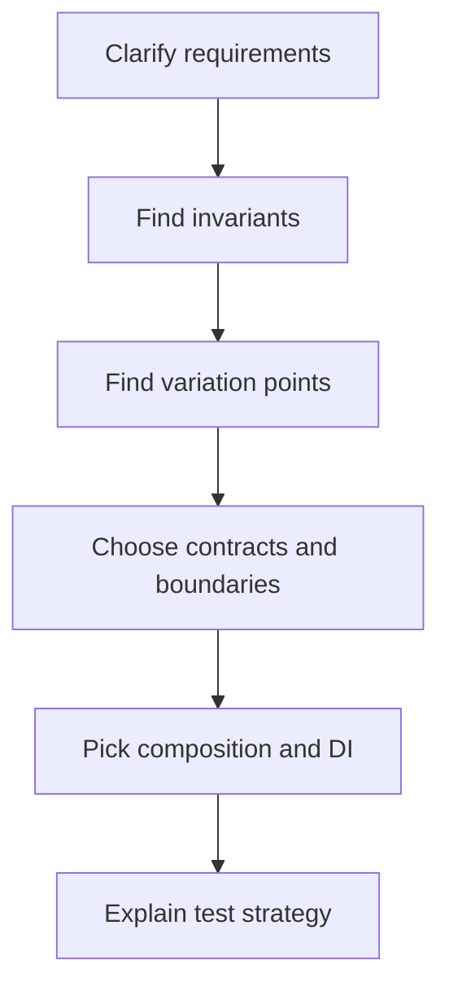
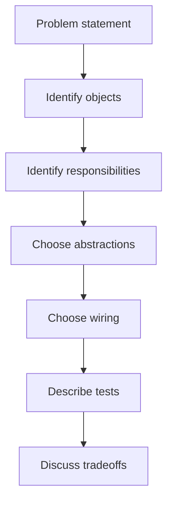

# OOP and Clean Code Interview Case Studies: Beginner-to-Expert Notes

## 1. Learning goals

By the end of this note, you should be able to:

- explain common OOP design decisions in interview form;
- talk through a system design at the class and responsibility level;
- identify variation points, boundaries, and invariants;
- justify composition, DI, and contracts with practical reasons;
- explain how you would refactor a legacy design safely.

## 2. Prerequisites

- Basic OOP and class design
- Familiarity with composition, inheritance, and dependency injection
- A little comfort with refactoring ideas

## 3. Topic at a glance

Interview case studies are practice stories that show how to think about design, not just how to write code.
They are like rehearsing a real conversation before the interview happens.

### Minimal first example

```python
class FakeGateway:
    def charge(self, amount: float) -> str:
        return "TXN-1"


class PaymentService:
    def __init__(self, gateway) -> None:
        self.gateway = gateway

    def pay(self, amount: float) -> str:
        return self.gateway.charge(amount)


print(PaymentService(FakeGateway()).pay(25.0))
```

Output:

```text
TXN-1
```

Why this output?

The service depends on a gateway contract, so a fake gateway can stand in during testing or interview examples.

Roadmap: first we build the mental model, then we learn the design steps, then we walk through common case studies, and finally we practice answering clearly.

## 4. Core vocabulary

| Term | Plain-language meaning | Example |
| --- | --- | --- |
| Boundary | Where one part of a system meets another | service and repository |
| Variation point | A place where behavior can differ | payment provider |
| Invariant | A rule that must always hold | inventory cannot go below zero |
| Contract | The behavior a class promises | `charge()` method |
| Adapter | Wrapper around an external service | gateway client |
| Dispatcher | Object that chooses where work goes | notification dispatcher |
| Legacy code | Existing code that may be messy but must keep working | god class |

## 5. Mental model



In interviews, strong design usually comes from clearly separating what never changes from what may vary.

## 6. Foundations

### 6.1 Always start with clarification

Ask what must be true, what can change, and what the system must integrate with.

### 6.2 Separate domain logic from infrastructure

Business rules should stay away from email, database, and HTTP details when possible.

### 6.3 Describe the test strategy early

If the design is testable, that is usually a sign the boundaries are healthy.

## 7. How it works



The interview answer is strongest when you can move from requirements to boundaries to tests without jumping straight into classes.

## 8. Core operations or methods

### 8.1 Clarify invariants

Ask what the system must never allow.

### 8.2 Find variation points

Look for parts that may change often, such as providers, policies, or channels.

### 8.3 Pick contracts

Use small interfaces or protocols for replaceable behavior.

### 8.4 Choose composition

Prefer wiring objects together over deep inheritance when behavior differs.

### 8.5 Explain refactoring path

Show how a messy design could be improved without breaking behavior.

## 9. Guided examples

### Example 1: Payment processing

```python
class FakeGateway:
    def charge(self, amount: float) -> str:
        return f"TXN-{int(amount)}"


class PaymentService:
    def __init__(self, gateway) -> None:
        self.gateway = gateway

    def pay(self, amount: float) -> str:
        return self.gateway.charge(amount)


print(PaymentService(FakeGateway()).pay(42.0))
```

Output:

```text
TXN-42
```

### Example 2: Notification system

```python
class EmailNotifier:
    def send(self, message: str) -> None:
        print(f"email: {message}")


class PushNotifier:
    def send(self, message: str) -> None:
        print(f"push: {message}")


def notify(notifier, message: str) -> None:
    notifier.send(message)


notify(EmailNotifier(), "hello")
notify(PushNotifier(), "hello")
```

Output:

```text
email: hello
push: hello
```

### Example 3: Inventory domain

```python
class InventoryItem:
    def __init__(self, quantity: int) -> None:
        self.quantity = quantity

    def reserve(self, amount: int) -> None:
        if amount > self.quantity:
            raise ValueError("not enough stock")
        self.quantity -= amount


item = InventoryItem(5)
item.reserve(2)
print(item.quantity)
```

Output:

```text
3
```

## 10. Common patterns and real-world applications

- Payment systems often need gateway abstractions and retry policies.
- Notification systems often need channel selection and user preferences.
- Inventory systems often need explicit state transitions and invariants.
- Legacy systems often need gradual extraction instead of one huge rewrite.

## 11. Common mistakes, misconceptions, and failure cases

### Mistake 1: Jumping into classes before clarifying rules

Without invariants and boundaries, the design may solve the wrong problem.

### Mistake 2: Overusing inheritance

If behavior varies a lot, composition is usually easier to explain and test.

### Mistake 3: Ignoring testability

If the design is hard to fake or stub, the design is likely too coupled.

### Mistake 4: Refactoring the whole legacy system at once

Extract behavior step by step and keep the system working at each stage.

## 12. Comparison and decision guide

| Situation | Strong choice | Why | Avoid when |
| --- | --- | --- | --- |
| Different providers with same action | composition + protocol | flexible and testable | the provider is the same forever |
| Shared behavior with real subtype meaning | inheritance | clear subtype relationship | behavior varies wildly |
| External dependency in tests | fake or stub | predictable tests | a real external call is needed |
| Messy legacy class | incremental extraction | safer than rewrite | the code path is trivial |

Selection rule:

- Design around invariants first.
- Use composition when behavior may vary.
- Use inheritance only when the subtype relationship is genuine.

## 13. Efficiency, limitations, safety, and best practices

- In interviews, clarity matters more than fancy patterns.
- Keep the answer concrete and bounded.
- Mention tests and failure handling.
- Avoid promising abstractions that are not needed yet.

Best practices:

- State the domain rules first.
- Identify where real-world integrations happen.
- Explain how the design can grow without breaking the contract.

## 14. Advanced concepts

### Replace conditional with polymorphism

When many branches represent real business variation, a strategy object can be cleaner than a long `if/elif` chain.

### Incremental legacy refactoring

Extract pure logic first, then infrastructure, then presentation.

## 15. Interview or assessment knowledge

- How would you design a payment system with multiple providers?
- How would you support email, SMS, and push notifications?
- How do you model inventory safely?
- How would you refactor a god class?
- Why is composition often better than inheritance?

## 16. Practice exercises

1. Explain one variation point in a payment system.
2. Describe one invariant in inventory management.
3. Explain why a notifier should be injected.
4. Explain one step in refactoring a legacy god class.
5. Say when inheritance is acceptable in an interview answer.

### Solutions

#### Solution 1

A payment provider is a variation point because different gateways may implement the same action differently.

#### Solution 2

Inventory should not go below zero.

#### Solution 3

Injected notifiers are easy to replace in tests and keep business logic separate from delivery details.

#### Solution 4

Extract pure business logic first so it can be tested independently.

#### Solution 5

Inheritance is acceptable when the subtype relationship is real and stable.

## 17. Summary cheat sheet

| Case study | Main lesson |
| --- | --- |
| Payments | abstract the gateway |
| Notifications | separate channels and selection |
| Inventory | protect invariants |
| Legacy refactor | extract in small safe steps |

## 18. Mastery checklist and next steps

- [ ] I can explain the design of a simple payment service.
- [ ] I can describe a notification design with replaceable channels.
- [ ] I can explain an inventory invariant.
- [ ] I can talk through a legacy refactor safely.
- [ ] I can justify composition and DI clearly.

Next topics:

- `10_dataclasses_protocols_and_domain_modeling.md`
- `11_dependency_injection_and_testability.md`
- `13_code_smells_and_refactoring_playbook.md`
- `15_class_creation_descriptors_and_metaclasses.md`
