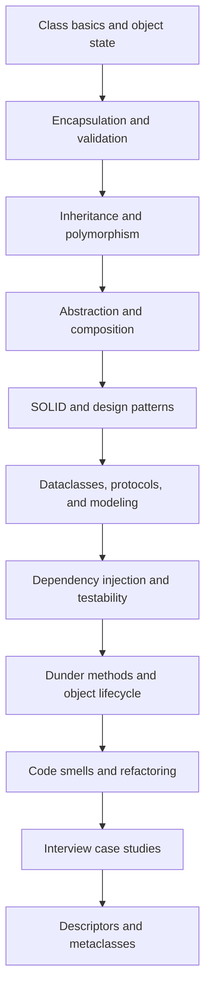

# OOP and Clean Code Mastery Roadmap
## 1. Series purpose

This roadmap organizes the OOP and clean-code notes into a practical learning path.
It is like a map for a city: it shows where to start, what to learn next, and how the topics connect.

### Roadmap at a glance

## 2. Design foundations

### Learn the basic object model first

Know how classes, instances, methods, and attributes work.

### Learn to protect state

Keep invalid data out and keep responsibilities small.

### Learn to prefer composition

Use smaller objects that collaborate instead of one large inheritance tree.

### Learn abstraction and contracts

Type against behavior, not just concrete classes.

## 3. Notes in this series

### 8.1 Class basics and object state

Start here if classes still feel new.

### 8.2 Encapsulation, validation, and safe classes

Learn how to keep objects valid.

### 8.3 Inheritance, MRO, and polymorphism

Learn where inheritance helps and where it hurts.

### 8.4 Abstraction and composition

Use interfaces and small collaborating objects.

### 8.5 SOLID and design patterns

Learn the principles that keep designs flexible.

### 8.6 Dataclasses, protocols, and domain modeling

Learn to model data and behavior clearly.

### 8.7 Dependency injection and testability

Learn how to make code easier to test and change.

### 8.8 Dunder methods and object lifecycle

Learn how Python object behavior hooks work.

### 8.9 Code smells and refactoring

Learn how to improve code without breaking behavior.

### 8.10 Interview case studies

Learn to explain design decisions with real scenarios.

### 8.11 Descriptors and metaclasses

Learn the advanced tools for attribute behavior and class creation.

## 4. Study decision guide

| Need | Best choice | Why |
| --- | --- | --- |
| Simple data model | `dataclass` | clear and low-boilerplate |
| Replaceable behavior | composition | keeps coupling low |
| Shared contract | `Protocol` or ABC | expresses behavior clearly |
| Testable external dependency | DI | makes substitution easy |
| Attribute rules | descriptor | controls access cleanly |
| Class-family rules | metaclass | only when simpler hooks are not enough |

## 5. Engineering rules

- Prefer readability over cleverness.
- Keep object lifetimes and ownership explicit.
- Avoid hidden side effects during import or class creation.
- Keep domain rules close to the domain model.
- Refactor in small steps and verify behavior often.

## 6. Final mental model

| Topic | Remember |
| --- | --- |
| Classes and objects | start simple |
| Encapsulation | keep state valid |
| Composition | prefer for variation |
| Abstraction | type by behavior |
| DI | inject dependencies |
| Refactoring | change safely in steps |
| Advanced hooks | use only when justified |
