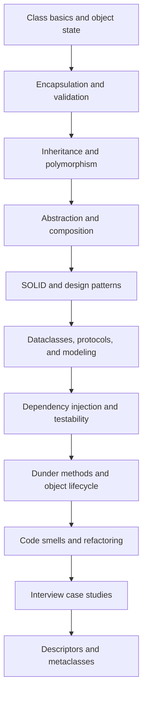
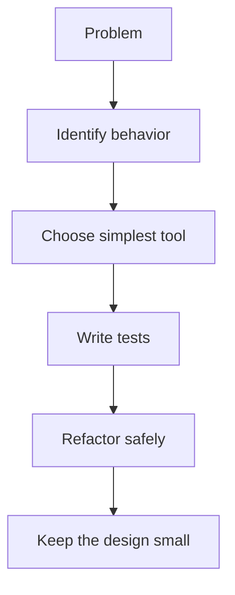

# OOP and Clean Code Mastery Roadmap: Beginner-to-Expert Notes

## 1. Learning goals

By the end of this roadmap, you should be able to:

- choose the right OOP tool for a design problem;
- explain when to use classes, composition, inheritance, ABCs, and protocols;
- write cleaner, safer, more testable Python object-oriented code;
- recognize common code smells and know how to refactor them safely;
- understand when advanced class-creation features are justified.

## 2. Prerequisites

- Basic Python syntax
- Functions, dictionaries, lists, and modules
- A small amount of comfort with classes

## 3. Topic at a glance

This roadmap organizes the OOP and clean-code notes into a practical learning path.
It is like a map for a city: it shows where to start, what to learn next, and how the topics connect.

### Roadmap at a glance



## 4. Core vocabulary

| Term | Plain-language meaning | Example |
| --- | --- | --- |
| Class | A blueprint for creating objects | `class User:` |
| Object | A concrete instance of a class | `User("Ana")` |
| Encapsulation | Keeping state and rules together | validation inside a class |
| Composition | Building behavior from smaller objects | service uses a notifier |
| Inheritance | Reusing behavior through a parent class | `class Dog(Animal)` |
| Polymorphism | Different objects responding to the same interface | `gateway.charge()` |
| SOLID | A set of design principles for cleaner OOP | SRP, OCP, DIP |
| DI | Passing dependencies in instead of creating them inside | constructor injection |
| Descriptor | An object that controls attribute access | `property`-style behavior |
| Metaclass | A class that creates classes | advanced class construction |

## 5. Mental model

Think in layers:

1. Start with simple classes and object state.
2. Add validation and encapsulation.
3. Choose composition before inheritance when behavior varies.
4. Use abstraction when multiple implementations must fit the same contract.
5. Use dataclasses and protocols to make modeling and typing clearer.
6. Use dependency injection to keep code testable.
7. Reach for advanced hooks like descriptors or metaclasses only when simpler tools are not enough.

## 6. Foundations

### 6.1 Learn the basic object model first

Know how classes, instances, methods, and attributes work.

### 6.2 Learn to protect state

Keep invalid data out and keep responsibilities small.

### 6.3 Learn to prefer composition

Use smaller objects that collaborate instead of one large inheritance tree.

### 6.4 Learn abstraction and contracts

Type against behavior, not just concrete classes.

## 7. How it works



The most important habit in clean OOP is not using every pattern.
It is choosing the smallest design that solves the current problem well.

## 8. Core topics in this module

### 8.1 Class basics and object state

Start here if classes still feel new.

### 8.2 Encapsulation, validation, and safe classes

Learn how to keep objects valid.

### 8.3 Inheritance, MRO, and polymorphism

Learn where inheritance helps and where it hurts.

### 8.4 Abstraction and composition

Use interfaces and small collaborating objects.

### 8.5 SOLID and design patterns

Learn the principles that keep designs flexible.

### 8.6 Dataclasses, protocols, and domain modeling

Learn to model data and behavior clearly.

### 8.7 Dependency injection and testability

Learn how to make code easier to test and change.

### 8.8 Dunder methods and object lifecycle

Learn how Python object behavior hooks work.

### 8.9 Code smells and refactoring

Learn how to improve code without breaking behavior.

### 8.10 Interview case studies

Learn to explain design decisions with real scenarios.

### 8.11 Descriptors and metaclasses

Learn the advanced tools for attribute behavior and class creation.

## 9. Guided examples

### Example 1: Simple learning order

```text
classes -> validation -> composition -> abstraction -> testing -> advanced hooks
```

### Example 2: Safe design habit

```text
Prefer a small working solution first.
Add abstraction only when the problem actually needs it.
```

### Example 3: Practical goal

```text
Model the domain clearly, keep dependencies injected, and keep classes easy to test.
```

## 10. Common patterns and real-world applications

- Use small classes for real business concepts.
- Use dataclasses for simple data-holding models.
- Use protocols when multiple implementations should fit the same API.
- Use dependency injection when you want easy testing.
- Use refactoring when code grows messy instead of piling on new features.

## 11. Common mistakes, misconceptions, and failure cases

### Mistake 1: Using inheritance everywhere

Use inheritance only when the subtype relationship is stable and real.

### Mistake 2: Adding patterns too early

Do not introduce factories, base classes, or metaclasses before the need is real.

### Mistake 3: Ignoring tests before refactoring

If you change risky code without tests, you lose safety.

### Mistake 4: Turning a simple design into a framework

Complexity should be earned, not added by habit.

## 12. Comparison and decision guide

| Need | Best choice | Why |
| --- | --- | --- |
| Simple data model | `dataclass` | clear and low-boilerplate |
| Replaceable behavior | composition | keeps coupling low |
| Shared contract | `Protocol` or ABC | expresses behavior clearly |
| Testable external dependency | DI | makes substitution easy |
| Attribute rules | descriptor | controls access cleanly |
| Class-family rules | metaclass | only when simpler hooks are not enough |

## 13. Efficiency, limitations, safety, and best practices

- Prefer readability over cleverness.
- Keep object lifetimes and ownership explicit.
- Avoid hidden side effects during import or class creation.
- Keep domain rules close to the domain model.
- Refactor in small steps and verify behavior often.

## 14. Advanced concepts

- `__init_subclass__` is often better than a custom metaclass.
- Descriptors can power validation and computed attributes.
- Metaclasses should stay rare and focused.

## 15. Interview or assessment knowledge

- Explain composition vs inheritance with tradeoffs.
- Explain LSP with a real example.
- Explain ABC vs Protocol.
- Explain why DI improves testability.
- Explain how you would refactor a god class.

## 16. Practice exercises

1. Explain the difference between an entity and a value object.
2. Describe one case where composition is better than inheritance.
3. Explain why a testable service should receive dependencies.
4. Describe one common code smell and one safe refactor.
5. Explain why a metaclass should be a last resort.

## 17. Summary cheat sheet

| Topic | Remember |
| --- | --- |
| Classes and objects | start simple |
| Encapsulation | keep state valid |
| Composition | prefer for variation |
| Abstraction | type by behavior |
| DI | inject dependencies |
| Refactoring | change safely in steps |
| Advanced hooks | use only when justified |

## 18. Mastery checklist and next steps

- [ ] I understand the module learning order.
- [ ] I can explain the role of each major topic.
- [ ] I know which note to read next when I get stuck.
- [ ] I can avoid overengineering in OOP design.

Next topics:

- `Why OOP Exists - Classes and Objects.md`
- `Encapsulation, Object State, Validation and Safe Classes.md`
- `Composition vs Inheritance and Clean Code.md`
- `SOLID Principles in Python.md`
