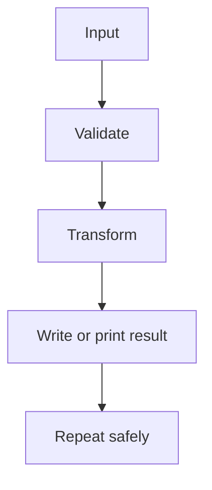

# Basic Scripting and Automation: Beginner-to-Expert Notes

## 1. Learning goals

By the end of this note, you should be able to:

- identify a task that is worth automating;
- structure a small Python script clearly;
- use functions to keep scripts readable;
- explain simple automation boundaries and safety checks.

## 2. Prerequisites

- Functions, loops, and basic modules
- Files, paths, and simple data handling

## 3. Topic at a glance

A script is a small program that performs a repeatable task.
Automation means using code to reduce manual effort and repeated mistakes.

### Minimal first example

```python
def normalize_names(names: list[str]) -> list[str]:
    return [name.strip().title() for name in names]


print(normalize_names(["  ana", "raj  ", "mia"]))
```

Output:

```text
['Ana', 'Raj', 'Mia']
```

Why this output?

The function trims spaces and converts each name into title case.

Roadmap: first we build the mental model, then we learn the scripting shape, then we compare script choices, and finally we practice safe automation thinking.

## 4. Core vocabulary

| Term | Plain-language meaning | Example |
| --- | --- | --- |
| Script | Small program that does one repeatable job | cleanup script |
| Automation | Using code to reduce manual work | rename files |
| Entry point | Where the script starts | `main()` |
| Argument | Input passed to a script | `--input data.csv` |
| Idempotent | Safe to run more than once | same result if rerun |

## 5. Mental model



## 6. Foundations

### 6.1 Keep logic in functions

```python
def normalize_names(names: list[str]) -> list[str]:
    return [name.strip().title() for name in names]


print(normalize_names(["  ana", "raj  ", "mia"]))
```

Output:

```text
['Ana', 'Raj', 'Mia']
```

### 6.2 Add a clear entry point

```python
def main() -> None:
    print("ready")


main()
```

Output:

```text
ready
```

### 6.3 Make automation deterministic

```python
def count_items(items: list[str]) -> int:
    return len(items)


print(count_items(["a", "b", "c"]))
```

Output:

```text
3
```

## 7. How it works

Good scripts read input, validate it, transform it, and then produce a clear result.
The best small automation scripts are easy to rerun and easy to test.

## 8. Core operations or methods

- break work into functions;
- use `main()` for orchestration;
- validate inputs before changing anything;
- print or return a clear result;
- keep side effects controlled.

## 9. Guided examples

### Example 1: Normalize values

```python
def normalize_names(names: list[str]) -> list[str]:
    return [name.strip().title() for name in names]


print(normalize_names(["  ana", "raj  "]))
```

Output:

```text
['Ana', 'Raj']
```

### Example 2: Summarize a small input

```python
def count_names(names: list[str]) -> int:
    return len(names)


print(count_names(["Ana", "Raj", "Mia"]))
```

Output:

```text
3
```

### Example 3: Safe script shape

```python
def main() -> None:
    names = ["ana", "raj"]
    print([name.title() for name in names])


main()
```

Output:

```text
['Ana', 'Raj']
```

## 10. Common patterns and real-world applications

- cleanup scripts;
- report generation;
- file renaming;
- simple imports and exports;
- scheduled maintenance tasks.

## 11. Common mistakes, misconceptions, and failure cases

### Mistake 1: Mixing too much logic with top-level code

Keep reusable logic in functions.

### Mistake 2: Automating unsafe changes without a dry run

Preview the effect before deleting or renaming data.

### Mistake 3: Making scripts hard to rerun

Prefer idempotent operations when possible.

## 12. Comparison and decision guide

| Need | Best choice | Why |
| --- | --- | --- |
| Small repeatable task | script | simple and direct |
| Complex multi-step system | application | needs more structure |
| One-off manual step | manual action | no repetition yet |

## 13. Efficiency, limitations, safety, and best practices

- keep scripts small and explicit;
- validate inputs before acting;
- avoid destructive operations without confirmation;
- log or print results clearly when useful.

## 14. Advanced concepts

- command-line arguments;
- dry-run mode;
- batch processing;
- scheduling.

## 15. Interview or assessment knowledge

- What makes a script automation-friendly?
- Why should logic live in functions?
- What does idempotent mean?
- Why is a dry run useful?

## 16. Practice exercises

1. Write a function that normalizes a list of names.
2. Add a `main()` function that prints a result.
3. Explain why dry-run mode is useful.
4. Explain what idempotent means.
5. Describe one real task you could automate.

### Solutions

#### Solution 1

```python
def normalize_names(names: list[str]) -> list[str]:
    return [name.strip().title() for name in names]


print(normalize_names(["  ana", "raj"]))
```

Output:

```text
['Ana', 'Raj']
```

#### Solution 2

```python
def main() -> None:
    print("done")


main()
```

Output:

```text
done
```

#### Solution 3

Dry-run mode lets you preview the result before making changes.

#### Solution 4

Idempotent means running the script again gives the same safe result.

#### Solution 5

You could automate file renaming or report generation.

## 17. Summary cheat sheet

| Concept | Remember |
| --- | --- |
| Script | small repeatable program |
| Automation | reduce manual work |
| `main()` | clear entry point |
| Dry run | preview before changing |
| Idempotent | safe to rerun |

## 18. Mastery checklist and next steps

- [ ] I can structure a script with functions and `main()`.
- [ ] I can explain dry-run and idempotence.
- [ ] I can identify a safe automation task.
- [ ] I can keep side effects controlled.

Next topics:

- `10_iterators.md`
- `14_os_module.md`
- `15_pathlib.md`
- `16_datetime.md`
