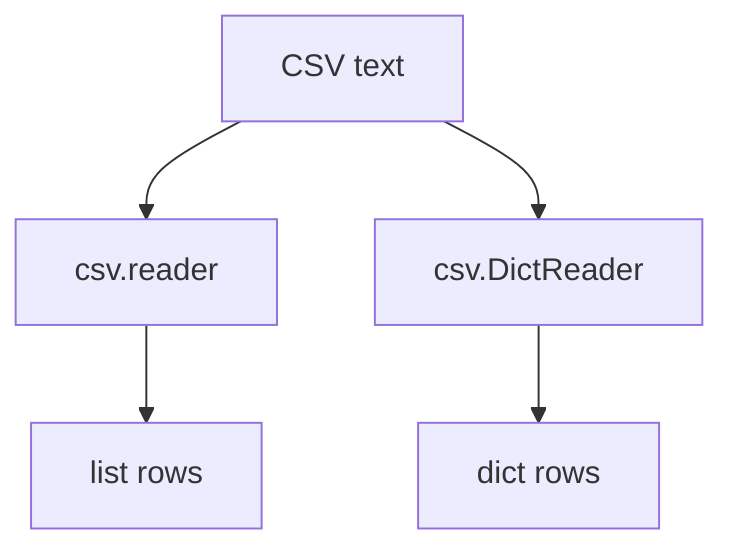

# CSV: Beginner-to-Expert Notes

## 1. Learning goals

By the end of this note, you should be able to:

- read CSV rows with `csv.reader` and `csv.DictReader`;
- write CSV rows with `csv.writer`;
- handle headers and newline handling correctly;
- recognize when CSV is a better fit than JSON.

## 2. Prerequisites

- Lists, dictionaries, and files
- Basic knowledge of rows and columns

## 3. Topic at a glance

CSV is a simple text format for table-like data.
It is useful when your data is naturally arranged in rows and columns.

### Minimal first example

```python
import csv
from io import StringIO

text = "name,age\nAna,30\n"
reader = csv.reader(StringIO(text))

print(next(reader))
print(next(reader))
```

Output:

```text
['name', 'age']
['Ana', '30']
```

Why this output?

CSV reads each line as a row and splits it into columns.

Roadmap: first we build the mental model, then we learn reader and writer tools, then we compare CSV with JSON, and finally we practice common pitfalls.

## 4. Core vocabulary

| Term | Plain-language meaning | Example |
| --- | --- | --- |
| CSV | Comma-separated values | `name,age` |
| Row | One line of table data | `Ana,30` |
| Header | First row with column names | `name,age` |
| `reader` | Reads rows as lists | `csv.reader(...)` |
| `DictReader` | Reads rows as dictionaries | `csv.DictReader(...)` |
| `writer` | Writes rows to CSV | `csv.writer(...)` |

## 5. Mental model



## 6. Foundations

### 6.1 `reader` returns rows as lists

```python
import csv
from io import StringIO

reader = csv.reader(StringIO("name,age\nAna,30\n"))
print(next(reader))
```

Output:

```text
['name', 'age']
```

### 6.2 `DictReader` returns rows as dictionaries

```python
import csv
from io import StringIO

reader = csv.DictReader(StringIO("name,age\nAna,30\n"))
print(next(reader))
```

Output:

```text
{'name': 'Ana', 'age': '30'}
```

### 6.3 `writer` writes rows

```python
import csv
from io import StringIO

buffer = StringIO()
writer = csv.writer(buffer)
writer.writerow(["name", "age"])
writer.writerow(["Ana", 30])

print(buffer.getvalue())
```

Output:

```text
name,age
Ana,30
```

## 7. How it works

CSV is plain text, so everything is stored as strings.
If you need numbers or booleans, convert them explicitly after reading.

## 8. Core operations or methods

- `csv.reader(...)`
- `csv.DictReader(...)`
- `csv.writer(...)`
- `writerow()`
- `writerows()`

## 9. Guided examples

### Example 1: Read rows as lists

```python
import csv
from io import StringIO

reader = csv.reader(StringIO("a,b\n1,2\n"))
print(next(reader))
print(next(reader))
```

Output:

```text
['a', 'b']
['1', '2']
```

### Example 2: Read rows as dictionaries

```python
import csv
from io import StringIO

reader = csv.DictReader(StringIO("name,age\nAna,30\n"))
print(next(reader)["name"])
```

Output:

```text
Ana
```

### Example 3: Write a small CSV

```python
import csv
from io import StringIO

buffer = StringIO()
writer = csv.writer(buffer)
writer.writerow(["city", "country"])
writer.writerow(["Pune", "India"])

print(buffer.getvalue())
```

Output:

```text
city,country
Pune,India
```

## 10. Common patterns and real-world applications

- exporting rows from a report;
- importing spreadsheet-like data;
- simple data interchange when a table is enough;
- batch processing from flat files.

## 11. Common mistakes, misconceptions, and failure cases

### Mistake 1: Forgetting that CSV values are strings

Convert numeric values explicitly.

### Mistake 2: Not handling headers

If your CSV has a header row, use `DictReader` or skip the header intentionally.

### Mistake 3: Ignoring newline handling in real files

When working with real files, open them correctly to avoid blank-line issues.

## 12. Comparison and decision guide

| Need | Best choice | Why |
| --- | --- | --- |
| Table-like flat data | CSV | simple and widely supported |
| Nested structured data | JSON | supports dictionaries inside dictionaries |

## 13. Efficiency, limitations, safety, and best practices

- CSV is simple but limited;
- values are text, so type conversion is your job;
- be careful with delimiters, quoting, and headers.

## 14. Advanced concepts

- custom delimiters;
- quoting rules;
- streaming larger files row by row.

## 15. Interview or assessment knowledge

- What is CSV good for?
- Why are all CSV values strings when read?
- When is `DictReader` useful?
- Why is CSV less expressive than JSON?

## 16. Practice exercises

1. Read the first row from a CSV string.
2. Read a CSV row as a dictionary.
3. Write two rows to a CSV buffer.
4. Explain why numbers come back as strings.
5. Explain when CSV is the right choice.

### Solutions

#### Solution 1

```python
import csv
from io import StringIO

reader = csv.reader(StringIO("a,b\n1,2\n"))
print(next(reader))
```

Output:

```text
['a', 'b']
```

#### Solution 2

```python
import csv
from io import StringIO

reader = csv.DictReader(StringIO("name,age\nAna,30\n"))
print(next(reader))
```

Output:

```text
{'name': 'Ana', 'age': '30'}
```

#### Solution 3

```python
import csv
from io import StringIO

buffer = StringIO()
writer = csv.writer(buffer)
writer.writerow(["x", "y"])
writer.writerow([1, 2])
print(buffer.getvalue())
```

Output:

```text
x,y
1,2
```

#### Solution 4

CSV is plain text, so it does not preserve numeric types automatically.

#### Solution 5

Use CSV for flat table data that should stay easy to open in many tools.

## 17. Summary cheat sheet

| Tool | Use |
| --- | --- |
| `reader` | rows as lists |
| `DictReader` | rows as dictionaries |
| `writer` | write rows |

## 18. Mastery checklist and next steps

- [ ] I can read CSV rows.
- [ ] I can write CSV rows.
- [ ] I know when to use `DictReader`.
- [ ] I understand that CSV values are text.

Next topics:

- `14_os_module.md`
- `15_pathlib.md`
- `17_basic_scripting_and_automation.md`
