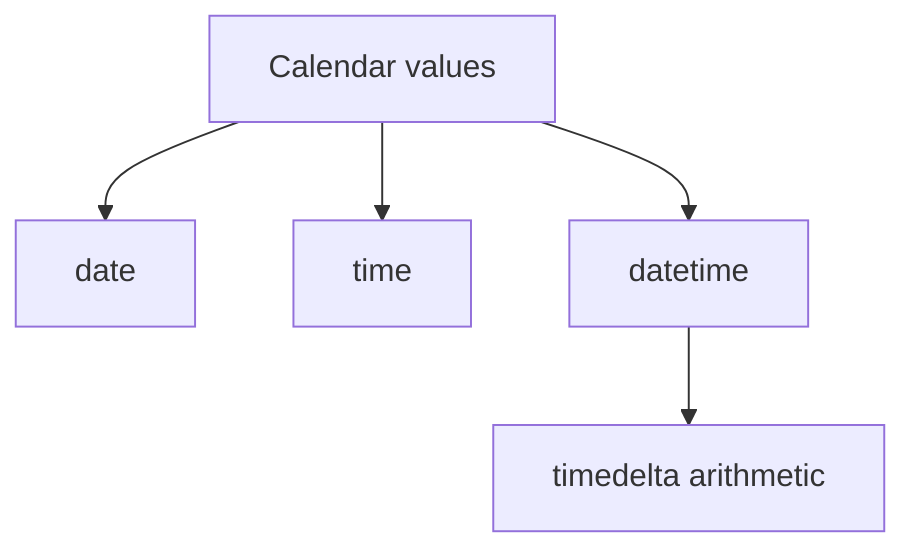

# `datetime`: Beginner-to-Expert Notes

## 1. Learning goals

By the end of this note, you should be able to:

- create dates, times, and datetimes;
- use `timedelta` for time differences;
- format date and time values;
- recognize the difference between naive and timezone-aware datetimes.

## 2. Prerequisites

- Basic Python objects and imports
- Simple arithmetic

## 3. Topic at a glance

The `datetime` module helps you represent dates and times.
It is useful for logs, reports, schedules, and automation tasks.

### Minimal first example

```python
from datetime import date

today = date(2026, 8, 9)
print(today.isoformat())
```

Output:

```text
2026-08-09
```

Why this output?

`isoformat()` converts the date to the standard `YYYY-MM-DD` format.

Roadmap: first we build the mental model, then we learn date, time, and timedelta basics, then we compare formatting choices, and finally we practice time-aware code.

## 4. Core vocabulary

| Term | Plain-language meaning | Example |
| --- | --- | --- |
| `date` | calendar day only | `date(2026, 8, 9)` |
| `time` | time of day only | `time(14, 30)` |
| `datetime` | date and time together | `datetime(2026, 8, 9, 14, 30)` |
| `timedelta` | duration or difference | `timedelta(days=2)` |
| Timezone-aware | datetime with timezone information | UTC datetime |

## 5. Mental model



## 6. Foundations

### 6.1 Date values

```python
from datetime import date

day = date(2026, 8, 9)
print(day.year)
print(day.isoformat())
```

Output:

```text
2026
2026-08-09
```

### 6.2 Time differences

```python
from datetime import timedelta

delta = timedelta(days=2, hours=3)
print(delta)
```

Output:

```text
2 days, 3:00:00
```

### 6.3 Datetime arithmetic

```python
from datetime import datetime, timedelta

start = datetime(2026, 8, 9, 10, 0)
end = start + timedelta(hours=2, minutes=30)
print(end.isoformat(sep=" "))
```

Output:

```text
2026-08-09 12:30:00
```

## 7. How it works

`datetime` objects represent calendar values directly.
Arithmetic with `timedelta` lets you move forward or backward in time in a predictable way.

## 8. Core operations or methods

- `date(...)`
- `time(...)`
- `datetime(...)`
- `timedelta(...)`
- `isoformat()`
- `strftime()`

```python
from datetime import date

day = date(2026, 8, 9)
print(day.strftime("%Y/%m/%d"))
```

Output:

```text
2026/08/09
```

## 9. Guided examples

### Example 1: Print a date

```python
from datetime import date

print(date(2026, 8, 9).isoformat())
```

Output:

```text
2026-08-09
```

### Example 2: Add a duration

```python
from datetime import datetime, timedelta

start = datetime(2026, 8, 9, 9, 0)
print((start + timedelta(hours=1)).isoformat(sep=" "))
```

Output:

```text
2026-08-09 10:00:00
```

### Example 3: Format a date

```python
from datetime import date

day = date(2026, 8, 9)
print(day.strftime("%d-%m-%Y"))
```

Output:

```text
09-08-2026
```

## 10. Common patterns and real-world applications

- scheduled jobs and reminders;
- file naming with dates;
- time-based reports;
- measuring or shifting dates in automation scripts.

## 11. Common mistakes, misconceptions, and failure cases

### Mistake 1: Using current time when a fixed value is better for tests

### Mistake 2: Confusing `date` and `datetime`

### Mistake 3: Ignoring timezone issues in real systems

## 12. Comparison and decision guide

| Need | Best choice | Why |
| --- | --- | --- |
| Calendar day only | `date` | simple and clear |
| Time of day only | `time` | no date attached |
| Date and time together | `datetime` | general scheduling |
| Duration | `timedelta` | arithmetic on time values |

## 13. Efficiency, limitations, safety, and best practices

- use fixed dates in examples and tests when possible;
- be explicit about timezone handling in real systems;
- format dates intentionally for humans or machines.

## 14. Advanced concepts

- timezone-aware datetimes;
- parsing text into datetime objects;
- ISO 8601 formatting.

## 15. Interview or assessment knowledge

- What is the difference between `date` and `datetime`?
- What does `timedelta` represent?
- Why are timezone-aware datetimes important?

## 16. Practice exercises

1. Create a date and print it.
2. Add two hours to a datetime.
3. Format a date with `strftime`.
4. Explain the difference between `date` and `datetime`.
5. Explain why timezone-aware datetimes matter.

### Solutions

#### Solution 1

```python
from datetime import date

print(date(2026, 8, 9))
```

Output:

```text
2026-08-09
```

#### Solution 2

```python
from datetime import datetime, timedelta

print((datetime(2026, 8, 9, 9, 0) + timedelta(hours=2)).isoformat(sep=" "))
```

Output:

```text
2026-08-09 11:00:00
```

#### Solution 3

```python
from datetime import date

print(date(2026, 8, 9).strftime("%d-%m-%Y"))
```

Output:

```text
09-08-2026
```

#### Solution 4

`date` represents a calendar day, while `datetime` represents a date and a time.

#### Solution 5

Timezone-aware datetimes matter because real systems may run in different time zones.

## 17. Summary cheat sheet

| Concept | Remember |
| --- | --- |
| `date` | calendar day |
| `time` | clock time |
| `datetime` | both together |
| `timedelta` | duration |
| `strftime` | formatting |

## 18. Mastery checklist and next steps

- [ ] I can create dates and datetimes.
- [ ] I can add durations with `timedelta`.
- [ ] I can format time values.
- [ ] I know why timezone awareness matters.

Next topics:

- `17_basic_scripting_and_automation.md`
