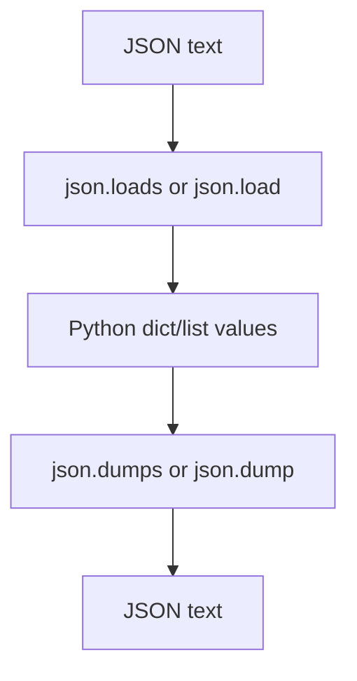

# JSON: Beginner-to-Expert Notes

## 1. Learning goals

By the end of this note, you should be able to:

- read JSON text into Python objects;
- write Python objects back to JSON text;
- use `json.loads`, `json.dumps`, `json.load`, and `json.dump`;
- recognize common JSON limitations and errors.

## 2. Prerequisites

- Dictionaries, lists, strings
- Basic file handling concepts

## 3. Topic at a glance

JSON is a text format for structured data.
It is common because many languages and tools can read it.

### Minimal first example

```python
import json

data = '{"name": "Ana", "age": 30}'
obj = json.loads(data)
print(obj["name"])
```

Output:

```text
Ana
```

Why this output?

`loads()` converts JSON text into a Python dictionary.

Roadmap: first we build the mental model, then we learn reading and writing, then we compare JSON with Python types, and finally we practice safe usage.

## 4. Core vocabulary

| Term | Plain-language meaning | Example |
| --- | --- | --- |
| JSON | Text format for data | `{"x": 1}` |
| `loads` | Parse text into Python | `json.loads(text)` |
| `dumps` | Convert Python into text | `json.dumps(obj)` |
| `load` | Read JSON from a file | `json.load(file)` |
| `dump` | Write JSON to a file | `json.dump(obj, file)` |

## 5. Mental model



## 6. Foundations

### 6.1 `loads()` parses a string

```python
import json

text = '{"name": "Ana", "age": 30}'
obj = json.loads(text)
print(obj["age"])
```

Output:

```text
30
```

### 6.2 `dumps()` serializes a Python object

```python
import json

obj = {"name": "Ana", "age": 30}
print(json.dumps(obj, sort_keys=True))
```

Output:

```text
{"age": 30, "name": "Ana"}
```

### 6.3 Pretty printing helps debugging

```python
import json

obj = {"name": "Ana", "age": 30}
print(json.dumps(obj, indent=2, sort_keys=True))
```

Output:

```text
{
  "age": 30,
  "name": "Ana"
}
```

## 7. How it works

JSON supports a limited set of data types.
Python types outside that set need conversion before serialization.

## 8. Core operations or methods

- `json.loads(text)`
- `json.dumps(obj)`
- `json.load(file)`
- `json.dump(obj, file)`

```python
import json

obj = {"x": 1}
print(json.dumps(obj))
```

Output:

```text
{"x": 1}
```

## 9. Guided examples

### Example 1: Parse a JSON string

```python
import json

data = '{"city": "Pune"}'
print(json.loads(data)["city"])
```

Output:

```text
Pune
```

### Example 2: Serialize a dictionary

```python
import json

data = {"city": "Pune"}
print(json.dumps(data))
```

Output:

```text
{"city": "Pune"}
```

### Example 3: Pretty print nested data

```python
import json

data = {"user": {"name": "Ana", "active": True}}
print(json.dumps(data, indent=2, sort_keys=True))
```

Output:

```text
{
  "user": {
    "active": true,
    "name": "Ana"
  }
}
```

## 10. Common patterns and real-world applications

- API request and response payloads;
- configuration files;
- logging structured events;
- exchanging nested data between systems.

## 11. Common mistakes, misconceptions, and failure cases

### Mistake 1: Assuming every Python object is JSON serializable

`datetime`, sets, and custom objects often need conversion first.

### Mistake 2: Trusting JSON input without validation

External JSON should be checked before use.

### Mistake 3: Confusing JSON booleans and Python booleans

JSON uses lowercase `true` and `false`; Python uses `True` and `False`.

## 12. Comparison and decision guide

| Need | Best choice | Why |
| --- | --- | --- |
| Nested structured text | JSON | portable and common |
| Human-edited config | JSON or YAML | readable, but validate carefully |
| Tabular rows | CSV | simpler for tables |

## 13. Efficiency, limitations, safety, and best practices

- validate data after parsing;
- use stable key ordering when helpful for diffs;
- avoid serializing unsupported types without an explicit rule;
- keep JSON at system boundaries.

## 14. Advanced concepts

- custom encoders;
- decoding into typed domain objects;
- file streaming for larger payloads.

## 15. Interview or assessment knowledge

- What is JSON?
- What do `loads` and `dumps` do?
- Why is JSON useful for interoperability?
- What are common JSON limitations?

## 16. Practice exercises

1. Parse a JSON string and read a key.
2. Serialize a Python dictionary to JSON text.
3. Pretty print nested JSON.
4. Explain one JSON limitation.
5. Explain why validation matters after parsing.

### Solutions

#### Solution 1

```python
import json

print(json.loads('{"name": "Ana"}')["name"])
```

Output:

```text
Ana
```

#### Solution 2

```python
import json

print(json.dumps({"x": 1}))
```

Output:

```text
{"x": 1}
```

#### Solution 3

```python
import json

print(json.dumps({"user": {"name": "Ana"}}, indent=2, sort_keys=True))
```

Output:

```text
{
  "user": {
    "name": "Ana"
  }
}
```

#### Solution 4

JSON does not directly represent every Python type.

#### Solution 5

Validation matters because parsed data comes from outside your code and may not match your expectations.

## 17. Summary cheat sheet

| Function | Use |
| --- | --- |
| `loads` | parse text |
| `dumps` | create text |
| `load` | read from file |
| `dump` | write to file |

## 18. Mastery checklist and next steps

- [ ] I can parse JSON text.
- [ ] I can serialize Python objects to JSON.
- [ ] I understand pretty printing.
- [ ] I know JSON is a boundary format, not a full Python type system.

Next topics:

- `13_csv.md`
- `14_os_module.md`
- `15_pathlib.md`
- `17_basic_scripting_and_automation.md`
