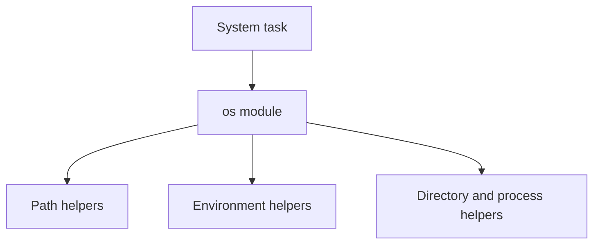

# `os` Module: Beginner-to-Expert Notes

## 1. Learning goals

By the end of this note, you should be able to:

- use `os` for basic system and filesystem tasks;
- understand when `os` is useful versus `pathlib`;
- read environment variables and work with simple paths;
- recognize the low-level role of `os`.

## 2. Prerequisites

- Basic Python functions and strings
- Files and directories

## 3. Topic at a glance

The `os` module provides operating-system related utilities.
It is a lower-level tool than `pathlib` and is often used for compatibility or system access.

### Minimal first example

```python
import os

print(os.path.basename("data/report.csv"))
```

Output:

```text
report.csv
```

Why this output?

`basename()` returns the last path component.

Roadmap: first we build the mental model, then we learn the core functions, then we compare `os` with `pathlib`, and finally we practice basic scripting patterns.

## 4. Core vocabulary

| Term | Plain-language meaning | Example |
| --- | --- | --- |
| `os` | operating system utilities | `os.listdir()` |
| Environment variable | key/value setting from the environment | `os.getenv()` |
| Path component | one part of a path | file name or folder name |
| `os.path` | path-related helpers | `basename`, `join` |

## 5. Mental model



## 6. Foundations

### 6.1 Path helpers

```python
import os

print(os.path.join("data", "report.csv"))
print(os.path.basename("data/report.csv"))
```

Output:

```text
data/report.csv
report.csv
```

### 6.2 Environment variables

```python
import os

value = os.getenv("DEMO_MODE", "off")
print(value)
```

Output:

```text
off
```

### 6.3 Directory listing

```python
import os
import tempfile

with tempfile.TemporaryDirectory() as tmp:
    open(os.path.join(tmp, "a.txt"), "w", encoding="utf-8").close()
    open(os.path.join(tmp, "b.txt"), "w", encoding="utf-8").close()
    print(sorted(os.listdir(tmp)))
```

Output:

```text
['a.txt', 'b.txt']
```

## 7. How it works

`os` exposes lower-level system operations.
For path handling, `os.path` provides string-based helpers.

## 8. Core operations or methods

- `os.getenv()`
- `os.path.join()`
- `os.path.basename()`
- `os.listdir()`

## 9. Guided examples

### Example 1: Join a path

```python
import os

print(os.path.join("logs", "app.log"))
```

Output:

```text
logs/app.log
```

### Example 2: Read a default setting

```python
import os

print(os.getenv("APP_MODE", "development"))
```

Output:

```text
development
```

### Example 3: List files in a temp folder

```python
import os
import tempfile

with tempfile.TemporaryDirectory() as tmp:
    open(os.path.join(tmp, "one.txt"), "w", encoding="utf-8").close()
    open(os.path.join(tmp, "two.txt"), "w", encoding="utf-8").close()
    print(sorted(os.listdir(tmp)))
```

Output:

```text
['one.txt', 'two.txt']
```

## 10. Common patterns and real-world applications

- read configuration from environment variables;
- inspect directory contents;
- create compatibility code for older codebases;
- work with process and filesystem utilities.

## 11. Common mistakes, misconceptions, and failure cases

### Mistake 1: Using string concatenation for paths

Use path helpers instead of manual slashes.

### Mistake 2: Assuming environment variables are always set

Always provide a default or handle absence explicitly.

### Mistake 3: Using `os` where `pathlib` would be clearer

For new code, `pathlib` is often easier to read.

## 12. Comparison and decision guide

| Need | Best choice | Why |
| --- | --- | --- |
| Lower-level system utilities | `os` | broad compatibility |
| Readable path manipulation | `pathlib` | clearer object-oriented API |

## 13. Efficiency, limitations, safety, and best practices

- prefer `pathlib` for most new path code;
- use `os` when you need system-level helpers or compatibility;
- keep environment lookups explicit and predictable.

## 14. Advanced concepts

- `os.walk`;
- process environment;
- platform differences.

## 15. Interview or assessment knowledge

- When would you use `os` instead of `pathlib`?
- Why should you avoid path string concatenation?
- What does `os.getenv()` do?

## 16. Practice exercises

1. Join `logs` and `app.log`.
2. Read an environment variable with a default.
3. List files in a temporary directory.
4. Explain why `pathlib` is often preferred.
5. Explain what `os.path.basename()` returns.

### Solutions

#### Solution 1

```python
import os

print(os.path.join("logs", "app.log"))
```

Output:

```text
logs/app.log
```

#### Solution 2

```python
import os

print(os.getenv("APP_MODE", "development"))
```

Output:

```text
development
```

#### Solution 3

```python
import os
import tempfile

with tempfile.TemporaryDirectory() as tmp:
    open(os.path.join(tmp, "a.txt"), "w", encoding="utf-8").close()
    print(sorted(os.listdir(tmp)))
```

Output:

```text
['a.txt']
```

#### Solution 4

`pathlib` is often preferred because it is more readable and easier to compose safely.

#### Solution 5

It returns the last component of a path.

## 17. Summary cheat sheet

| Function | Use |
| --- | --- |
| `os.getenv` | read environment value |
| `os.path.join` | combine path pieces |
| `os.path.basename` | get file name |
| `os.listdir` | list directory contents |

## 18. Mastery checklist and next steps

- [ ] I can use `os` for basic system tasks.
- [ ] I know what `os.path` does.
- [ ] I can read environment variables safely.
- [ ] I understand when `pathlib` is the better default.

Next topics:

- `15_pathlib.md`
- `16_datetime.md`
- `17_basic_scripting_and_automation.md`
